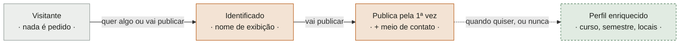

# Modelo de dados por perfil

**Cerimônia 14 do upstream**
**Entrada:** `ADR-0004` · `15-personas-revisadas.md` · `data/locais-campus.toml`
**Alimenta:** a modelagem de domínio

---

## O princípio: zero trust sobre o que o usuário declara

Não temos como validar **nada**. Não há integração com o Unifor Online, não há API do
TORPEDO, não há forma de confirmar que uma matrícula existe ou pertence a quem a
digitou.

Isso não é uma limitação a contornar — é a premissa. E ela tem uma consequência que
governa todo o resto:

> **Guardar um dado que não conseguimos verificar não o torna verdadeiro; torna-o um
> passivo.** Se não podemos confirmar, não podemos afirmar — e o que não podemos afirmar
> não deveria estar no banco fingindo que sim.

A pergunta deixa de ser *"quem é essa pessoa?"* e passa a ser **"qual é o mínimo que
precisamos guardar para o fluxo funcionar, sabendo que nada é verificável?"**

---

## Cadastro progressivo: pede-se quando é necessário

Ninguém preenche cadastro para olhar vitrine. A coleta acontece em três momentos, e cada
dado só é pedido no momento em que passa a ser necessário.

### Momento 0 — Visitante

**Nada é pedido.** A vitrine é pública: ver itens, filtrar por categoria e ler a proposta
não exigem identificação.

### Momento 1 — Identificação

| Dado | Obrigatório | Para quê | Verificável |
|---|---|---|---|
| **Nome de exibição** | sim | É o que aparece para quem se interessa. Sem ele ninguém sabe com quem está falando | ❌ |

Um campo. Sem senha, sem e-mail de confirmação, sem matrícula. O sistema gera
internamente um identificador de sessão — **opaco, e nunca digitado por ninguém**, para
que ninguém possa assumir a identidade de outro adivinhando um número.

### Momento 2 — Primeira publicação

| Dado | Obrigatório | Para quê | Verificável |
|---|---|---|---|
| **Meio de contato** | sim | Sem ele o anúncio é um beco sem saída | ❌ |
| **Tipo do contato** | sim | Saber se é TORPEDO, e-mail, @ de rede — muda como se exibe e como se orienta quem vai procurar | — |

O tipo é escolhido pela pessoa, não pelo produto. P03 pediu isso literalmente:
*"gostaria de ter a opção de inserir qualquer coisa, como um e-mail profissional ou um @
de alguma rede social"*. E P04 recusou o telefone: *"acho pessoal de mais"*.

**Pedido na primeira publicação, não na entrada** — quem só quer olhar não precisa
declarar como ser encontrado.

### Momento 3 — Enriquecimento opcional, a qualquer tempo

| Dado | Obrigatório | Para quê |
|---|---|---|
| **Curso** | não | Sob o `ADR-0004`, é **eixo de conexão** — passar adiante para alguém do próprio curso é a versão explícita do que veteranos já fazem |
| **Semestre** | não | Indica quem está chegando e quem está saindo |
| **Locais habituais** | não | Conveniência: pré-seleciona os pontos de encontro ao publicar |

Curso e semestre eram descartados como demografia nas personas antigas. Sob o
enquadramento do ecossistema **deixaram de ser demografia e viraram o eixo** — mas
continuam opcionais, porque exigi-los na entrada é barreira, e a barreira é o que a
Persona 3 menos suporta.

---

## O que nunca guardamos, e por quê

| Dado | Por que fica de fora |
|---|---|
| **Matrícula** | Não é validável, **não serve para achar ninguém** (a busca do TORPEDO é por nome), é dado pessoal numa vitrine pública, e como credencial permitiria qualquer um assumir a identidade de outro. Some inteira do modelo |
| **Senha** | Não há autenticação. Ter senha sugeriria uma garantia que o produto não dá |
| **Telefone** | Só se a pessoa o escolher como meio de contato. Nunca como campo próprio |
| **CPF, endereço, dado fiscal** | Só fariam sentido se houvesse transação dentro do sistema. **Não há** |
| **Localização** | O produto sugere pontos do campus; não precisa saber onde ninguém está |
| **Histórico de navegação, o que a pessoa olhou** | Não serve a nenhum outcome declarado |

---

## Os dois perfis, e a assimetria entre eles

| | **Quem publica** | **Quem se interessa** |
|---|---|---|
| Precisa se identificar | ✅ | ✅ |
| Fornece meio de contato | ✅ **obrigatório** | ❌ **não fornece** |
| Aparece publicamente | nome, na vitrine | só para quem publicou |

**Quem se interessa não fornece contato**, e isso é decisão, não esquecimento: **é ele
quem inicia a conversa.** Ele recebe o contato de quem publicou e fala pelo canal daquela
pessoa. Pedir contato dos dois lados dobraria a coleta sem que ninguém usasse a metade
extra.

**Consequência aceita:** quem publicou não consegue avisar os interessados que escolheu
outra pessoa. Se três pessoas se interessam, as três falam com ele e ele resolve na
conversa. É menos elegante e evita guardar dado de gente que talvez nunca converse com
ninguém.

---

## O que a venda exigiria — e por que ela não muda nada hoje

O modelo acima **não suporta transação**. Se a venda fosse processada dentro do sistema,
apareceria uma classe inteira de dados que hoje não existe: identificação civil, dados
fiscais, registro da transação, política de privacidade e termos reais.

**Enquanto a venda for apenas um campo do anúncio** — o preço é exibido e o pagamento se
combina fora, exatamente como a entrega —, o perfil de quem vende é **idêntico** ao de
quem doa. Nenhum dado a mais.

E isso é coerente com dois achados: nenhum dos quatro entrevistados se descreveu como
vendedor, e o `ADR-0004` registra que transação comercial troca, mas não aproxima.

> **A decisão sobre venda permanece aberta**, mas o modelo de dados mostra que ela só
> importa se alguém decidir processar pagamento. Enquanto não, não há o que modelar.

---

## O que o zero trust obriga a interface a dizer — e a não dizer

Esta é a parte que costuma ser esquecida e que aparece no vídeo.

| ❌ Não pode dizer | ✅ Pode dizer |
|---|---|
| "Usuário verificado" | "Identificado" |
| "Estudante da UNIFOR" | "Diz ser da UNIFOR" — ou simplesmente o nome, sem asserção |
| "Perfil confirmado" | nada |
| Qualquer selo de confiança | — |

**Nenhuma tela pode afirmar identidade.** O produto sabe que alguém digitou um nome, e
só. Chamar a tela de identificação de *"Entrar"* já sugere autenticação — e uma
autenticação aparente que não autentica é pior do que não ter nenhuma, porque cria
confiança que não se sustenta.

Isso não é pessimismo: é o que permite os pontos de encontro fazerem sentido. **Você
encontra num lugar movimentado justamente porque não sabe quem é a outra pessoa.**

---

## Riscos aceitos, declarados

| Risco | Por que é aceitável aqui |
|---|---|
| **Nome falso** | O contato só serve para achar a pessoa no canal dela. Nome inventado não encontra ninguém — o ataque falha sozinho |
| **Contato falso ou abandonado** | O anúncio vira beco sem saída. Custa uma mensagem sem resposta a quem tentou; não vaza nada |
| **A mesma pessoa criar várias identidades** | Não há o que ganhar: não existe reputação, ranking nem limite por pessoa |
| **Publicar item que não existe** | Custa uma ida ao campus a quem se interessou. Só resolveria com moderação, que é trabalho contínuo e não código |

**O que nenhum desses riscos ameaça:** dado pessoal de terceiro. É consequência direta
de guardar pouco — **não há o que vazar porque quase não há o que guardar.**

---

## O que fica para a modelagem de domínio

- Se **Local** é entidade do domínio ou tabela de referência
- Se **Pessoa** é agregado próprio ou só o dono de um item
- Onde vive o meio de contato — na pessoa, ou por anúncio
- O que acontece com anúncios de alguém que nunca mais volta
