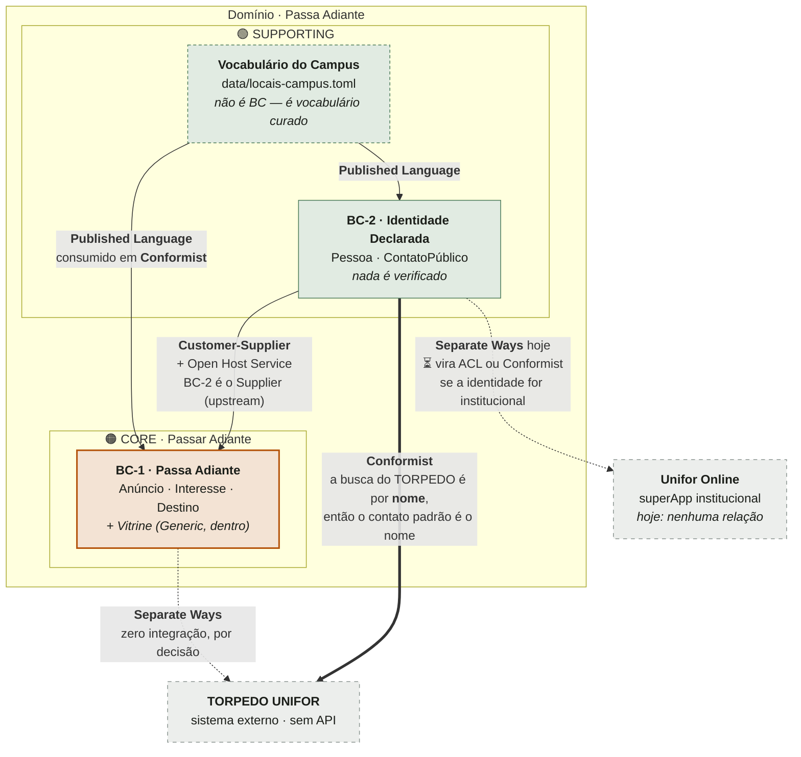
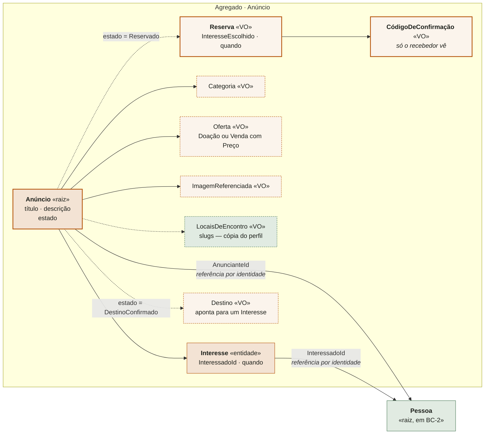
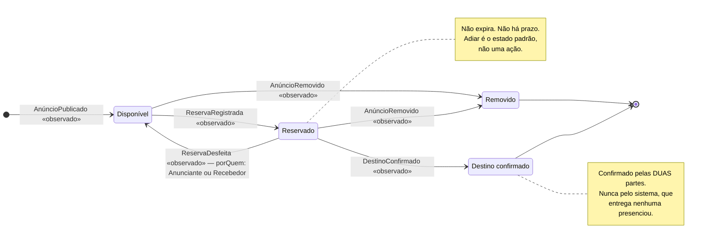
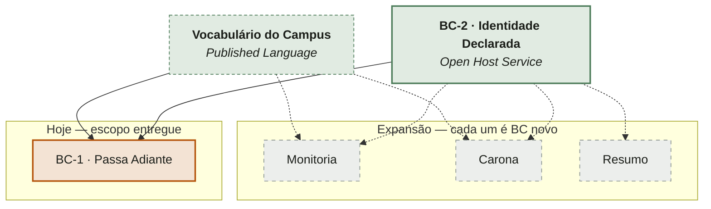

# Modelagem de domínio

**Cerimônia 15 do upstream**
**Entrada:** `ADR-0004` · `PRD-0001` · `16-modelo-de-dados-por-perfil.md` ·
`15-personas-revisadas.md` · `12-historias-e-criterios-de-aceite.md` ·
`09-corte-de-escopo.md` · `data/locais-campus.toml` · `ADR-0003`
**Alimenta:** os tickets da pipeline — é daqui que a **W0** tira o que é agregado, o que é
invariante e o que é evento

> **Revisão de 2026-07-28, tarde — as decisões C1, C2 e C6.** Locais ficam no perfil como
> padrão e ajustáveis por anúncio (§5.5); matrícula some do modelo (C2); e o estado binário
> virou um **ciclo de reserva com código de confirmação e desistência dos dois lados**
> (§5.2, §5.3, §5.6).
>
> **O que mudou de fronteira: nada.** Os dois bounded contexts continuam dois, e o ciclo
> inteiro coube no agregado `Anúncio` que já existia — a revisão que eu tinha me obrigado a
> fazer está na §5.1.1. **O que mudou de epistemologia:** BC-1 deixou de ter eventos
> declarados, e o modelo ganhou seu primeiro fato que **exige duas pessoas** (§7.1).
> **O que a decisão contradiz:** PRD e corte de escopo, em três pontos — C8, C11 e C12.

> **Rótulos usados neste documento.** `verificado` — li o arquivo ou rodei o comando ·
> `documentado` — fonte canônica afirma, com autor, obra e página · `inferido` — leitura
> minha, pode estar errada.
>
> **Nada de DDD de memória.** Toda definição abaixo vem do MCP `acdg-skills`, com linha e
> página. As páginas conferidas estão na seção *Fontes* ao fim.

---

## 0. A frase que organiza o modelo inteiro

Antes de qualquer agregado, existe uma premissa que o `16-modelo-de-dados-por-perfil.md`
enunciou para os dados e que vale para **todo** o domínio:

> **O sistema observa o ato. Nunca observa o fato.**

`inferido` — é a generalização de `16-modelo-de-dados-por-perfil.md:18-20` (*"Guardar um
dado que não conseguimos verificar não o torna verdadeiro; torna-o um passivo"*) aplicada
para além do cadastro.

| O sistema observa | O sistema **não** observa | Onde isso já está escrito |
|---|---|---|
| Que alguém digitou um nome | Que o nome seja dela | `16:155-157` |
| Que alguém clicou "Tenho interesse" | Que essa pessoa exista, ou que queira mesmo o item | `16:169-172` |
| Que o anunciante reservou para um interessado | Que a entrega vá acontecer | `09-corte-de-escopo.md:52-53` |
| **Que o anunciante apresentou um código que o sistema só entregou ao recebedor** | **Que os dois tenham se encontrado** | decisão C6, §5.2 |
| Que uma das duas partes desfez a reserva | **De quem foi a falha** | §7.1, nota |
| Que um anúncio foi publicado | Que o item exista | `16:172` |
| — | **Que duas pessoas tenham se conhecido** | `ADR-0004:76-79` |

Essa distinção é a espinha do modelo. Ela decide **três** coisas de uma vez: o nome dos
estados (§5.2), a separação entre evento observado e evento declarado (§7), e por que a
identidade é um contexto à parte (§3.2).

> **O que a decisão do ciclo de reserva mudou nesta frase.** Nada. Mas mudou o **lado
> esquerdo da tabela**: o sistema passou a observar um ato que **exige duas contas**, e
> não só uma. Isso é mais do que ele sabia antes — e continua sendo menos do que um
> encontro. O modelo ganhou **corroboração**, não **presença**. Confundir as duas produz
> exatamente o mesmo defeito que produzia o estado `Entregue`, com um nome novo.

---

## 1. Legenda — o que cada classificação significa

Obrigatória por pedido do Gabriel: quem lê o diagrama sem conhecer DDD precisa entender o
que cada caixa e cada seta querem dizer.

### 1.1 Classificação de subdomínio

| Termo | O que significa | Fonte |
|---|---|---|
| **Core Domain** | *"The distinctive part of the model, central to the user's goals, that differentiates the application and makes it valuable."* Não é "o mais complexo" nem "o maior" — é **onde está a vantagem**. É onde a excelência é exigida e para onde vai a maior parte do esforço | Evans, *Domain-Driven Design*, p. 311 (glossário) · e Vernon, *IDDD*, p. 96 |
| **Supporting Subdomain** | *"If it models some aspect of the business that is essential, yet not Core, it is a Supporting Subdomain. The business creates a Supporting Subdomain because it is somewhat specialized."* Essencial, **especializado**, e ainda assim não é onde se compete | Vernon, *IDDD*, p. 96 |
| **Generic Subdomain** | *"if it captures nothing special to the business, yet is required for the overall business solution, it is a Generic Subdomain."* Commodity: qualquer produto do gênero tem, e ter melhor não ganha nada | Vernon, *IDDD*, p. 96 |
| **Cohesive Mechanism** | O que **não** é subdomínio nenhum: *"A COHESIVE MECHANISM does not represent the domain; it solves some sticky computational problem posed by the expressive models. A model proposes; a COHESIVE MECHANISM disposes."* | Evans, *DDD*, p. 248 |

> **Nota sobre "Generic".** Generic **não** quer dizer reusável nem comprável. Evans é
> explícito: *"while I have emphasized the generic quality of these subdomains, I have not
> mentioned the reusability of code (…) you should specifically not concern yourself with
> the reusability of that code"* (p. 248). A pergunta que separa Generic de Supporting é
> **"isso captura algo especial deste negócio?"**, não "existe biblioteca pronta?".

### 1.2 Termos táticos usados adiante

| Termo | O que significa | Fonte |
|---|---|---|
| **Bounded Context** | *"The delimited applicability of a particular model."* E, na formulação que uso aqui: *"a Bounded Context is principally a linguistic boundary"* — **onde a palavra muda de significado, a fronteira existe** | Evans, *DDD*, p. 311 · Vernon, *IDDD*, p. 105 |
| **Ubiquitous Language** | *"A language structured around the domain model and used by all team members to connect all the activities of the team with the software."* | Evans, *DDD*, p. 311 |
| **Aggregate** | *"A cluster of associated objects that are treated as a unit for the purpose of data changes. External references are restricted to one member of the AGGREGATE, designated as the root. A set of consistency rules applies within the AGGREGATE'S boundaries."* | Evans, *DDD*, p. 311 |
| **Invariante** | *"An invariant is a business rule that must always be consistent."* E a regra que decide fronteira: *"When trying to discover the Aggregates in a Bounded Context, we must understand the model's true invariants. Only with that knowledge can we determine which objects should be clustered into a given Aggregate."* | Vernon, *IDDD*, p. 450 |
| **Referência por identidade** | *"Prefer references to external Aggregates only by their globally unique identity, not by holding a direct object reference"* | Vernon, *IDDD*, p. 460 |
| **Domain Event** | *"Something happened that domain experts care about."* Vernon registra que Evans não deu definição formal no livro azul — o padrão foi detalhado depois | Vernon, *IDDD*, p. 369 |
| **Context Map** | *"A representation of the BOUNDED CONTEXTS involved in a project and the actual relationships between them and their models."* | Evans, *DDD*, p. 311 |

### 1.3 Relações do context map — a legenda das setas

Todas as definições abaixo são de Vernon, *IDDD*, **p. 142** (seção *"Finally, the
Definitions!"*), que por sua vez as cita de Evans, *Domain-Driven Design Reference*.
Estão aqui as nove; as que este projeto **usa** estão marcadas com ✅.

| Padrão | Definição (Vernon, p. 142) | Em uma frase | Usado? |
|---|---|---|---|
| **Partnership** | *"When teams in two Contexts will succeed or fail together, a cooperative relationship needs to emerge. The teams institute a process for coordinated planning of development and joint management of integration."* | Afundam ou nadam juntos; planejam junto | ❌ §4.3 explica por quê |
| **Shared Kernel** | *"Designate with an explicit boundary some subset of the domain model that the teams agree to share. Keep the kernel small. This explicit shared stuff has special status and shouldn't be changed without consultation with the other team."* | Um pedaço do modelo é literalmente o mesmo código nos dois lados | ❌ |
| **Customer-Supplier** | *"When two teams are in an upstream-downstream relationship (…) Downstream priorities factor into upstream planning. Negotiate and budget tasks for downstream requirements."* | O de cima serve o de baixo, e negocia com ele | ✅ |
| **Conformist** | *"the downstream team eliminates the complexity of translation between bounded contexts by slavishly adhering to the model of the upstream team."* | O de baixo aceita o modelo do de cima como está | ✅ |
| **Anticorruption Layer** | *"As a downstream client, create an isolating layer to provide your system with functionality of the upstream system in terms of your own domain model."* | Camada de tradução defensiva, para o modelo alheio não contaminar o seu | ⏳ só na expansão (§9) |
| **Open Host Service** | *"Define a protocol that gives access to your subsystem as a set of services. Open the protocol so that all who need to integrate with you can use it."* | Você publica uma porta única e estável, em vez de N integrações ad hoc | ✅ |
| **Published Language** | *"Use a well-documented shared language that can express the necessary domain information as a common medium of communication (…) often combined with Open Host Service."* | Um vocabulário comum, documentado, que os dois lados falam | ✅ |
| **Separate Ways** | *"If two sets of functionality have no significant relationship, they can be completely cut loose from each other. Integration is always expensive (…) Declare a bounded context to have no connection to the others at all."* | Zero integração, de propósito | ✅ |
| **Big Ball of Mud** | *"there are parts of systems (…) where models are mixed and boundaries are inconsistent. Draw a boundary around the entire mess and designate it a Big Ball of Mud."* | Cerque a bagunça e não modele dentro dela | ❌ |

---

## 2. Espaço do problema — os subdomínios

> Vernon, *IDDD*, p. 96: *"Being Supporting or Generic doesn't mean unimportant (…) It's
> the Core Domain that requires excellence in implementation, since it will provide
> distinct advantages to the business."*

| # | Subdomínio | Classificação | Por que essa classificação |
|---|---|---|---|
| **S1** | **Passar Adiante** — o gesto, do anúncio ao destino registrado | 🟠 **CORE** | É o único trecho do produto que um grupo de WhatsApp não faz **por topologia** (`ADR-0004:56-59`). O gate de interesse resolve quatro coisas com um mecanismo só — cobertura, lastro, privacidade e a tela vazia (`09-corte-de-escopo.md:41-47`) — e é isso que o benchmark de marketplaces **não** tem. É aqui que a excelência é exigida |
| **S2** | **Identidade Declarada** — quem é a pessoa, e como falar com ela fora daqui | 🟢 **SUPPORTING** | Essencial (sem contato o anúncio é beco sem saída, `16:68`) e **especializado pela recusa deliberada de autenticar**. É o que o impede de ser Generic: todo IdP de prateleira *afirma* identidade, e este produto não pode afirmar nada (`16:148-157`). Não se compra "identidade que não promete nada" |
| **S3** | **Locais de Encontro** — o vocabulário curado do campus | 🟢 **SUPPORTING** | O campo `tambem_chamado` é literalmente *"o conhecimento que hoje só passa de veterano para calouro"* (`locais-campus.toml:35-37`). Isso é especialíssimo deste negócio — é a matéria-prima do pertencimento que o `ADR-0004` diz ser o propósito. É o Supporting mais **próximo** do Core, e o primeiro candidato a virar Core se o produto crescer |
| **S4** | **Vitrine e Catálogo** — listar, ordenar por recência, filtrar por categoria fixa | ⚪ **GENERIC** | Commodity. Trokaí, UniStore e Tradr têm (`ADR-0004:43-45`); ter melhor não ganha nada. **Ressalva que muda código:** a *regra de honestidade* que governa **o que a vitrine afirma** (`12:264-270`, `09-corte:97-110`) **não é Generic — é Core**, e não mora aqui. Ver §2.1 |
| **S5** | Sessão, cookie, CSRF, Service Worker, PWA | **não é subdomínio** | É **Cohesive Mechanism**, na distinção de Evans (p. 248): *"does not represent the domain; it solves some sticky computational problem"*. Decidido no `ADR-0003` e **downstream desta modelagem**. Registrado aqui só para que ninguém o modele como domínio |

### 2.1 A ressalva do S4, porque ela evita um erro concreto

O mecanismo da vitrine é genérico; **as afirmações da vitrine não são**.

- `12-historias-e-criterios-de-aceite.md:266`: *"Base vazia exibe um estado inicial honesto
  — **não** números inventados"*
- `12:267`: *"Nenhum texto afirma atividade que não aconteceu"*
- `09-corte-de-escopo.md:107-110`: o contador não pode ser um número fixo no HTML

Esses três critérios são a mesma frase da §0 aplicada à landing. Se a estatística for
implementada dentro do "catálogo" — tratada como enfeite de listagem — ela vira um número
qualquer. Ela é **projeção do Core**: conta fatos que o sistema observou.

`inferido`, mas com consequência prática: as contagens da landing derivam dos eventos de
§7.1, não de uma tabela de métricas.

---

## 3. Espaço da solução — os bounded contexts

**São dois.** Não sete.

> Evans, *DDD*, p. 237: *"In a typical case, the system under design is going to get carved
> into one or two BOUNDED CONTEXTS that the main development teams will be working on,
> perhaps with another CONTEXT or two in a supporting role."*
>
> E Vernon, *IDDD*, p. 113, sobre o custo dos dois excessos: *"If we constrain a given
> Bounded Context too stringently, gaping holes result from vital but missing contextual
> concepts. And if we keep piling concepts onto the model that don't express the core of
> the business problem being solved, we will muddy the waters."*

### 3.1 BC-1 · Passa Adiante

**A fronteira:** tudo que fala de **anúncio, interesse e destino**.

| Dentro | Fora |
|---|---|
| `Anúncio` (raiz de agregado) | Quem é a pessoa por trás do `AnuncianteId` |
| `Interesse` (entidade dentro de `Anúncio`) | O meio de contato — mora em BC-2 |
| `Categoria`, `Oferta` (doação \| venda+preço), `ImagemReferenciada` | Curso, semestre, **locais habituais do perfil** |
| **`Reserva` e `CódigoDeConfirmação`** (§5.2) | A curadoria dos locais — acontece fora do software |
| **`LocaisDeEncontro` do anúncio** — cópia do perfil na publicação (§5.5) | Reputação, nota, histórico de trocas (§9) |
| O estado do anúncio e sua transição | Cookie, sessão, Service Worker (`ADR-0003`) |
| A vitrine, o filtro e as estatísticas honestas | |

**Por que a fronteira passa exatamente aqui.** Porque é até aqui que a palavra *anúncio*
tem um significado só. Dentro, um anúncio é sempre "a oferta publicada e o gesto que ela
carrega" — na vitrine pública, em "meus anúncios" e na tela de interessados. O que muda
entre essas telas é **o que se mostra**, não o que a coisa é.

### 3.2 BC-2 · Identidade Declarada

**A fronteira:** tudo que fala de **quem é a pessoa e como encontrá-la fora do sistema**.

| Dentro | Fora |
|---|---|
| `Pessoa` (raiz de agregado): nome de exibição | Qualquer coisa que a pessoa tenha anunciado |
| `ContatoPúblico`: tipo + valor + o que exibir | A regra "não se publica sem contato" — é de BC-1 (§5.4) |
| Curso, semestre, locais habituais (opcionais) | O gate do interesse — é de BC-1 |
| A regra de que **nada pode ser afirmado** (`16:148-157`) | **Quantas reservas ativas a pessoa tem** — é de BC-1 (§5.6) |
| | A sessão como mecanismo (`ADR-0003`) |

> **A linha nova da coluna "Fora" é a mais importante desta seção.** O limite de *uma
> reserva ativa por pessoa* (decisão C6) parece dado de pessoa, e não é. Se `Pessoa`
> souber quantas reservas tem, **BC-2 passa a depender de `Anúncio`** — o que a §4.3
> proíbe, e o que fecha a porta do Unifor Online: um provedor institucional de identidade
> jamais carregará o estado de reserva de um app de campus. O limite vive em BC-1. Ver
> §5.6.

**Por que a fronteira passa exatamente aqui — o teste linguístico.** A palavra *pessoa*
muda de significado ao cruzar a linha:

| | Em **Identidade Declarada** | Em **Passa Adiante** |
|---|---|---|
| O que é uma pessoa | **O sujeito de afirmações que ninguém verificou** — um nome digitado e um jeito de ser achada lá fora | **Uma parte do gesto** — `Anunciante` ou `Interessado`, referenciada só por identidade |
| O que se pode dizer dela | *"Identificado"*. Nunca *"verificado"*, nunca *"estudante da UNIFOR"* (`16:148-153`) | Nada. O gesto não faz asserção sobre gente |
| O que a torna válida | Ter nome. E, se vai publicar, ter contato | Ter registrado um interesse, ou ser dona do anúncio |

`documentado` que essa é a razão certa de traçar fronteira — Vernon, *IDDD*, p. 105:
*"a Bounded Context is principally a linguistic boundary."*

**E a razão que vale mais que a linguística:** é a porta que se fecha se a fronteira não
existir. A política institucional da UNIFOR é centralizar no **Unifor Online**. No dia em
que a identidade vier de lá, **BC-2 inteiro é substituído e BC-1 não é tocado**. Se
`Pessoa` estiver fundida em `Anúncio`, essa troca vira reescrita. Ver §9.

### 3.3 Vocabulário do Campus — o que **não** é um bounded context

`data/locais-campus.toml` **não é um bounded context e não tem agregado**, e isso é uma
resposta direta à pergunta aberta de `16-modelo-de-dados-por-perfil.md:181` (*"Se Local é
entidade do domínio ou tabela de referência"*).

**Nem uma nem outra: é um vocabulário publicado.** Os três testes:

1. **Não tem invariante que o software garanta.** Nada no sistema impede um local errado;
   quem garante é o curador humano, em revisão de commit.
2. **Não tem ciclo de vida dentro do software.** O `slug` *"nunca muda"* (`locais-campus.toml:23`)
   e é atribuído por uma pessoa, fora do sistema.
3. **É consumido por dois contextos** — pelo perfil (`16:84`) e pelo anúncio
   (`locais-campus.toml:5-6`) — sem pertencer a nenhum.

Sem invariante não há agregado (Vernon, p. 450). Quando referenciado, `Local` é um
**Value Object** cujo valor é o `slug`, imutável por declaração.

> **A costura já está escrita no próprio arquivo**, e é a razão de eu não o promover a
> contexto agora: *"Se um dia locais puderem ser sugeridos por quem publica, eles NÃO
> entram aqui: ficam separados e sem o selo"* (`locais-campus.toml:16-19`). **Essa é uma
> invariante em espera** — *local curado carrega uma garantia; local sugerido não*. No dia
> em que ela existir, `Local` ganha ciclo de vida (`proposto → curado → aposentado`), a
> palavra passa a ter dois significados, e aí sim nasce um contexto.

### 3.4 As fronteiras que eu **não** tracei, e por quê

Registradas porque são as tentações deste produto, e alguém vai propô-las.

| Fronteira tentadora | Por que não é fronteira |
|---|---|
| **Vitrine pública** × **Meus anúncios** | É a mesma `Anúncio`, com a mesma invariante, vista por duas projeções com autorizações diferentes (`D3`, `12:60-66`). **Leitura é projeção e nunca define agregado nem contexto** — se definisse, o modelo viraria refém da UI |
| **Anúncio** × **Interesse** como contextos separados | A invariante `I4` (§5.7) atravessa os dois. Uma invariante atravessada é a prova de que a fronteira está no lugar errado |
| **Reserva** como contexto ou agregado próprio | Tentação nova, trazida por C6. `I4` continua exigindo os interessados dentro do agregado no instante da reserva — tirar a `Reserva` de lá quebraria a única invariante que fecha a fronteira. Ver §5.1.1 e §5.6 |
| **Doação** × **Venda** | `16:126-140` já demonstrou: enquanto o pagamento acontecer fora, *"o perfil de quem vende é **idêntico** ao de quem doa"*. Um campo, não um contexto |
| **Onboarding do calouro** | É um *outcome* (`ADR-0004`), não um modelo. Não tem termo próprio, não tem invariante, não tem estado |
| **Estatísticas / Sinal de vida** | Projeção dos eventos de §7.1. Dar-lhe contexto próprio é o caminho para o número inventado que `12:266` proíbe |

---

## 4. Context Map

### 4.1 O mapa geral

### 4.2 Dentro do Core — o modelo de BC-1

**`Reserva` e `Destino` nunca coexistem** — são o mesmo lugar do agregado em dois estados.
A `Reserva` é substituída inteira: desfeita, some; confirmada, vira `Destino` e o código é
**descartado**. Descartar o código não é higiene de segurança — é consequência do modelo:
ele mede a confirmação de uma reserva que não existe mais.

**A seta que mais importa é a de referência por identidade.** `Anúncio` guarda
`AnuncianteId`, nunca o objeto `Pessoa`. É o que faz o critério de segurança de `H-08`
(*"Quem não está identificado não vê a forma de contato — em lugar nenhum da resposta,
inclusive no JSON bruto"*, `12:202`) ser **estrutural** em vez de depender de alguém
lembrar de filtrar o campo. `documentado` — Vernon, *IDDD*, p. 460.

### 4.3 As relações, uma a uma

#### BC-2 → BC-1 · **Customer-Supplier** com **Open Host Service**

- **Direção:** `Identidade Declarada` é o **Supplier** (upstream); `Passa Adiante` é o
  **Customer** (downstream).
- **O que a classificação proíbe:** BC-1 pode depender de BC-2. **BC-2 nunca pode depender
  de `Anúncio`.** É a regra que impede alguém de colocar a lógica de "meus anúncios"
  dentro do modelo de identidade.
- **O que a classificação obriga:** *"Downstream priorities factor into upstream planning"*
  (Vernon, p. 142) — a forma de BC-2 é negociada pelo que o Core precisa, não o contrário.
  Isso é coerente com Supporting servindo Core (Vernon, p. 96).
- **O Open Host Service** que BC-2 publica tem exatamente duas operações, e a segunda
  carrega uma condição do Customer: *quem é a sessão atual* e *o contato público de X,
  se e somente se o pedinte registrou interesse* (`12:202-206`).
- **Por que não Partnership.** Partnership é *"succeed or fail together (…) coordinated
  planning"* (Vernon, p. 142) e implica dependência **mútua**. Aqui a dependência mútua é
  precisamente o que se quer proibir. Com uma pessoa só no projeto, Partnership seria
  verdadeira e inútil: descreveria a organização e não restringiria nada.

#### Vocabulário do Campus → BC-1 e BC-2 · **Published Language**, consumido em **Conformist**

- **Published Language** porque o TOML é um vocabulário compartilhado e **documentado no
  próprio arquivo**: campos explicados (`locais-campus.toml:21-29`), apelidos registrados
  (`:31-37`), e até os códigos de horário traduzidos *"porque quem acabou de chegar não
  decodifica 'MAB'"* (`:41-43`). É a definição de Vernon, p. 142.
- **Conformist** porque os dois contextos usam o `slug` como vem, sem traduzir e sem
  renomear. **E aqui Conformist é escolha boa, não derrota** — Evans, *DDD*, p. 224:
  *"When using an off-the-shelf component that has a large interface, you should typically
  CONFORM to the model implicit in that component (…) If it is good enough to give you
  value, there is probably knowledge crunched into its design."* O conhecimento embutido
  aqui é o vocabulário do campus, e traduzi-lo destruiria o que ele tem de valioso.
- **Sem Anticorruption Layer**, e é deliberado: ACL existe para se defender de um modelo
  alheio ruim. Este é nosso e é bom.

#### BC-1 → TORPEDO · **Separate Ways**

- *"Integration is always expensive, and sometimes the benefit is small. Declare a bounded
  context to have no connection to the others at all"* (Vernon, p. 142).
- `verificado` — não há API (`ADR-0004:41-42`), e o corte é decisão de produto
  (`09-corte-de-escopo.md:91`). O sistema **nunca** sabe se a mensagem chegou.
- Consequência que o mapa torna visível: entre `InteresseRegistrado` e o fechamento do
  gesto existe um vão que o produto escolheu não atravessar, e é o vão onde tudo pode dar
  errado sem que o sistema saiba (`10-story-map.md:34-37`).
- **O que a decisão C6 mudou aqui, e é modesto.** O código não atravessa o vão — a conversa
  continua inteiramente no TORPEDO, e o Separate Ways continua valendo. O que ele faz é
  colocar **uma marca de cada lado**: o sistema sabe quando o vão começou (`ReservaRegistrada`)
  e sabe se alguém voltou dele (`DestinoConfirmado` ou `ReservaDesfeita`). **Continua sem
  saber o que aconteceu lá dentro**, que é o ponto do Separate Ways.

#### BC-2 → TORPEDO · **Conformist**

Esta é a mais fácil de perder de vista, e é real.

`verificado` em `03-problem-statement.md:113` e `08-hipoteses.md:48`: **a busca do TORPEDO
é por nome, não por matrícula.** Daí o último critério de `H-13`: *"Sem escolha registrada,
o padrão é o **nome** — sem o qual o contato pelo chat do campus é impossível (a busca é
por nome)"* (`12:287`).

Ou seja: **o formato do contato padrão do produto é ditado por um sistema externo com o
qual não há integração nenhuma.** BC-2 conforma ao modelo do TORPEDO sem trocar um byte
com ele. Duas classificações diferentes para o mesmo par de caixas — Separate Ways na
integração, Conformist na linguagem — e as duas são verdadeiras.

#### BC-2 → Unifor Online · **Separate Ways** hoje

Nenhuma relação existe. Registrado no mapa porque é onde a política institucional aponta
e porque é a costura mais valiosa deste modelo. Ver §9.

---

## 5. Os agregados e a invariante que justifica cada fronteira

> A regra, e é a única: *"When trying to discover the Aggregates in a Bounded Context, we
> must understand the model's true invariants. Only with that knowledge can we determine
> which objects should be clustered into a given Aggregate."* — Vernon, *IDDD*, p. 450.
>
> **Nem tela, nem quem lê o dado, nem conveniência de consulta.**

### 5.1 `Anúncio` — raiz de agregado em BC-1

**Contém:** `Interesse` (entidade), e os VOs `Categoria`, `Oferta`, `ImagemReferenciada`,
`Reserva` (que contém `CódigoDeConfirmação`), `Destino`, `LocaisDeEncontro`.

**A invariante que obriga `Interesse` a estar dentro** — `H-10`, `12:232`:

> *"Só é possível marcar alguém que **demonstrou interesse** — não um nome digitado"*

Não há como garantir isso transacionalmente com `Interesse` fora da fronteira: no instante
em que o destino é registrado, é preciso conhecer o conjunto de interessados. A mesma
fronteira é exigida por `12:205` (*"A mesma pessoa registrar interesse duas vezes **não
cria dois registros**"*), que é uma regra de unicidade **dentro** do anúncio.

**Por que isso não é um agregado grande demais.** A coleção é naturalmente pequena — o PRD
descreve *"duas pessoas querem o mesmo item"* como o caso (`PRD-0001:152`).

**Referências para fora:** só por identidade — `AnuncianteId`, e `InteressadoId` em cada
`Interesse` (Vernon, p. 460).

#### 5.1.1 A revisão de fronteira que eu tinha me obrigado a fazer — e o resultado

A versão anterior deste documento declarou uma condição de revisão:

> *"Se um dia existir 'desistir do interesse' ou aviso de não-escolha, `Interesse` ganha
> ciclo próprio e a fronteira precisa ser reexaminada."*

**As duas condições dispararam com a decisão C6.** A revisão está feita, e o resultado é:
**a fronteira não se move.** Item por item, porque o raciocínio importa mais que a
conclusão.

| Gatilho | O que a decisão C6 trouxe | Move a fronteira? |
|---|---|---|
| **Aviso de não-escolha** | *"quem se interessou vê que alguém já foi escolhido, sem precisar de notificação"* | ❌ **Não.** É o aviso implementado como **leitura**, não como notificação. O `Interesse` do preterido não muda de estado — quem mudou foi o `Anúncio`. **Leitura é projeção e nunca define agregado** (§3.4). Esta é a versão sutil da falsa fronteira, e ela quase passa |
| **Desistir** | Qualquer um dos dois desfaz a reserva | ❌ **Não** — e com uma ressalva. O que se desfaz é a **`Reserva`**, não o **`Interesse`**. `Reserva` é VO do `Anúncio`; some inteira. Ver a ressalva abaixo |
| **Código de confirmação** | Um segredo que só o recebedor vê | ❌ **Não.** O código só tem sentido dentro de uma reserva, e a reserva só tem sentido dentro de um anúncio. Fora do agregado ele não é nada |

**A ressalva, e ela é uma pergunta de produto em aberto (C9):** quando o **recebedor**
desiste, o `Interesse` dele continua registrado? Duas respostas, e as duas mantêm
`Interesse` dentro do agregado:

- **(a) Continua.** O anunciante pode reservar para a mesma pessoa de novo. `Interesse`
  segue sem ciclo de vida. Custo: a lista de interessados mostra alguém que já disse não.
- **(b) A desistência retira o interesse.** `Interesse` ganha dois estados
  (`registrado → retirado`). **Isso é ciclo de vida, e ainda assim a fronteira não se
  move** — ganhar estado não é ganhar independência. O que moveria a fronteira seria
  `Interesse` ser consultado ou alterado **sem passar pelo `Anúncio`**, e nenhuma tela
  pede isso. E `I4` (`12:232`) continua exigindo os interessados dentro do agregado no
  instante da reserva.

`inferido`, com recomendação: **(b)**. Ela dá ao anunciante a informação que ele precisa
para escolher outro, e o custo é um campo. Mas é decisão de produto.

**A conclusão que interessa para o custo:** todo o ciclo de reserva — estado, código,
confirmação e as duas desistências — **cabe no agregado que já existia**. Nenhum agregado
novo, nenhum contexto novo. A única regra que **não** coube é o limite de uma reserva
ativa por pessoa, e ela é o assunto da §5.6.

### 5.2 O estado do `Anúncio` — o ciclo de reserva, e o nome que mentia

**A decisão C6 partiu o estado binário em três.** O que era uma declaração unilateral
virou um ciclo com uma janela transitória, e o efeito de modelo é maior do que parece:
**o BC-1 deixou de ter eventos declarados.** Ver §7.

**A transição `Reservado → Removido` é `inferido`, e vale marcar.** `12:174-175` dá ao
anunciante o direito de remover o próprio anúncio **sem restringir o estado**, então a
leitura natural é que ele possa remover um anúncio reservado — é o caso *"desisti de doar
de vez"*. Duas consequências que precisam ser decididas junto: **libera o `P1` do
recebedor** (deve liberar) e **o recebedor não é avisado** — ele descobre lendo, como o
preterido. Se o produto quiser proibir a remoção enquanto reservado, é uma linha, e vira
teste.

#### O nome de cada estado, e o que ele afirma

| Estado | O que o sistema pode afirmar sem mentir | O que ele **não** afirma |
|---|---|---|
| **`Disponível`** | Um anúncio existe e ninguém foi escolhido | Que o item exista (`16:172`) |
| **`Reservado`** | O anunciante escolheu um dos interessados, e o anúncio está retido | Que os dois vão se encontrar, nem quando |
| **`DestinoConfirmado`** | O anunciante apresentou um código que o sistema **só entregou ao recebedor** | Que a entrega aconteceu. Que os dois se viram |
| **`Removido`** | O anunciante retirou o anúncio | Por quê |

**`Entregue` está morto, e a correção ficou mais barata do que era.** `verificado` nas
fontes que ainda o usam: `12:233` (*"o item passa a 'entregue'"*), `12:158`,
`09-corte-de-escopo.md:79`. A linguagem honesta já existia no próprio discovery —
`PRD-0001:87`, `12:100` (`H-01`), `12:253` (`H-11`) — e **sobrevive intacta**:

| Superfície | Termo | Por quê |
|---|---|---|
| Modelo e API | **`Reservado`** · **`DestinoConfirmado`** | É o que o sistema sabe |
| Vitrine pública, item reservado | **"reservado"** | Verdadeiro: o sistema de fato reservou. Nada é afirmado sobre o mundo |
| Vitrine pública, item fechado | **"encontrou destino"** | Já é a linguagem do produto (`PRD-0001:87`) e continua verdadeira |
| Tela do anunciante | **"quem recebeu"** | Para ele **é fato de primeira mão**. `D3` (`12:60-66`) já proíbe que o sistema afirme isso a terceiros |
| Tela de quem se interessou | **"já foi reservado"** | O aviso de não-escolha, por leitura |

> **A frase proibida na interface é "entrega confirmada".** Ela reintroduz exatamente a
> mentira que `Entregue` fazia, agora com um mecanismo mais convincente por trás — o que a
> torna pior, não melhor. O que foi confirmado é a **reserva**; a entrega o sistema
> continua sem ver.

#### `DestinoCorrigido` deixou de existir, e isso resolve C6

`12:234` e `PRD-0001:156` dão ao anunciante o direito de **corrigir** quem recebeu. No
ciclo novo esse direito é atendido por um caminho melhor: **desfazer a reserva e reservar
outro**, o que emite um código novo para a pessoa certa. Corrigir *depois* da confirmação
não faz sentido — o código só existiu do lado de quem foi escolhido.

**Isso fecha a contradição C6** (*"destino registrado por engano, e nada permite voltar a
disponível"*): agora existe caminho de volta, e ele é uma transição de primeira classe.
**Sobrou uma pergunta menor** — se `DestinoConfirmado` é terminal. Ver C10.

### 5.3 O `CódigoDeConfirmação` — o que ele é, e o que ele prova

#### É um Value Object. Não é entidade, não é agregado.

`documentado` — Vernon, *IDDD*, **p. 292**, lista as características de um Value:

> *"- It measures, quantifies, or describes a thing in the domain. - It can be maintained
> as immutable. - It models a conceptual whole by composing related attributes as an
> integral unit. - It is completely replaceable when the measurement or description
> changes. - It can be compared with others using Value equality. - It supplies its
> collaborators with Side-Effect-Free Behavior."*

Passando o código por cada uma:

| Característica | O código | |
|---|---|---|
| Mede, quantifica ou **descreve** | Descreve **qual reserva** está sendo confirmada | ✅ |
| Imutável | Um código nunca muda. Reserva nova, código novo | ✅ |
| Todo conceitual | Um atributo só — Vernon admite (*"just one, a few, or a number"*, p. 292) | ✅ |
| **Completamente substituível** | Desfeita a reserva, o código não é editado: **desaparece** | ✅ |
| **Igualdade por valor** | Dois códigos com os mesmos caracteres **são o mesmo código**. Não existe "este `ABC123`" e "aquele `ABC123`" | ✅ **decisiva** |
| Comportamento sem efeito colateral | Compara-se com o que foi digitado e devolve sim ou não | ✅ |

E o teste do outro lado, que é o que fecha — Evans, *DDD*, **p. 48**:

> *"Many objects are not fundamentally defined by their attributes, but rather by a thread
> of continuity and identity."*

**O código não tem fio de continuidade nenhum.** Não sobrevive à própria reserva, não tem
histórico, não tem transição de estado, e ninguém pergunta *"o que aconteceu com aquele
código"*. Ele é definido **inteiramente** pelos seus caracteres. É Value Object, e mora
dentro do VO `Reserva`, que mora dentro do agregado `Anúncio`.

**A mesma análise se aplica à própria `Reserva`, e o produto já a decidiu sem saber.** Uma
`Reserva` seria entidade se o modelo precisasse distinguir *esta* reserva de *aquela* —
isto é, se guardasse as reservas passadas. **O contador de "quantas vezes o item foi
reservado" foi cortado por ambiguidade.** Sem histórico de reservas, não há o que
identificar: o anúncio tem zero ou uma `Reserva`, e ela é substituída inteira. **VO.**

#### O que o código prova — confirmo a leitura do time, e afino

**Confirmado:** o código **não prova encontro presencial**. Nada impede mandá-lo por
mensagem, e policiar isso exigiria localização — que `16:101` recusa em uma linha
(*"o produto sugere pontos do campus; não precisa saber onde ninguém está"*).

**A afinação.** "Prova participação das duas partes" está quase certo, e a imprecisão
custa se alguém construir reputação em cima (§9). O que o sistema observa, literalmente:

> **Uma sessão do anunciante apresentou uma cadeia de caracteres que o sistema gerou e
> revelou apenas ao lado do recebedor.**

Disso decorre, com rigor:

| O código **evidencia** | O código **não** evidencia |
|---|---|
| Que a informação atravessou de um lado ao outro | Que as duas pessoas estiveram no mesmo lugar |
| Que houve **cooperação** entre as duas contas | Que o item mudou de mãos |
| Que o anunciante **não conseguiu fechar sozinho** | Que por trás das duas contas há duas pessoas distintas |

A terceira linha da coluna esquerda é o ganho real, e ela é **condicional**: vale se e
somente se o anunciante **não puder produzir o código sozinho**. Se o código for curto ou
tentável à vontade, `DestinoConfirmado` degrada silenciosamente de volta a declaração
unilateral e toda a promoção da §7 cai junto. **O quanto ele precisa ser inadivinhável, e
como limitar tentativas, é decisão downstream** — mas a afirmação epistêmica do modelo
depende dela, e por isso está escrita aqui.

`inferido`, e é a distinção que o §0 exige: **corroboração não é presença.**

### 5.4 `Pessoa` — raiz de agregado em BC-2

Responde a `16-modelo-de-dados-por-perfil.md:182` (*"Se Pessoa é agregado próprio ou só o
dono de um item"*): **agregado próprio.**

**A invariante que a torna raiz:** tem ciclo de vida independente de qualquer anúncio.
Existe antes do primeiro anúncio (Momento 1, `16:54-62`), continua depois de todos serem
removidos, e enriquece *"quando quiser, ou nunca"* (`16:45`).

**Onde vive o meio de contato** — responde a `16:183`: **na `Pessoa`.** Três evidências:

1. `16:64-77` põe o contato no **Momento 2** como dado de perfil, não de anúncio.
2. `H-13` é escrita como escolha da pessoa: *"quero escolher o que aparece como meu
   contato"* (`12:279`), sem menção a anúncio.
3. `16:116` diz *"fala pelo canal daquela **pessoa**"* — não daquele anúncio.

**Consequência aceita:** o contato revelado é sempre o **atual**, nunca um retrato do
momento do interesse. É o comportamento correto — quem se interessou quer falar com a
pessoa agora.

**A invariante que NÃO é de `Pessoa`, e é o achado desta seção.** `16:64-77` diz que o
contato é obrigatório *"na primeira publicação"*. Escrita assim, seria uma invariante de
`Pessoa` que depende de saber se ela publicou — ou seja, uma invariante atravessando a
fronteira, que é o defeito que a §3.4 rejeita.

**A formulação correta põe a regra do lado certo:**

> **Um `Anúncio` não pode ser publicado por uma `Pessoa` sem `ContatoPúblico`.**
> É pré-condição de `Anúncio`, verificada em BC-1 lendo o estado publicado por BC-2.

`Pessoa` fica com invariantes só dela: tem nome de exibição; se tem contato, o contato tem
tipo e valor; e, sem escolha registrada, o exibido é o nome (`12:287`).

**E fica com o que a decisão C1 lhe deu:** `LocaisHabituais`, uma coleção de VOs `Local`
(slugs). Ver §5.5.

**O que `Pessoa` continua não sabendo, e é decisão:** quantas reservas ativas ela tem
(§5.6), quantas trocas concluiu (§9), e qualquer coisa que dependa de `Anúncio`.

### 5.5 Os locais de encontro — a decisão C1, e a consequência que ninguém escreveu

**A decisão:** locais ficam no perfil de quem publica como padrão, ajustáveis por anúncio.

**Ela já estava escrita** e eu não a tinha lido como decisão — `16:84`:
*"Locais habituais | não | Conveniência: **pré-seleciona os pontos de encontro ao
publicar**"*. C1 ratifica `16:84`. Boa notícia: nada no modelo precisa ser inventado.

| Onde | O quê | Contexto |
|---|---|---|
| `Pessoa.LocaisHabituais` | Preferência da pessoa, opcional, muda quando ela quiser | BC-2 |
| `Anúncio.LocaisDeEncontro` | Onde **esta** troca deve acontecer | BC-1 |

**A consequência que precisa estar escrita, porque sem ela vira bug:**

> **`Anúncio.LocaisDeEncontro` é uma cópia tirada no momento da publicação, não uma
> referência viva ao perfil.** Mudar os locais habituais **não** move o ponto de encontro
> de anúncios já publicados.

`inferido`, e o argumento é a §0 outra vez: as duas perguntas são diferentes. O **contato**
responde *"como falo com essa pessoa agora"* — por isso é sempre o atual (§5.4). O **local**
responde *"onde combinamos esta troca"* — e uma combinação que muda sozinha porque a outra
pessoa editou o perfil é a definição de um encontro perdido. **Mesmo modelo, duas
temporalidades, e a diferença é o verbo.**

**O que C1 *não* muda:** `Local` continua sem ciclo de vida e sem invariante que o software
garanta. Continua **Value Object cujo valor é o `slug`**, vindo de um **Published Language**
consumido em **Conformist** (§3.3). A costura de `locais-campus.toml:16-19` segue em
espera.

### 5.6 O limite de uma reserva ativa — de quem é essa invariante?

**Resposta curta: de ninguém. Não é invariante — é pré-condição, e a consistência é
eventual.** O caminho até aí é o que interessa.

#### Por que ela não cabe em nenhum agregado

A regra é: *uma pessoa, como recebedora, tem no máximo uma reserva ativa*. Ela fala de
**uma pessoa e N anúncios**. Três lugares onde ela poderia morar, e o que cada um custa:

| Onde | Por que não |
|---|---|
| **Em `Pessoa` (BC-2)** | `Pessoa` passaria a saber de `Anúncio`. Viola a direção Customer-Supplier da §4.3 e **fecha a porta do Unifor Online** — o dia em que a identidade vier de lá, BC-2 é substituído, e nenhum IdP institucional carrega reserva de app de campus |
| **Num agregado `Reserva` próprio em BC-1** | Tira a `Reserva` de dentro do `Anúncio` e quebra `I4` (`12:232`): o destino tem de ser **um dos interessados**, e os interessados estão no `Anúncio`. Trocaria uma invariante real por uma que não é |
| **Num agregado novo com chave de pessoa** (`Compromisso`) | Funciona — "no máximo um" vira invariante de instância. Mas reservar passaria a modificar **dois** agregados na mesma transação, contra a regra de bolso de Vernon, *IDDD*, **p. 391**: *"That breaks a rule of thumb to modify one Aggregate instance per transaction."* E compraria uma garantia que o domínio não pede |

#### O critério de Vernon, aplicado

`documentado` — Vernon, *IDDD*, **p. 464**:

> *"Discussing this with Eric Evans revealed a very simple and sound guideline. When
> examining the use case (or story), ask whether it's the job of the user executing the
> use case to make the data consistent. If it is, try to make it transactionally
> consistent (…) If it is another user's job, or the job of the system, allow it to be
> eventually consistent."*

**Quem executa o caso de uso é o anunciante** — é ele quem reserva. É trabalho dele manter
consistente o número de reservas de **outra pessoa**? Não, e ele nem pode: ver as reservas
do recebedor em outros anúncios seria vazamento, do mesmo tipo que `I11` proíbe. **É estado
de outro usuário. Pelo critério de Evans citado por Vernon: consistência eventual.**

E há o teste mais duro, o da p. 450 (*"An invariant is a business rule that must always be
consistent"*): **o que corrompe se a regra for violada?** Nada. Duas reservas simultâneas
para a mesma pessoa não perdem item, não vazam contato, não travam estado — as duas são
desfazíveis. A regra não protege correção; **ela é um dispositivo de incentivo**, e o
próprio time a descreveu assim: *quem reserva e some trava a si mesmo*. Regra cuja violação
não corrompe nada não é invariante verdadeira.

#### O que quebra em cada escolha

| Escolha | O que quebra |
|---|---|
| **Transacional** | Precisa de uma fronteira de consistência por pessoa dentro de BC-1 — um agregado a mais, duas escritas por transação, e o custo de manter isso vivo. Ganha: a garantia de que a corrida nunca acontece. **Preço alto por um cenário que não corrompe nada** |
| **Eventual** (recomendada) | Numa corrida, duas reservas para a mesma pessoa coexistem. Custo: o incentivo afrouxa em **uma** troca. Nenhum item se perde, nenhum contato vaza, ambas se desfazem. **É o custo aceitável** |

**Na prática:** a verificação acontece na mesma operação que cria a reserva, lendo os
outros anúncios. Nessa escala a janela é teórica. Mas o modelo **não pode chamá-la de
invariante**, porque a tabela da §5.7 é a entrada da W0 — e um teste escrito como
invariante de agregado afirmaria uma garantia que o modelo não dá.

**Fica registrada como `P1`, pré-condição.** Tem precedente no próprio modelo: `I12`
(*"não se publica sem `ContatoPúblico`"*) já é pré-condição de `Anúncio` verificada lendo
estado de fora do agregado. Mesma forma, mesmo lugar.

### 5.7 As invariantes, listadas, com a origem

Esta tabela é a entrada da **W0**. Cada linha é um teste que deve falhar antes da
implementação.

| # | Invariante | Onde | Agregado |
|---|---|---|---|
| **I1** | A mesma pessoa não registra interesse duas vezes no mesmo anúncio | `12:205` | `Anúncio` |
| **I2** | Ninguém registra interesse no próprio anúncio | `12:206` | `Anúncio` |
| **I3** | Anúncio que **não está `Disponível`** não aceita novos interesses | `12:207`, `12:235` + C6 | `Anúncio` |
| **I4** | O reservado é **um dos interessados** — nunca um nome digitado | `12:232` | `Anúncio` ← *é esta que fecha a fronteira* |
| **I5** | Anúncio em `DestinoConfirmado` sai da vitrine pública | `12:233`, `12:100` | `Anúncio` |
| **I6** | Preço existe se e somente se a oferta for venda | `12:140`, `D2` | `Anúncio` |
| **I7** | Categoria pertence à lista fixa de `D1` — rejeição na API | `12:142` | `Anúncio` |
| **I8** | Título, categoria e doação/venda são obrigatórios | `12:139` | `Anúncio` |
| **I9** | Só o anunciante reserva | `12:236` | `Anúncio` |
| **I10** | Só o anunciante remove o próprio anúncio | `12:174-175` | `Anúncio` |
| **I11** | O contato não aparece a quem não registrou interesse — **inclusive no JSON bruto** | `12:202` | atravessa: regra de BC-1 sobre dado de BC-2 |
| **I12** | Não se publica anúncio sem `ContatoPúblico` | `16:64-77`, reformulado em §5.4 | `Anúncio` (pré-condição) |
| **I13** | Sem escolha registrada, o contato exibido é o nome | `12:287` | `Pessoa` |
| **I14** | Nenhum lembrete é disparado por anúncio parado | `12:237` | — invariante **negativa**, e vale um teste |

**As que a decisão C6 acrescenta.** Sem critério de aceite ainda — ver C8.

| # | Invariante | Origem | Agregado |
|---|---|---|---|
| **I15** | Um anúncio tem **no máximo uma** `Reserva` ativa | C6 | `Anúncio` |
| **I16** | Só se confirma apresentando o código **daquela** reserva. Sem código não há transição para `DestinoConfirmado` | C6 | `Anúncio` |
| **I17** | **O código nunca aparece para o anunciante — em lugar nenhum da resposta, inclusive no JSON bruto** | C6 | `Anúncio` — *estrutural, como `I11`* |
| **I18** | Só a pessoa reservada vê o código. Nem os outros interessados, nem quem não se identificou | C6 | `Anúncio` |
| **I19** | Anunciante **e** recebedor podem desfazer a reserva; qualquer um dos dois devolve o anúncio a `Disponível` | C6 | `Anúncio` |
| **I20** | Desfeita a reserva, o código deixa de existir. Reserva nova, código novo | C6 · §5.3 | `Anúncio` |
| **I21** | Uma `Reserva` **não expira**. Nenhuma transição é disparada por tempo | C6 — *"adiar é o estado padrão"* | `Anúncio` — **negativa**, como `I14` |
| **I22** | `Anúncio.LocaisDeEncontro` não muda quando `Pessoa.LocaisHabituais` muda | C1 · §5.5 | `Anúncio` |
| **P1** | Uma pessoa tem **no máximo uma reserva ativa como recebedora** | C6 | **pré-condição de `reservar`, consistência eventual** — §5.6 |

**`I17` é a invariante mais importante da leva, e é de segurança**, exatamente como `I11`.
Se o código vazar para a tela ou para o JSON do anunciante, `DestinoConfirmado` volta a ser
declaração unilateral **sem que nada no sistema pareça quebrado** — o teste passa, a tela
funciona, e a única coisa que se perde é a verdade da afirmação. É o defeito mais caro
possível aqui, e por isso o teste precisa inspecionar a resposta da API, não a tela.

**`I14` e `I21` são invariantes negativas** — garantem a **ausência** de comportamento.
`I14` existe *"para que ninguém 'melhore' o produto adicionando lembretes depois"*
(`12:239-241`); `I21` existe pelo mesmo motivo, contra a melhoria óbvia de dar prazo à
reserva. Adiar é o estado padrão, e um teste é o que impede alguém de transformá-lo em
ação.

---

## 6. Linguagem ubíqua

> Evans, *DDD*, p. 311: *"A language structured around the domain model and used by all
> team members."* O termo do glossário é o que **as pessoas do domínio** usam — não o
> vocabulário técnico.

### 6.1 Glossário

| Termo | O que significa aqui | De onde veio |
|---|---|---|
| **Passar adiante** | O gesto inteiro, do anúncio ao destino. E o nome do produto | O verbo do próprio produto; `PRD-0001` |
| **Desapegar** | A intenção de quem tem material sem uso | Questionário — *"para onde iria desapegar"*, `14-mapa-de-empatia.md:99` |
| **Anúncio** | A oferta publicada. **A unidade do modelo** | `09-corte-de-escopo.md:67`, `10-story-map.md:86`, edital |
| **Item** | O **objeto físico**, que vive fora do sistema | `PRD-0001:83`. ⚠️ Ver §6.2 |
| **Vitrine** | A listagem pública, sem identificação | `09-corte-de-escopo.md:65` |
| **Tenho interesse** | O gate. O ato pelo qual se obtém o contato | `09-corte-de-escopo.md:34-35`, literal |
| **Interessado** | Quem registrou interesse num anúncio | `H-09`, `12:219` |
| **Anunciante** | Quem publicou | `09-corte-de-escopo.md:44` |
| **Reservar** | O anunciante escolher um dos interessados. Retém o anúncio e emite o código | Decisão C6 |
| **Reservado** | O estado público de um anúncio já prometido a alguém, ainda sem confirmação | Decisão C6 |
| **Recebedor** | O interessado que foi reservado. **Não** "destinatário" — ele ainda não recebeu nada | Decisão C6 |
| **Código de confirmação** | O segredo que o sistema entrega **só ao recebedor**, e que o anunciante precisa obter dele para fechar | Decisão C6 |
| **Confirmar** | O anunciante apresentar o código. Fecha o gesto | Decisão C6 |
| **Desistir** | Qualquer um dos dois desfazer a reserva. O anúncio volta a disponível | `PRD-0001:157` — *"Desisti de doar"* |
| **Encontrou destino** | O estado público de um anúncio confirmado pelas duas partes | `PRD-0001:87`, `12:100`, `12:253` |
| **Quem recebeu** | O destinatário, **na tela do anunciante**, depois de confirmado | `PRD-0001:86`, `12:252` |
| **Identificado** | Alguém que digitou um nome. **Nunca "verificado", nunca "estudante da UNIFOR"** | `16:148-153` |
| **Meio de contato** | Como falar com o anunciante, fora do sistema. A pessoa escolhe o tipo | `16:68-77` |
| **TORPEDO** | O canal institucional onde a conversa acontece. Fora do produto | `02-sintese-questionario.md:107` |
| **Local / ponto de encontro** | Lugar curado do campus onde a troca deve acontecer | `data/locais-campus.toml` |
| **DJ · CC · Biblioteca** | Os locais, pelos nomes que o campus usa — com os apelidos registrados | `locais-campus.toml:54-79` |
| **Geladeira** | O concorrente real. Fricção zero e nenhuma resposta | `PRD-0001:20-31` |
| **Pertencer / estar no ecossistema** | O eixo das personas e o propósito do produto | `15-personas-revisadas.md:20-22`, `ADR-0004` |
| **Sinal de vida** | O que a landing precisa mostrar para não parecer abandonada | `12:258-270`, `H-12` |

### 6.2 Sinônimos disfarçados de conceitos — o defeito mais caro

Seis casos. Os dois primeiros custam código; o terceiro e o quarto custam testes
inventados; os dois últimos nasceram com a decisão C6.

#### 1. **Anúncio × Item** — não são a mesma coisa

`verificado`. O `PRD-0001` fala em *item* (`:83`, `:86`, `:87`); o corte de escopo e o
story map falam em *anúncio* (`09-corte:67`, `10-story-map.md:86`); as histórias alternam
os dois no mesmo documento (`12:131` *"Publicar um item"* × `11-matriz:38` *"seus próprios
anúncios"*).

**São conceitos distintos, e a distinção importa:** o **item** é físico e está fora do
sistema; o **anúncio** é o registro. *"Item entregue"* e *"anúncio com destino registrado"*
não são a mesma afirmação — a primeira o sistema não pode fazer.

**Proposta:** `Anúncio` no modelo e na API. *Item* só quando se fala do objeto físico. O
edital, aliás, usa a construção certa: *"anunciar um item"*.

#### 2. **Entregue × Encontrou destino** — §5.2

#### 3. **Matrícula** — ~~cinco documentos~~ **decidido: some inteira**

`verificado`. **C2 foi decidida:** a matrícula sai do modelo e dos documentos. `16:97` já
argumentava (*"não é validável, não serve para achar ninguém"*) e prevalece. O modelo desta
cerimônia **nunca teve** matrícula, então nada muda aqui — o que muda é a lista de arquivos
a corrigir, que está na §10, **C2**.

#### 4. **Autenticado × Identificado**

`11-matriz-de-requisitos.md:36` diz que o requisito 1.7 *"atende pela via **autenticado**"*.
`16:148-157` diz que nenhuma tela pode afirmar identidade e que chamar a tela de
*"Entrar"* já sugere autenticação.

**Não é contradição — é ambiguidade de sujeito, e ela se resolve nomeando:** a **sessão** é
autenticada no sentido técnico (o cookie prova que é a mesma sessão, `ADR-0003`); a
**pessoa** não é verificada. Regra: *autenticado* pode ser dito da sessão, em documento
técnico. **Nunca da pessoa, e nunca na interface.**

#### 5. **Confirmar** — a mesma ambiguidade de sujeito, num verbo novo

Exatamente a forma do caso 4, e por isso vale registrar antes que apareça no código:

| Sujeito | A frase | Verdadeira? |
|---|---|---|
| As duas partes | *"as duas partes confirmaram a reserva"* | ✅ é o que aconteceu |
| O sistema | *"o sistema confirmou a entrega"* | ❌ ele não viu entrega nenhuma |

**Regra:** *confirmado* qualifica a **reserva** ou o **destino**. Nunca a **entrega**, e
nunca com o sistema como sujeito. `DestinoConfirmado` está certo; `EntregaConfirmada`
seria o `Entregue` de volta com um mecanismo melhor por trás — o que o torna mais
convincente e igualmente falso.

#### 6. **Destinatário × Recebedor** — dois momentos, não dois nomes

Enquanto o anúncio está `Reservado`, a pessoa escolhida **ainda não recebeu nada**.
Chamá-la de *destinatário* ou de *quem recebeu* nessa janela é a mesma antecipação que o
`Entregue` fazia, num escopo menor.

**Proposta:** **`Recebedor`** durante `Reservado` (é quem vai receber, e o produto o
retém); **"quem recebeu"** só depois de `DestinoConfirmado`, e só na tela do anunciante,
onde é fato de primeira mão (`D3`, `12:60-66`).

---

## 7. Eventos de domínio

> *"Something happened that domain experts care about."* — Vernon, *IDDD*, p. 369.

A separação abaixo é a §0 aplicada: **observado** = o sistema presenciou o ato;
**declarado** = alguém afirmou, e o sistema guardou a afirmação.

**A decisão C6 mudou a distribuição, e essa é a notícia da seção.** Antes, o fechamento do
gesto era **um evento declarado** — `DestinoRegistrado`, o anunciante afirmando algo sobre
o mundo. Agora ele é **uma cadeia de três eventos observados**, porque cada passo é um ato
dentro do sistema que o sistema presenciou. **BC-1 ficou sem nenhum evento declarado.** As
declarações que sobraram são todas de BC-2, onde é o lugar delas.

### 7.1 Observados

| Evento | O que o sistema presenciou | Origem |
|---|---|---|
| **`AnúncioPublicado`** | Um POST autenticado com os campos válidos | `H-04` |
| **`InteresseRegistrado`** | Um clique de uma sessão identificada, num anúncio de outra pessoa | `H-08` · `09-corte:44` |
| **`ReservaRegistrada`** | O anunciante escolheu um dos interessados. O sistema reteve o anúncio e emitiu o código | C6 |
| **`DestinoConfirmado`** | O anunciante apresentou o código que o sistema **só revelou ao recebedor** | C6 |
| **`ReservaDesfeita`** | Uma das duas partes desfez a reserva. Carrega **`porQuem`** | C6 |
| **`AnúncioRemovido`** | O anunciante removeu o próprio anúncio | `H-06` |

**`ReservaRegistrada` é observado, e o antigo `DestinoRegistrado` era declarado — a
diferença é o que a ação afirma.** Reservar não afirma nada sobre o mundo: afirma uma
escolha do próprio anunciante, dentro do sistema, com efeito dentro do sistema. Marcar
"entregue" afirmava um fato lá fora. **A janela transitória tirou a mentira do caminho** —
esse é o ganho de modelo da decisão, e ele não era o objetivo dela.

**`DestinoConfirmado` é o primeiro evento do modelo que exige duas pessoas.**
`InteresseRegistrado` exige uma pessoa e um anúncio alheio; `DestinoConfirmado` exige dois
atos vivos, e o sistema é **testemunha do próprio segredo**: ele gerou o código, revelou-o
a um lado só, e viu o outro lado apresentá-lo. Isso é observação, não declaração. **Mas
observação do código, não do encontro** — §5.3.

> **`ReservaDesfeita` sabe quem desistiu. Não sabe de quem foi a falha.** É a distinção
> mais fácil de perder aqui, e a mais cara. O anunciante que desfaz a reserva pode ser
> exatamente **o que foi deixado esperando** — ele desfaz para liberar o item, que é o
> comportamento correto. Ler `porQuem` como culpa puniria quem fez a coisa certa. O sistema
> observa **qual lado encerrou**; o motivo é permanentemente inobservável, como o encontro.
> **`CulpaAtribuída` não existe e não pode existir** — §7.3.

**Uma decisão de forma:** `ReservaDesfeita` com `porQuem: Anunciante | Recebedor`, e não
dois eventos separados. O efeito no agregado é idêntico — o anúncio volta a `Disponível`;
o que difere é **quem**, e quem é campo, não evento. Dois eventos sugeririam que
aconteceram duas coisas diferentes. `inferido`.

**`ContatoRevelado` continua não sendo evento separado.** `12:204` diz *"Registrado, o
contato é revelado"* — os dois são simultâneos por construção do gate. **A revelação é o
efeito de `InteresseRegistrado`**, e é aí que o produto faz a única coisa que um grupo
fechado não faz: torna duas pessoas alcançáveis uma para a outra.

**`CódigoEmitido` também não é evento separado**, pelo mesmo motivo: é o efeito de
`ReservaRegistrada`. Modelá-lo à parte registraria o mesmo fato duas vezes.

### 7.2 Declarados

| Evento | O que foi declarado | Quem declara | O que o sistema **não** sabe |
|---|---|---|---|
| **`IdentificaçãoDeclarada`** | *"Meu nome é X"* | Qualquer um | Se o nome é dela |
| **`ContatoDeclarado`** | *"Me acha assim"* | Quem vai publicar | Se o canal existe ou responde |
| **`PerfilEnriquecido`** | Curso, semestre, locais habituais | Quem quiser | Nada disso é verificável |

**Saíram desta tabela:** `DestinoRegistrado` (virou `ReservaRegistrada`, observado) e
`DestinoCorrigido` (deixou de existir — §5.2). **Sobrou só BC-2**, que é o contexto cuja
definição é *"o sujeito de afirmações que ninguém verificou"* (§3.2). O modelo ficou mais
arrumado do que estava, e não foi de propósito.

> **O ato é observado; o conteúdo é declarado.** O sistema viu o anunciante clicar — isso é
> fato. O que o clique afirma sobre o mundo é declaração. Confundir as duas coisas é o que
> produz um estado chamado `Entregue` — e, agora, o que produziria um chamado
> `EntregaConfirmada`.

### 7.3 Os eventos que **não** existem, e por que nomeá-los

Nomear a ausência impede que alguém depois afirme que o dado existe.

| Evento ausente | Por que não existe | Onde está decidido |
|---|---|---|
| **`EncontroAconteceu`** | Inobservável em qualquer escopo. Permanente | `ADR-0004:76-79` — *"Nada do que o produto entrega mede vínculo"* |
| **`EntregaConfirmada`** | O sistema não vê entrega. `DestinoConfirmado` **não é isto** e o nome importa | §5.2, §6.2 caso 5 |
| **`CulpaAtribuída`**, **`FalhaDoRecebedor`** | O sistema sabe **quem desistiu**, nunca **de quem foi a falha**. Quem desiste pode ser quem foi deixado esperando | §7.1, nota |
| **`ReservaExpirada`** | Reserva não tem prazo. Proibido por `I21` — *"adiar é o estado padrão, não uma ação"* | C6 |
| **`InteressePreterido`** | Não existe como **notificação**. O preterido descobre **lendo** o estado `Reservado` | `16:119-122` + C6 |
| **`AnúncioExpirado`** | Não existe expiração. Ver contradição **C5** | `PRD-0001:154` |
| **`LembreteDisparado`** | Proibido por `I14` | `12:237` |
| **`TrocaAvaliada`**, **`ReputaçãoAtualizada`** | Reputação está fora de escopo desde o problem statement. Ver §9.1 para onde moraria | `09-corte:90`, `PRD-0001:106-107` |
| **`VínculoCriado`**, **`PessoaAgregadaAoEcossistema`** | O propósito do `ADR-0004` **não tem evento**. É maior do que qualquer coisa que o artefato demonstre | `ADR-0004:76-79` |

**A linha de `EntregaConfirmada` mudou de justificativa, e é honesto dizer isso.** Antes ela
não existia porque *"exigiria o recebedor voltar ao sistema"* (`09-corte:93`,
`PRD-0001:104-106`). **A decisão C6 passou a exigir exatamente isso** — o recebedor precisa
abrir o app para ler o código. Ver contradição **C8**. O que mantém o evento fora da lista
agora é outra coisa: mesmo com as duas partes agindo, **entrega** continua sendo algo que o
sistema não presencia.

A última linha é a mais importante do documento para o vídeo: o propósito é grande e o
que o sistema observa é pequeno, e o `ADR-0004` já disse que isso é permanente. O modelo
não deve inventar um evento para disfarçar.

### 7.4 O evento central — concordo, com uma correção

A análise anterior concluiu que **`InteresseRegistrado` é o evento central**. `inferido`, e
concordo — mas **uma das três razões caiu com a decisão C6**, e é honesto marcar qual:

1. **É o único momento em que duas pessoas que não se conheciam ficam alcançáveis.** Sob o
   `ADR-0004`, é a definição do produto. ✅ intacta.
2. ~~**É o evento com mais lastro.**~~ ❌ **Caiu.** `DestinoConfirmado` tem mais: exige dois
   atos, um deles contra um segredo que o próprio sistema emitiu. `InteresseRegistrado`
   exige um clique.
3. **É o único que o gate torna inevitável:** *"é como se obtém o contato"*
   (`09-corte:37`). ✅ intacta — e ganhou força: `DestinoConfirmado` só pode acontecer
   **depois** de um `InteresseRegistrado` (`I4`), e a maior parte das trocas nunca chegará
   lá. O interesse é o que sempre acontece.

**A conclusão sobrevive por 1 e 3.** E a razão nova, mais forte que as duas: `Reserva`,
código e confirmação são todos **filhos** do interesse — o modelo inteiro do fechamento
pende de um evento que já era o central. C6 não deslocou o centro; **enraizou-o**.

**A correção que faço** é sobre `ADR-0004:112`:

> *"a marcação de entrega **confirma** que o encontro aconteceu"*

Se o sujeito de *confirma* for **o sistema**, a frase é falsa e contradiz a premissa de
zero trust de `16:18-20`. Se for **o anunciante** — que estava lá e sabe —, é verdadeira.

**Não proponho ADR substituto ao `ADR-0004`**, e digo por quê: a **decisão** dele (linha
49-50) não está errada, e a ambiguidade não vive na decisão, vive numa cláusula da seção de
consequências. Ela se resolve inteiramente **no nome do estado** (§5.2), que é mudança de
modelo e não de ADR. Abrir ADR pela regência de um verbo é rigor que não muda decisão.

**Mas proponho um ADR novo, e por outro motivo.** A cláusula de `ADR-0004:112` fala de
*"a marcação de entrega"* — um ato que **deixou de existir** com C6. E o ciclo de reserva
com código é, por si só, exatamente o que `.claude/rules/handbook.md` manda registrar:
decisão cara de reverter, que muda estado, evento, invariante e a superfície pública. Ela
não cabe num documento de discovery.

> **Proposta: um ADR para o ciclo de reserva e confirmação**, registrando (a) o estado
> transitório, (b) o código e a direção deliberada — quem recebe mostra, quem publica
> digita —, (c) a desistência bilateral sem prazo, (d) o limite de uma reserva ativa, e
> (e) o que o código **não** prova. Sem `substitui:`, porque não substitui ninguém.
> **Numeração e criação não são minhas** — o índice é gerado e a decisão é do Gabriel.

---

## 8. A assimetria estrutural — o modelo representa ou esconde?

A pergunta é de `15-personas-revisadas.md:185-202`: quem tem o que oferecer já está dentro
do ecossistema; quem precisa está fora.

### O modelo **representa** — e representa bem

| | Anunciante *(Personas 1 e 2, dentro)* | Interessado *(Persona 3, fora)* |
|---|---|---|
| Precisa se identificar | ✅ | ✅ |
| Precisa fornecer contato | ✅ **obrigatório** | ❌ **nada** |
| Aparece publicamente | nome, na vitrine | só para quem publicou |

`verificado` em `16:106-117`. **A barreira está do lado que tem motivo para atravessá-la, e
foi removida do lado que menos a tolera.** O cadastro progressivo de `16:27-47` é a
assimetria virada estrutura, e o modelo faz isso sem precisar de um conceito de
"pertencimento" — ele o codifica na **forma do fluxo**.

`inferido`, e é o melhor achado do modelo: a assimetria não precisa de campo. Precisa de
ordem.

### Onde o modelo **esconde**

**Não há, no modelo, nenhum conceito que represente grau de pertencimento — e o eixo
inteiro das personas é esse.**

- `15-personas-revisadas.md:20-22`: *"As personas abaixo são segmentadas por **grau de
  pertencimento ao campus**. É a variável que o produto tenta mover."*
- `16:82,86-89`: curso e semestre *"deixaram de ser demografia e viraram o eixo"*.
- **E nenhum critério de aceite em `12-historias-e-criterios-de-aceite.md` lê curso ou
  semestre.** Nenhuma tela mostra. Nenhum filtro usa. Nenhum evento carrega.

Sob a própria regra de `16:18-20` — *"Guardar um dado que não conseguimos verificar não o
torna verdadeiro; torna-o um passivo"* — **curso e semestre são hoje dado coletado sem
consumidor.** Ver contradição **C3**.

Duas leituras, e a escolha é de produto:
- **(a)** É coleta antecipada para a expansão. Coerente com §9 — mas é exatamente o passivo
  que a própria regra do documento condena.
- **(b)** Falta a feature que os consome. Sob o `ADR-0004`, o candidato óbvio seria a
  vitrine exibir *"alguém de Engenharia, 8º semestre"* junto ao anúncio — o que daria ao
  eixo de conexão uma superfície. **Não é decisão minha.**

---

## 9. Onde a expansão abriria contexto novo

A visão declarada e deliberadamente fora de escopo: **monitoria, ajuda em disciplina,
carona, resumo** (`ADR-0004:106`).

### As costuras, e o que cada uma custa se for fechada errado agora

| Costura | O que acontece na expansão | O que a fronteira de hoje preserva |
|---|---|---|
| **Cada oferta é um BC novo** | A linguagem muda inteira: *anúncio* → *oferta de monitoria*; *destino registrado* → nada (uma monitoria tem sessão, uma carona tem horário e trajeto). Nenhum conceito de `Anúncio` sobrevive | Nada precisa ser feito agora. **Não** generalizar `Anúncio` para "oferta" — seria abstração especulativa sobre um domínio que ninguém modelou |
| **Identidade é o único ponto realmente comum** | Todos os N contextos precisam de *quem é* e *como falar*. Nenhum precisa de anúncio | **É a justificativa mais forte do split de §3.2.** Vernon, p. 142, no caso SaaSOvation: *"By integrating with the Identity and Access Context, both the Collaboration Context and the Agile Project Management Context avoid going their Separate Ways with respect to security and permissions"* |
| **Locais servem monitoria e carona também** | O vocabulário do campus é o mesmo. Carona quebraria o modelo (precisa de origem e destino fora do campus) | Published Language já é o padrão certo. Se locais passarem a ser sugeridos, `Local` vira agregado e nasce um BC — a invariante em espera está em `locais-campus.toml:16-19` |
| **Unifor Online como fonte de identidade** | BC-2 é substituído por um **Anticorruption Layer** sobre o modelo institucional — ou por **Conformist**, se a instituição ditar o modelo | **BC-1 não é tocado.** É a porta que a fronteira de hoje mantém aberta, e o custo de mantê-la aberta é zero: é um limite de módulo num único código-base |
| **TORPEDO ganhar API** | Separate Ways viraria Customer-Supplier com ACL, e `EntregaConfirmada` passaria a ser possível | Nada a fazer. Enquanto não houver API, modelar a integração seria fingir controle (`10-story-map.md:144`) |

**O que eu não faria agora, e é explícito:** nenhum evento genérico, nenhuma "oferta"
abstrata, nenhuma fila de eventos. O `ADR-0002` e o escopo do desafio descartam event
sourcing, CQRS, saga e microsserviço, e nada nesta modelagem os pede.

### 9.1 Confiança progressiva — a fronteira de hoje fecha essa porta?

**Não fecha. E nada precisa mudar agora.** Este é o resultado bom, e ele vem com um achado
que não é óbvio.

Fora de escopo desde o começo — `09-corte:90` (*"Avaliação, nota, reputação — fora do
escopo desde o problem statement"*) e `PRD-0001:106-107`. A pergunta aqui é só de
fronteira.

#### Onde a reputação moraria

**Num bounded context novo. Nunca dentro de BC-2.** A tentação é forte, porque reputação
*parece* atributo de pessoa. Ela não é:

| Se morasse em **BC-2** | Se for **BC-3 · Confiança** |
|---|---|
| `Pessoa` passaria a depender de `Anúncio` — a reputação se alimenta de trocas. Viola a §4.3 | Consome `DestinoConfirmado` de BC-1; referencia `PessoaId` de BC-2. Depende dos dois, e nenhum depende dele |
| **Fecha a porta do Unifor Online.** BC-2 é a peça desenhada para ser substituída; um IdP institucional nunca carregará a reputação de um app de campus. Reputação lá dentro transforma a substituição em perda de dado | BC-2 continua substituível. **A porta permanece aberta** |

Classificação: **Supporting**, e provavelmente o segundo mais próximo do Core depois de
`Locais`. Só vira contexto de verdade quando ganhar invariante própria — nível, decaimento,
limiar que **restringe comportamento** (*"só quem concluiu N trocas reserva mais de um
item"*). Enquanto for só uma contagem de trocas, é **projeção**, e a §3.4 já recusou dar
contexto a projeção.

#### O achado: a decisão C6 é o que torna a porta transitável

Antes de C6, reputação seria construída sobre `DestinoRegistrado` — **declaração unilateral
do anunciante**. Reputação assim é farmável por uma pessoa só: publica, se interessa com
uma segunda identidade, marca a si mesma. O `16:171` já dizia que criar várias identidades
não valia a pena *"porque não existe reputação"*; se a reputação existisse, valeria.

**`DestinoConfirmado` muda isso**, e é a única coisa que muda: fechar exige o código, e o
código exige o outro lado. Farmar continua possível com duas identidades — mas custa duas
sessões, dois atos e, por causa de `P1`, **uma troca de cada vez**. O limite de reserva
ativa, criado para outra coisa, é um limitador de taxa de farm de brinde.

#### O que precisaria ser verdade — e já é

| Requisito de uma reputação futura | Estado hoje |
|---|---|
| Um evento de troca concluída, durável, nomeando **as duas** partes | ✅ `DestinoConfirmado` carrega `AnuncianteId` e o `Interesse` escolhido |
| Que esse evento não possa ser produzido por um lado só | ✅ é o código — **desde que inadivinhável** (§5.3) |
| Identidade estável para pendurar a reputação | ✅ `PessoaId` de BC-2, com a ressalva permanente de que é auto-declarada |

**Custo de manter a porta aberta hoje: zero.** Nenhum campo, nenhuma tabela, nenhum
agregado. A única coisa que a fecharia é escrever reputação dentro de `Pessoa` — e este
documento acabou de proibir isso por outro motivo (§3.2, o limite de reserva).

#### A armadilha que eu deixaria escrita antes de alguém construir

**Não construa reputação sobre `ReservaDesfeita.porQuem`.** É a fonte mais tentadora — é
literalmente "quem falhou" — e é a errada. O anunciante que desfaz a reserva costuma ser
**quem foi deixado esperando**: ele desfaz para liberar o item. Contar desistências como
demérito puniria exatamente o comportamento que o produto quer. O sistema sabe **qual lado
encerrou**; o motivo é inobservável (§7.1).

---

## 10. Contradições encontradas

Com arquivo e linha. **Não decidi nenhuma delas** — a decisão é do Gabriel.

### 10.0 Onde cada uma está

| # | Assunto | Situação |
|---|---|---|
| **C1** | Locais de encontro sem critério de aceite | 🟡 **decidida pela metade** — o modelo está resolvido (§5.5); o critério de aceite continua faltando |
| **C2** | Matrícula em cinco documentos | 🟢 **decidida** — some. Resta corrigir os cinco arquivos |
| **C3** | Curso e semestre sem consumidor | 🔴 aberta |
| **C4** | `Entregue` afirma o que o sistema não viu | 🟢 **resolvida** por C6 — §5.2 |
| **C5** | Vitrine viva × anúncio que nunca expira | 🔴 aberta, e **C6 a agravou** — ver C12 |
| **C6** | Destino registrado por engano | 🟢 **resolvida** — `ReservaDesfeita` é o caminho de volta |
| **C7** | `ADR-0004:112`, ambiguidade de "confirma" | 🟡 aberta, agora com proposta de ADR novo — §7.4 |
| **C8** | **Confirmação bilateral está cortada no PRD** | 🔴 **nova, e é a mais grave** |
| **C9** | Desistir da reserva retira o interesse? | 🔴 nova |
| **C10** | `DestinoConfirmado` é terminal? | 🔴 nova |
| **C11** | **"Não há fila automática nem reserva"** | 🔴 nova |
| **C12** | O risco de múltiplas identidades foi aceito **porque não havia limite por pessoa** | 🔴 nova |
| **C13** | Anúncio reservado sai da vitrine, ou fica com selo? | 🔴 nova |

**C8, C11 e C12 são contradições diretas entre a decisão C6 e documentos aprovados.** Não
invalidam a decisão; invalidam **as frases que dizem o contrário**, e essas frases estão em
PRD e corte de escopo, que alimentam a W0.

### C1 · Locais de encontro: feature com dados, propósito e curadoria — e **zero critério de aceite**

| Onde a feature existe | Onde ela deveria existir e não existe |
|---|---|
| `data/locais-campus.toml` — arquivo inteiro, com regra de curadoria (`:14-19`) | `PRD-0001:79-98` — não está em Essenciais nem em Desejáveis |
| `16-modelo-de-dados-por-perfil.md:84` — "locais habituais" no perfil | `12-historias-e-criterios-de-aceite.md` — **nenhuma história, nenhum critério** |
| `15-personas-revisadas.md:115` — serve a Persona 2 | `09-corte-de-escopo.md:59-95` — não está em "Entra" **nem** em "Fica de fora" |
| `14-mapa-de-empatia.md:105-108` — a origem, numa entrevista | `11-matriz-de-requisitos.md` — não rastreado |

**Por que custa caro:** sob a pipeline deste repositório, a **W0 escreve testes derivados
dos critérios de aceite** (`12:6-9`). Sem critério, não há teste; sem teste, não há
implementação legítima. A feature está num limbo em que ninguém a cortou e ninguém a
especificou.

**Três saídas, e nenhuma é minha:** (a) história e critérios na cerimônia 10 revisitada;
(b) linha explícita em "Fica de fora" no corte de escopo; (c) declarar que é conteúdo de
seed, não feature.

> **Atualização — a decisão de produto resolveu metade.** Locais ficam no perfil como
> padrão e são ajustáveis por anúncio. Isso resolve a lacuna de **modelo** (§5.5) e ratifica
> `16:84`, que já dizia *"pré-seleciona os pontos de encontro ao publicar"* e que eu não
> tinha lido como decisão.
>
> **A outra metade continua aberta e continua bloqueando W0:** não há critério de aceite em
> `12-historias-e-criterios-de-aceite.md` para local de encontro — nem para o padrão do
> perfil, nem para o ajuste por anúncio, nem para `I22` (o local do anúncio não muda quando
> o perfil muda). Sem critério não há teste, e `I22` é justamente o tipo de regra que só
> aparece em produção quando alguém reclama que o ponto de encontro mudou sozinho.

### C2 · Matrícula: fora do modelo num documento, dentro em cinco

**Fora** — `16-modelo-de-dados-por-perfil.md:97`:
> *"**Matrícula** — Não é validável, não serve para achar ninguém (…) **Some inteira do
> modelo**"*

**Dentro:**

| Arquivo:linha | O que diz |
|---|---|
| `12-historias-e-criterios-de-aceite.md:286` | ⚠️ **critério de aceite:** *"A matrícula nunca aparece publicamente, em nenhuma resposta da API"* |
| `11-matriz-de-requisitos.md:36` | *"Fatia 2 · sessão por matrícula"* |
| `10-story-map.md:102` | *"Sessão por matrícula (`HttpOnly`, ADR-0003)"* |
| `09-corte-de-escopo.md:146` | *"Como a sessão por matrícula é estabelecida na prática"* |
| `08-hipoteses.md:50` | *"Sessão por matrícula — identidade interna"* |

**Por que custa caro:** `12:286` é o pior caso. A W0 escreveria um teste sobre um campo
que o modelo não tem — e o teste **passaria trivialmente**, o que `12:6-9` classifica como
teste fraco (*"Critério vago não gera teste — gera teste inventado"*).

`16` é o documento mais recente (cerimônia 14) e o único que argumenta a decisão. `inferido`:
ele deve prevalecer, e os outros cinco precisam de correção. **Não os corrigi** — é
trabalho alheio.

> **Atualização — decidida: a matrícula some inteira.** `16:97` prevalece. Este documento
> nunca a modelou, então o modelo não muda; o que existe agora é uma **lista de correção**,
> e os cinco arquivos acima são ela. O caso urgente continua sendo `12:286`, que é critério
> de aceite: enquanto estiver lá, a W0 escreve um teste sobre um campo inexistente, e ele
> **passa trivialmente** — o modo de falha que `12:6-9` classifica como teste fraco.

### C3 · Curso e semestre: promovidos a eixo, sem nenhum consumidor

`15-personas-revisadas.md:20-22` e `16:82,86-89` os elevam a eixo de conexão.
`12-historias-e-criterios-de-aceite.md` não os lê em nenhum critério. Sob `16:18-20`, dado
sem consumidor é passivo. Detalhado em §8.

### C4 · `Entregue` afirma o que o sistema não observou — 🟢 **resolvida**

`12:158`, `12:233`, `09-corte:79` × `PRD-0001:87`, `12:100`, `12:253`. Detalhado em §5.2.
A decisão C6 a resolveu de lado: o estado binário virou `Reservado` → `DestinoConfirmado`,
e a palavra *entregue* não aparece em nenhum dos dois. **Resta trocar o termo nos três
arquivos que ainda o usam**, e vigiar a substituição óbvia e errada — `EntregaConfirmada`
(§6.2, caso 5).

### C5 · Vitrine que precisa parecer viva × anúncio que nunca expira

| Diz que não pode parecer abandonada | Diz que o anúncio fica para sempre |
|---|---|
| `PRD-0001:65` — *"Alguém descreve a vitrine **sem** usar as palavras 'parado', 'vazio' ou 'abandonado'"* | `PRD-0001:154` — *"O item permanece disponível até quem publicou dizer o contrário"* |
| `12:258-270` (`H-12`) — *"perceber que há movimento aqui"* | `09-corte:89` — notificações cortadas, então não há como perguntar *"ainda está disponível?"* |

Sem expiração e sem lembrete, a vitrine acumula anúncios abandonados e degrada exatamente
para o estado que o `H-12` proíbe. **Não se manifesta em 15 dias com dados de seed** — por
isso está aqui e não como bloqueio. É contradição de longo prazo, e a decisão de resolvê-la
ou aceitá-la é de produto.

> **C6 acrescentou uma segunda forma dela, e esta é pior.** `I21` diz que a reserva não
> expira — *adiar é o estado padrão*. Um anúncio pode então ficar `Reservado`
> indefinidamente, e um item **reservado** é mais nocivo à vitrine que um item parado: ele
> ocupa lugar, não pode receber interesse (`I3`) e **não é oferta nenhuma**. O anúncio
> abandonado ao menos ainda promete algo.
>
> Continua não bloqueando os 15 dias, e continua sendo decisão de produto. Registrado
> porque a mesma pergunta agora tem duas respostas possíveis, e uma delas — dar prazo à
> reserva — está explicitamente proibida por `I21`.

### C6 · Estado não modelado: destino registrado por engano — 🟢 **resolvida**

`12:234` permitia **corrigir quem** é o destinatário, e **nada permitia voltar a
disponível**. O ciclo de reserva resolveu com uma transição de primeira classe:
`ReservaDesfeita` devolve o anúncio a `Disponível`, e qualquer um dos dois lados pode
acioná-la. `DestinoCorrigido` deixou de ser necessário (§5.2).

**Sobrou uma pergunta menor, que virou C10.**

### C7 · `ADR-0004:112` — ambiguidade de sujeito em "confirma"

Detalhado em §7.4. **Não proponho ADR substituto ao `ADR-0004`** — mas proponho um ADR
**novo** para o próprio ciclo de reserva, e o raciocínio está na §7.4. ADR aceito é
imutável; registrado aqui como manda `.claude/rules/handbook.md`.

### C8 · A confirmação bilateral está **cortada** no PRD e no corte de escopo

É a mais grave, porque a fonte cortada é o **PRD** e o corte de escopo — os dois documentos
de onde a W0 tira o que existe.

| Arquivo:linha | O que diz |
|---|---|
| `PRD-0001:104-106` | ⚠️ **Fora de escopo:** *"**Confirmação pelo lado de quem recebeu.** Exigiria essa pessoa voltar ao sistema, e não há evidência de que voltaria. O registro de destino serve a quem entregou (…) e não a uma auditoria"* |
| `09-corte-de-escopo.md:93` | *"**Confirmação bilateral de recebimento** — Exigiria o recebedor voltar ao sistema (…) Apostar o mecanismo central nele seria construir sobre a suposição mais frágil"* |

**A decisão C6 constrói exatamente isso.** Para mostrar o código, o recebedor **precisa
abrir o app**.

**A defesa existe, e é boa** — mas precisa estar escrita, porque hoje não está em lugar
nenhum: o corte assumia que a volta aconteceria **depois** da entrega, quando a pessoa já
tem o item e nenhum motivo. C6 pede a volta **antes**, no momento do encontro, quando ela
ainda quer o item — o motivo mais forte que o produto consegue produzir. E a falha é
recuperável: sem código, o anúncio simplesmente fica `Reservado`, que é um estado válido e
sem prazo.

**O que continua verdadeiro do corte original:** se o recebedor não abrir o app, **não há
outro caminho para `DestinoConfirmado`**. Não existe "confirmar sem código". O anunciante
que entregou e não conseguiu o código fica com um anúncio `Reservado` para sempre, ou
desfaz a reserva — e desfazer devolve à vitrine um item que já não existe. **Este é o
buraco novo do modelo, e ele é o antigo C6 deslocado uma casa.** Ver §11.

**Não decido.** As saídas plausíveis: (a) aceitar e documentar como risco; (b) permitir que
o anunciante feche sem código, com o estado dizendo que foi unilateral — o que ressuscita
`DestinoRegistrado` **ao lado** de `DestinoConfirmado`, e daria dois estados finais
honestos; (c) manter como está.

### C9 · Desistir da reserva retira o interesse?

`12:205` diz que a mesma pessoa não registra interesse duas vezes. C6 diz que o recebedor
pode desistir. **Nenhum documento diz o que acontece com o `Interesse` dele.** Detalhado em
§5.1.1, com as duas saídas e o custo de cada uma. Vira teste da W0 em qualquer resposta.

### C10 · `DestinoConfirmado` é terminal?

C6 descreve como sair de `Reservado`. **Não descreve como sair de `DestinoConfirmado`** —
nem se é possível.

`inferido`, com recomendação de **sim, terminal**: desfazer uma confirmação deixaria um lado
apagar sozinho uma evidência que o outro ajudou a produzir, o que destrói a única coisa que
o código comprou. E a saída já existe e é conhecida: remover e republicar (`PRD-0001:113`).
**Uma linha de decisão, e vira teste.**

### C11 · O PRD diz, literalmente, que **não há reserva**

`PRD-0001:152`, caso de exceção *"Duas pessoas querem o mesmo item"*:

> *"Quem publicou vê todos os interessados e escolhe quem recebeu. **Não há fila automática
> nem reserva** — a combinação acontece entre as pessoas"*

E `PRD-0001:153`, *"Combinei e a pessoa não apareceu"*:

> *"O item nunca é marcado como entregue. **Continua disponível**, e outra pessoa pode se
> interessar"*

**As duas frases descrevem o produto anterior a C6.** Na segunda, o comportamento novo é o
oposto: enquanto a reserva existe, o item **não** continua disponível — está retido, e é
disso que vem o incentivo. Os dois casos de exceção precisam ser reescritos, e o segundo
ganha uma resposta melhor do que tinha: *"desfaça a reserva; o item volta à vitrine e a
outra pessoa vê que ele voltou"*.

### C12 · O risco de múltiplas identidades foi aceito **porque não havia limite por pessoa**

`16:171`, tabela de riscos aceitos:

> *"**A mesma pessoa criar várias identidades** | Não há o que ganhar: não existe reputação,
> ranking nem **limite por pessoa**"*

**C6 cria um limite por pessoa** (`P1`). A justificativa do risco aceito deixou de ser
verdadeira: agora **há** o que ganhar com uma segunda identidade — segurar dois itens ao
mesmo tempo.

**Isso não derruba a decisão**, e vale dizer por quê: o limite é dispositivo de incentivo
para a maioria honesta, não controle de acesso, e o produto já recusou advertência e
banimento porque *banir uma string é banir quem não sabe contorná-la*. **O que precisa mudar
é a linha `16:171`** — hoje ela declara aceito um risco cuja razão sumiu, e é o tipo de
frase que alguém cita depois como se ainda valesse.

### C13 · Anúncio reservado sai da vitrine, ou fica com selo?

`12:233` diz *"Marcado, o item passa a 'entregue' e **sai da vitrine pública**"*, e `12:100`
diz que itens que encontraram destino não aparecem. **Com três estados, o critério não diz
mais em qual dos dois momentos o item sai.**

`inferido`, com recomendação: **`Reservado` continua na vitrine com o selo, `DestinoConfirmado`
sai.** Três razões — (1) o preterido precisa de alguma superfície para *ver que alguém foi
escolhido*, e a vitrine é a que existe; (2) um item que some e volta a cada desistência
falsifica o "sinal de vida" de `H-12` na direção contrária; (3) "reservado" é uma afirmação
verdadeira e o produto ganha em mostrá-la — é movimento visível, que é o que `H-12` pede.

E, junto: **`I3` foi generalizada** de *"item entregue não aceita interesses"* para *"item
que não está `Disponível` não aceita interesses"*. Isso é escolha, não dedução: reservado
que aceitasse interesse revelaria o contato a quem não pode ter o item — custo de
privacidade sem contrapartida. **Ambas viram teste da W0, e ambas são decisão de produto.**

---

## 11. O que não consegui modelar — a lacuna é informação

| O que | Por que não |
|---|---|
| ~~**Locais de encontro no fluxo**~~ | ✅ **Fechada.** A decisão C1 respondeu: perfil como padrão, ajustável por anúncio. Modelado em §5.5. Falta só o critério de aceite |
| ~~**`DestinoRegistrado → Disponível`**~~ | ✅ **Fechada** por `ReservaDesfeita` — §5.2 |
| **A entrega que aconteceu sem o código** | **A lacuna nova, e é o antigo C6 uma casa adiante.** Entregou, o recebedor não abriu o app, o código não foi apresentado. Não existe caminho para `DestinoConfirmado`, e desfazer a reserva devolve à vitrine um item que já não existe. Ver **C8** |
| **Como o eixo de pertencimento aparece na tela** | §8. Modelar o consumo de curso e semestre exigiria decidir o que a vitrine mostra — decisão de produto |
| **Onde o recebedor encontra o próprio código** | O modelo diz **quem** pode vê-lo (`I18`) e quem não pode (`I17`). Não diz por qual tela — e não existe "meus interesses" em nenhuma história. Não é modelagem: é uma tela que ninguém especificou, e sem ela `I18` não tem onde acontecer |
| **Apagar o contato tendo anúncios abertos** | `I12` diz que não se publica sem contato. Não diz o que acontece se a pessoa apagar o contato depois. O barato seria proibir enquanto houver anúncio disponível — mas é decisão de produto, e envolve o risco já aceito de *"contato abandonado"* (`16:170`) |
| **Anúncios de quem nunca mais volta** — pergunta aberta de `16:184` | O modelo responde *"nada acontece"*, por coerência com `PRD-0001:154`. Mas **C5** mostra que essa resposta tem custo, e agora tem duas formas — anúncio parado e **reserva parada** |
| **Quão inadivinhável o código precisa ser** | É downstream (§5.3), e eu não decido mecanismo. Mas registro que **a afirmação epistêmica de `DestinoConfirmado` depende disso**: código tentável à vontade devolve o estado a declaração unilateral sem que nada pareça quebrado |
| **Qualquer coisa sobre vínculo** | `ADR-0004:76-79` declara que é permanentemente inobservável. Não é lacuna deste documento — é lacuna do produto, assumida |

---

## Fontes

Todas obtidas via MCP `acdg-skills` (`skills_buscar` + `skills_citar`), com linha e página
verificadas na chamada. **Nenhuma citada de memória.**

| Obra | Páginas usadas | Para quê |
|---|---|---|
| Eric Evans, *Domain-Driven Design* | **p. 48** (Entity: *"thread of continuity and identity"*) · **p. 224** (Conformist como escolha boa) · **p. 237** (um ou dois contextos) · **p. 248** (Generic × Cohesive Mechanism; generic não é reusável) · **p. 311** (glossário: Core Domain, Bounded Context, Context Map, Aggregate, Ubiquitous Language) | Legenda de subdomínio, legenda tática, §2.1, §3, §4.3, **§5.3** |
| Vaughn Vernon, *Implementing Domain-Driven Design* | **p. 96** (Core / Supporting / Generic) · **p. 105** (fronteira linguística) · **p. 113** (contexto nem grande nem pequeno demais) · **p. 142** (os nove padrões de relacionamento, citados por Vernon de Evans, *DDD Reference*) · **p. 292** (as seis características de um Value) · **p. 369** (Domain Event) · **p. 391** (um agregado por transação) · **p. 450** (invariante determina fronteira; *"must always be consistent"*) · **p. 460** (referência por identidade) · **p. 464** (consistência eventual fora da fronteira; o critério *"whose job is it"*, atribuído a Evans) | §1, §2, §3, §4.3, §5, §7, §9 |

**A citação que decidiu a §5.6**, e vale reproduzir por inteiro — Vernon, **p. 464**:

> *"Discussing this with Eric Evans revealed a very simple and sound guideline. When
> examining the use case (or story), ask whether it's the job of the user executing the use
> case to make the data consistent. If it is, try to make it transactionally consistent, but
> only by adhering to the other rules of Aggregates. If it is another user's job, or the job
> of the system, allow it to be eventually consistent. That bit of wisdom not only provides
> a convenient tie breaker, but it helps us gain a deeper understanding of our domain. It
> exposes the real system invariants: the ones that must be kept transactionally
> consistent."*

A última frase é a que importa aqui: aplicar o critério **expõe quais invariantes são
reais**. Foi ela que separou `I15`–`I22` (invariantes de `Anúncio`) de `P1` (pré-condição
que ninguém garante transacionalmente) — e essa separação é o que impede a W0 de escrever
um teste afirmando uma garantia que o modelo não dá.

**Onde os dois divergem, e como resolvi:** Evans não usa o termo *Supporting Subdomain* —
o livro azul trabalha com Core Domain, Generic Subdomain e Cohesive Mechanism. A tripartição
Core / Supporting / Generic é de Vernon (p. 96). Usei a de Vernon porque o Gabriel pediu as
três classificações, e mantive a distinção de Evans entre Generic Subdomain e Cohesive
Mechanism (p. 248) porque é ela que retira `sessão`, `cookie` e `Service Worker` do modelo
de domínio — que é onde eles não deveriam estar.
