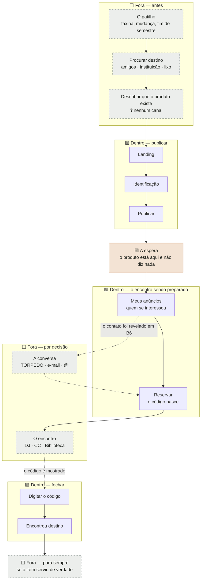

# Jobs to be Done, User Flows e Journey Mapping

> 🎨 **As duas jornadas também existem em versão visual** — no
> [Figma](https://www.figma.com/community/file/1663876864232938978)
> (fonte viva) e como PNG em [`docs/design/exportado/`](../design/exportado/) (snapshot
> versionado). O texto abaixo é a fonte do raciocínio; a figura mostra a forma.

**Cerimônia 17 do upstream**
**Entrada:** `02-sintese-questionario.md` (as falas) · `01-questionario-proto-personas_respostas.md`
(a fonte literal) · `14-mapa-de-empatia.md` · `15-personas-revisadas.md` · `PRD-0001` ·
`12-historias-e-criterios-de-aceite.md` (v2) · `18-decisoes-de-interacao.md` · `ADR-0004` ·
`data/locais-campus.toml`
**Alimenta:** `20-wireflows-e-mensagens.md` e o minuto 0:00–1:00 do vídeo

> **Rótulos.** `verificado` — li o arquivo · `documentado` — fonte canônica afirma, com
> autor, obra e página · `inferido` — leitura minha, pode estar errada.
>
> **Nenhuma job story deste documento é inventada sem dizer que é.** Cada uma abaixo traz
> a fala que a originou, com a pessoa e a linha da fonte. As que **não têm respondente**
> estão numa seção própria, marcadas 🔴, e não se misturam com as que têm.

---

## 0. Por que job story, e não user story

`documentado` — Jaime Levy, *Estratégias de UX*, **p. 72**:

> *"Em 2016, Clayton Christensen defendeu um framework teórico chamado JTBD (Jobs to Be
> Done, ou Trabalhos a serem Feitos), também conhecido como Jobs Theory (Teoria dos
> Trabalhos). A principal premissa da teoria é que a necessidade dos clientes é como um
> trabalho que precisa ser executado para que eles consigam fazer progressos em suas
> vidas. Se não puderem realizar esse trabalho, o cliente terá um problema."*

E, na mesma página, o erro que este documento precisa não cometer:

> *"Um erro comum é fazer com que essa seção soe como uma proposição de valor ou como uma
> lista de funcionalidades. Em geral, as pessoas que não trabalham com tecnologia não
> dizem algo como: 'Preciso de um aplicativo ou de uma plataforma online para…' ou
> 'Preciso ser capaz de adicionar colaboradores à minha conta'."*

**A diferença que importa aqui.** O arquivo `12-historias-e-criterios-de-aceite.md` já tem
dezoito user stories, e elas são boas no que fazem: descrevem **o que o sistema faz** e
viram teste. Nenhuma delas descreve **a situação em que a pessoa está**. A job story
descreve a situação e o progresso desejado — e é por isso que ela sobrevive a uma troca de
solução, enquanto a user story morre junto com a tela que ela nomeia.

Teste prático que apliquei em cada uma abaixo: **se a frase continua verdadeira num mundo
sem o Passa Adiante, é job story. Se ela cita uma tela, um botão ou um estado do sistema,
é user story disfarçada e foi reescrita.**

Formato canônico, e o único usado aqui:

> **Quando eu** ‹situação› **quero** ‹progresso› **para que eu** ‹resultado›

---

## 1. As job stories com respondente

Onze jobs. Sete têm fala; quatro não têm e estão na §2. **Nenhuma citação foi normalizada**
— a regra de `02-sintese-questionario.md:304-315` vale aqui igual.

### Lado de quem passa adiante

#### J1 · Fechar o gesto — **o job que justifica o produto**

> **Quando eu** deixo material meu numa iniciativa do campus e não vejo mais nada
> acontecer, **quero** saber que aquilo chegou a uma pessoa, **para que eu** não fique com
> a dúvida de ter espalhado lixo achando que estava doando.

`verificado` — P04, follow-up de 2026-07-28
(`01-questionario-proto-personas_respostas.md:164`):

> *"cheguei a deixar minhas apostilas do ensino médio lá uma vez, porém fiquei INSEGURO se
> realmente foi útil ou eu estava só 'espalhando lixo'"*

**O que este job derruba:** ele não pede canal, não pede facilidade e não pede vitrine.
Pede **resposta depois do ato**. É por isso que o enquadramento A caiu
(`02-sintese-questionario.md:321`) — a geladeira já tinha a fricção mínima possível.

⚠️ **P04 é o autor e não é cego** (`02:298`). Este é o job mais forte do produto e o seu
único apoio é o respondente menos independente da amostra. Registrado, não escondido.

#### J2 · Achar um destino sem virar uma pesquisa

> **Quando eu** decido desapegar de material acadêmico, **quero** achar um destino
> específico sem ter que investigar, **para que eu** não desista no meio do caminho e
> acabe jogando fora.

`verificado` — P01 (`01-…_respostas.md:22` e `:11`):

> *"já quis doar todas as minhas apostilas do ensino médio porém não consegui ir a fundo
> para descobrir um local seguro e objetivo para fazer isso"*
>
> *"Joguei minhas apostilas e trabalhos todas no lixo pois começaram a acumular muita
> poeira e não tinha onde guarda - las"*

⚠️ **O material citado é de ensino médio, não de universidade** — `02:44-46` exige que essa
ressalva viaje com a citação. O job continua plausível para material universitário, mas
**isso é extrapolação, não relato**.

**As duas falas são a mesma pessoa e o mesmo eixo:** a intenção existiu, a investigação
custou mais que o incômodo, e o lixo ganhou. O job não é "quero doar" — é **"quero não
precisar investigar"**.

#### J3 · Saber que existe um lugar que aceita

> **Quando eu** olho para o material que está parado na minha gaveta, **quero** saber que
> existe um lugar do campus que aceita aquilo, **para que eu** pare de adiar por não saber
> para onde levar.

`verificado` — P02 (`01-…_respostas.md:60` e `:63`):

> *"Ta parada em uma gaveta"* · e, perguntado para onde iria: *"Biblioteca?"*

**A interrogação é o dado**, e `15-personas-revisadas.md:104` já o nomeou: não é rejeição
do caminho, é desconhecimento de que existe caminho. Este é o job da **Persona 2**, e ele
é diferente do J2: a P01 procurou e não achou; a P02 **nunca procurou**, porque não sabia
que havia o que procurar.

#### J4 · Ser encontrado sem entregar o que é pessoal

> **Quando eu** publico algo para alguém do campus me procurar, **quero** escolher por
> onde me procuram, **para que eu** não precise entregar um dado que considero pessoal só
> para receber uma mensagem.

`verificado` — dois respondentes, e **um deles não foi primado**
(`01-…_respostas.md:145` e `:112`):

> P04: *"Eu não gostaria de compartilhar meu numero, acho pessoal de mais"*
>
> P03: *"gostaria de ter a opção de inserir qualquer coisa, como um e-mail profissional ou
> um @ de alguma rede social (incluindo wpp que vai ter isso daqui a pouco)"*

É o único job da lista com **duas fontes que dizem a mesma coisa por caminhos diferentes** —
P04 pelo lado negativo (o que não quer dar), P03 pelo positivo (o que quer poder escolher).
`02:148-150` registra que a decisão do canal institucional **sobrevive só por este
fundamento**, não pela tabela de preferência, que estava primada.

#### J5 · Doar o barato e não perder o caro

> **Quando eu** vou passar adiante algo que ainda vale dinheiro, **quero** poder pedir um
> valor sem me tornar vendedor, **para que eu** doe o que é barato e não perca o que é caro.

`verificado` — P02 e P03, **convergência sem contato** (`01-…_respostas.md:67` e `:117`):

> P02: *"Acho que eu não cobraria por livros mas algo como calculadora ou equipamentos
> talvez cobraria"*
>
> P03: *"Doaria se fosse algo não muito caro, como livros, apostilas, etc. Notebook eu
> tentaria revender."*

**É o job que sustenta `D2`** (`12:34`) e o único caso da amostra em que duas pessoas
externas chegaram ao mesmo critério sem se falar. `02:197` tirou a conclusão certa: não são
dois perfis, é **um usuário com dois modos**, e o gatilho é o preço do bem.

#### J6 · Entregar num lugar que os dois saibam achar

> **Quando eu** combino de entregar algo para alguém que não conheço, **quero** marcar num
> lugar do campus que as duas partes saibam achar sem explicação, **para que eu** não
> precise descrever o caminho nem encontrar um desconhecido num canto vazio.

`verificado` **em parte** — P01, na pergunta 10, sobre o que faltou perguntar
(`01-…_respostas.md:53`):

> *"acho que uma pergunta sobre lugares/postos de doação ou troca de materiais acadêmicos"*

⚠️ **A fala pede uma pergunta sobre lugares. Ela não descreve um encontro.** A parte
"encontrar um desconhecido num canto vazio" é `inferido` — vem de `data/locais-campus.toml`
(cabeçalho, *"quem chega não marca encontro num canto vazio"*) e de `16:160-161`, não da
entrevista. `14-mapa-de-empatia.md:105-108` já registrou que a ideia dos pontos de encontro
**tem origem nesta fala**, e é a única feature do produto com origem rastreável a uma
entrevista.

#### J7 · Não tratar a iniciativa como lixo

> **Quando eu** passo por uma iniciativa de doação no campus, **quero** ver que tem gente
> usando aquilo, **para que eu** não a trate como mais um monte de coisa largada.

`verificado` — P04 (`01-…_respostas.md:164`):

> *"ela é mal cuidada e super apagada de qualquer coisa, se não for alguém que ativamente
> quis olhar para ela... parece mais lixo na rua. Dentro do bloco D tbm tinha caixa de
> sucata, mas tbm parecia mais LIXO que algo bom"*

**Duas iniciativas independentes receberam o mesmo julgamento**, e é isso que torna a fala
mais que uma opinião. Este é o job que `H-12` atende (`12:234-246`), e é o motivo de o
estado vazio ser tela principal neste produto e não fallback.

---

## 2. As job stories **sem respondente** — 🔴 declaradas

`documentado` — Levy, **p. 72**, sobre o risco de escrever declarações que não se pode
validar: *"escolha seus termos com cuidado para que não sejam genéricos demais nem
específicos demais, ou difíceis de serem validados."*

**Nenhum ingressante foi entrevistado** (`02:287-289`). Todo o lado de quem chega ao campus
está abaixo, e **os quatro jobs são construção, não achado.** Estão escritos porque o
produto depende deles; estão separados porque confundi-los com os de cima seria o erro que
o discovery deste projeto já cometeu uma vez e corrigiu.

#### J8 · Conseguir material sem comprar 🔴

> **Quando eu** chego ao campus e descubro quanto custa o material do curso, **quero**
> descobrir quem tem aquilo sobrando, **para que eu** não comece o curso atrás de quem pode
> comprar.

🔴 **Zero respondentes, e há contra-evidência direta.** Os dois que precisaram de material
compraram novo — P03: *"comprei novo"* (`01-…_respostas.md:86`); P01: *"costumava sempre
optar por comprar os materiais já prontos e cedidos na própria faculdade"* (`:17`).
`02:209` é explícito: **nenhum dos quatro conseguiu material de veterano**, e o fluxo
veterano → calouro que a linha 21 do edital toma como dado não apareceu em nenhum relato.

#### J9 · Deixar de estar só matriculado 🔴

> **Quando eu** chego e não conheço ninguém, **quero** um jeito de encostar em gente do
> campus sem já precisar fazer parte de um grupo, **para que eu** deixe de estar só
> matriculado.

🔴 **É o `ADR-0004` escrito em formato de job story, e nada além disso.** A frase do autor
que o originou (`15:87`) — *"não só ir ver aula e ir embora, isso, um EAD faz"* — é do lado
de dentro, não do lado de quem chega. **Este é o job mais importante do produto e o de
menor evidência.** A assimetria está em `15:189-202` e não é resolvível com feature.

#### J10 · Saber se ainda estou na fila 🔴

> **Quando eu** digo que quero um item e a conversa não anda, **quero** saber se ainda
> estou na fila, **para que eu** decida se espero ou procuro outro.

🔴 **Nenhum respondente. Vem do modelo, não do campo** — `H-15` (`12:278-285`) e a Decisão 2
de `18:107-121`. É um job derivado de uma decisão de design, o que o torna circular: eu o
escrevi depois de decidir a tela que o atende.

#### J11 · Fechar o gesto do outro lado 🔴

> **Quando eu** recebo um item de alguém que não conhecia, **quero** que aquilo fique
> registrado como uma coisa que aconteceu entre nós, **para que eu** tenha um vínculo, e
> não só um objeto.

🔴 **Zero evidência, e o produto hoje não o atende** — ver §5, contradição `J-2`. Está
escrito porque, se o `ADR-0004` estiver certo, este é o job da Persona 3, e hoje ele não
tem uma linha de interface.

---

## 3. JTBD Canvas — só um, e do lado que tem evidência

Escrevi **um** canvas, não três. Um canvas por persona daria simetria e mentiria: das três
personas, só a Persona 1 tem relato de comportamento passado. As outras duas teriam um
canvas inteiro preenchido com suposição arrumadinha, que é exatamente o que
`14-mapa-de-empatia.md:24-26` recusou fazer com dois quadrantes vazios.

| Campo | Conteúdo |
|---|---|
| **Job performer** | Estudante ou ex-estudante com material acadêmico acumulado que **já tentou passar adiante pelo menos uma vez** — não "quem tem material", que inclui quem nunca agiu |
| **Job principal (funcional)** | Livrar-se de material que ainda vale **com a certeza de que ele foi útil a alguém** |
| **Job emocional** | Não ser a pessoa que espalhou lixo achando que estava doando |
| **Job social** | Ser alguém que passa adiante — `15:62` registra que passar material a um calouro do próprio curso *"é a versão explícita do que veteranos já fazem informalmente"* |
| **Jobs relacionados** | Decidir se doa ou cobra (**J5**) · Escolher como ser contatado (**J4**) · Combinar o encontro (**J6**) · Descobrir que existe caminho (**J3**) |
| **Solução atual (o concorrente)** | A gaveta · o lixo · a geladeira do ponto de ônibus · *"perguntar pro amigo"*. `02:214` — **nenhum dos quatro citou um app** |
| **Resultado esperado 1** | Minimizar o tempo entre decidir desapegar e o item sair de casa |
| **Resultado esperado 2** | **Minimizar a dúvida sobre o destino, depois de o item sair** ← é o único que a geladeira não entrega |
| **Resultado esperado 3** | Minimizar o dado pessoal exposto para receber uma mensagem |
| **Resultado esperado 4** | Maximizar a chance de o item ser usado por alguém que precisava |
| **O que o produto não mede** | O resultado 4. `ADR-0004:76-79` — *"Nada do que o produto entrega mede vínculo"*, e isso é permanente, não limitação de escopo |

**A linha que decide o produto é o resultado 2.** É o único da lista em que a geladeira
perde, e ela ganha em todos os outros — chega e larga, sem cadastro, sem foto, sem
formulário.

---

## 4. As duas jornadas

`documentado` — Levy, **p. 179**, sobre o que uma jornada precisa cobrir:

> *"Pense em toda a jornada do cliente, não importa se ela demora vinte minutos, como uma
> corrida no Uber, ou dois meses, como uma hospedagem no Airbnb. **Considere tanto as
> interações digitais como as experiências offline.** As legendas devem ser concisas uma
> frase."*

É por isso que as duas jornadas abaixo têm a coluna **"Onde"**, e é por isso que ela não é
um detalhe: neste produto, os dois momentos que decidem tudo — a conversa e o encontro —
são offline **por decisão**, não por lacuna.

Legenda da coluna **Onde**:
🟩 dentro do produto · ⬜ fora do produto, por decisão · 🟨 dentro, e mudo

---

### Jornada A — quem passa adiante

Persona 1 (`15:29-67`) e Persona 2 (`15:71-124`). É a jornada com evidência.

| # | Etapa | O que faz | O que pensa | O que sente | Ponto de dor | Onde |
|---|---|---|---|---|---|---|
| **A0** | **O gatilho** | Faxina, mudança, fim de semestre. Tropeça na caixa | *"isso ainda serve pra alguém"* | Incômodo leve, **sem urgência** | O gatilho é sempre externo (`14:172`). Ninguém acorda querendo desapegar | ⬜ |
| **A1** | **Procura destino** | Pensa nos amigos, na instituição, no lixo | *"pra onde eu levo isso?"* | Dúvida, e preguiça de investigar | *"não consegui ir a fundo para descobrir um local seguro e objetivo"* | ⬜ |
| **A2** | **Descobre o produto** | Alguém contou, ou viu um cartaz | *"isso é de verdade ou tá abandonado?"* | Ceticismo | **O produto não tem canal de aquisição nenhum.** Ver `J-1` na §5 | ⬜ |
| **A3** | **Chega na landing** | Lê a proposta, vê contadores e últimos itens | *"tem gente usando?"* | Alívio ou desdém, decidido em segundos | *"parece mais lixo na rua"* — se a landing parecer parada, acabou aqui | 🟩 |
| **A4** | **Se identifica** | Digita um nome | *"vou ter que fazer cadastro?"* | Impaciência | O concorrente **aceita o item sem perguntar nada** (`PRD-0001:43`) | 🟩 |
| **A5** | **Publica** | Preenche o formulário | *"quantos campos ainda faltam?"* | Pressa | Sete campos contra "chega e larga". Ver `J-3` na §5 | 🟩 |
| **A6** | **Espera** | **Nada** | *"será que alguém viu?"* | Ansiedade que vira desinteresse | **É o trecho mais longo da jornada e o produto é mudo nele.** Sem notificação (`PRD-0001:122`), sem lembrete (`I14`) | 🟨 |
| **A7** | **Alguém quer** | Abre "Meus anúncios", vê um interessado | *"quem é essa pessoa?"* | Alívio, e cautela | O produto não afirma nada sobre quem é, e **não pode** (`16:148-157`) | 🟩 |
| **A8** | **Combina** | Fala pelo TORPEDO, e-mail ou @ | *"e se não responder?"* | Insegurança | Contato falso vira beco sem saída (`16:170`). O produto não sabe se a mensagem chegou | ⬜ |
| **A9** | **Reserva** | Escolhe **uma** pessoa da lista | *"e os outros dois?"* | Desconforto de escolher | **Não tem como avisar quem não foi escolhido** (`16:119-122`). Eles descobrem lendo | 🟩 |
| **A10** | **Vai ao encontro** | Atravessa o campus até o DJ, o CC ou a Biblioteca | *"vai aparecer?"* | Expectativa | Pode não aparecer, e aí o item volta para a gaveta | ⬜ |
| **A11** | **Confirma** | Pede o código e digita | *"acabou?"* | Fechamento | Sinal ruim no campus — resolvido por `D6` (`12:318`), ver `J-4` | 🟩 |
| **A12** | **Depois** | Abre "Meus anúncios" e lê *"Encontrou destino"* | *"chegou em alguém"* | **A dor do J1, resolvida** | Se serviu **de verdade**, o produto nunca saberá (`ADR-0004:76-79`) | 🟩 |

**Oportunidades, por etapa:**

- **A3** — é a etapa que decide a jornada inteira, e ela dura segundos. `documentado` —
  Krug, **p. 39**: *"na maioria das vezes não escolhemos a melhor opção escolhemos a
  primeira opção razoável, uma estratégia conhecida como sacrifício."* A landing não é
  julgada, é **sacada**. O que ela precisa provar em um olhar é uma coisa só: que tem gente.
- **A5** — cada campo cortado do formulário é fricção devolvida ao concorrente. Ver `J-3`.
- **A6** — **a maior oportunidade não explorada da jornada, e a mais barata.** Hoje a
  pessoa não tem motivo nenhum para reabrir o app enquanto espera. Não proponho
  notificação (cortada, `PRD-0001:122`) nem número de visualizações (inventaria métrica
  que `12:240-246` proíbe). Proponho o que já existe e não está sendo dito: **"Meus
  anúncios" mostrar quantas pessoas se interessaram, como número, no card.** É dado real,
  não é promessa, e é a única coisa que muda sozinha entre uma visita e outra.
- **A9** — o desconforto de escolher é real e o produto não o alivia. Deliberado: aliviar
  exigiria o produto opinar sobre pessoas, e ele não sabe nada sobre nenhuma delas.
- **A12** — é o único momento em que o produto entrega o que prometeu. Ele acontece uma vez
  por item e dura três segundos.

---

### Jornada B — quem chega ao campus

🔴 **Persona 3 (`15:127-161`). Nenhum respondente. Toda esta tabela é construção.** Está
escrita porque o `ADR-0004` diz que este é o lado que justifica o produto — e um lado que
justifica o produto e não tem jornada é uma lacuna maior que uma jornada suposta e
declarada.

| # | Etapa | O que faz | O que pensa | O que sente | Ponto de dor | Onde |
|---|---|---|---|---|---|---|
| **B0** | **Descobre o custo** | Vê a lista de material do curso | *"vou ter que comprar tudo isso?"* | Aperto | 🔴 Contra-evidência: quem precisou **comprou novo** | ⬜ |
| **B1** | **Procura ajuda** | Pergunta… para quem? | *"não conheço ninguém aqui"* | Isolamento | 🔴 O grupo de WhatsApp **é fechado por definição** (`ADR-0004:56-59`) | ⬜ |
| **B2** | **Descobre o produto** | ❓ | ❓ | ❓ | **Este é o buraco real da jornada B, e não é falta de entrevista.** Ver `J-1` | ⬜ |
| **B3** | **Olha a vitrine** | Rola, filtra por categoria | *"tem coisa boa aqui?"* | Curiosidade | Sem busca (`PRD-0001:120`), quem sabe o que quer só acha rolando | 🟩 |
| **B4** | **Acha algo** | Abre o item, quer o contato | *"como falo com essa pessoa?"* | Pressa | O contato é gate: só depois de se identificar (`H-08`) | 🟩 |
| **B5** | **Se identifica** | Digita um nome | *"vou ter que dar meus dados?"* | Desconfiança | Um campo, e nenhuma tela pode chamar isso de "Entrar" (`16:155-158`) | 🟩 |
| **B6** | **Registra interesse** | Toca em "Tenho interesse", recebe o contato | *"agora é comigo"* | Alívio | **É ela quem inicia a conversa** (`16:114-116`) — e pode não ter coragem | 🟩 |
| **B7** | **Fala com a pessoa** | Manda mensagem no TORPEDO ou e-mail | *"vai responder?"* | Vulnerabilidade | ⬜ Fora do produto. Se não responderem, o produto não sabe e não ajuda | ⬜ |
| **B8** | **Espera a reserva** | Abre "Meus interesses" | *"ainda estou na fila?"* | Incerteza | **A tela existe justamente para esta linha** (Decisão 1, `18:83-101`) | 🟩 |
| **B9** | **É escolhida** | Vê "Reservado para você" e o código | *"é meu"* | Empolgação | Descobre lendo — ninguém avisa | 🟩 |
| **B10** | **Vai ao encontro** | Vai ao ponto do campus, e talvez seja a primeira vez que vai ali | *"onde fica o DJ?"* | Nervosismo | ⬜ **É aqui que o `ADR-0004` acontece** — e `data/locais-campus.toml` é o único artefato que a ajuda | ⬜ |
| **B11** | **Mostra o código** | Abre a tela, mostra os seis caracteres | *"pronto"* | Fechamento | Funciona sem sinal por `D6` (`12:318`) | 🟩 |
| **B12** | **Depois** | **Nada.** | — | — | **A jornada dela termina sem fechamento.** Ver `J-2` | 🟨 |

**Oportunidades, por etapa:**

- **B2** — nenhuma tela resolve. O produto precisa de uma porta de entrada física ou social
  no campus, e isso não é software. Registrado como `J-1`.
- **B6** — o produto pede que ela inicie a conversa com um desconhecido. É o ato mais caro
  socialmente da jornada inteira, e o produto não oferece nada para reduzi-lo — nem uma
  frase pronta, nem um contexto. Não proponho chat (cortado, `PRD-0001:106`). **Proponho
  uma linha na tela que revela o contato**, dizendo o que dizer. Custa uma frase e está
  em `20-wireflows-e-mensagens.md`, T3.
- **B10** — `data/locais-campus.toml` já carrega `onde_fica`, `tambem_chamado` e
  `movimento`, e nenhuma história de usuário exibe esses campos. **`H-04` grava o local;
  nenhuma tela mostra onde ele fica.** É `J-5`.
- **B12** — ver a proposta de fechamento em `J-2`. É a mudança mais barata deste documento.

---

## 5. Onde o produto não está — e onde ele está e fica calado



### As quatro ausências, e a diferença entre elas

| # | Onde | Natureza | Onde está decidido |
|---|---|---|---|
| **1** | **A conversa** | ⬜ **Ausência por decisão.** Chat, comentário e mensagem estão fora — construir mais um canal seria pedir que adotassem um lugar novo para fazer o que já fazem | `PRD-0001:106-108` |
| **2** | **O encontro** | ⬜ **Ausência que é o produto.** `ADR-0004:72`: *"A entrega presencial deixa de ser custo do processo e passa a ser o produto acontecendo."* O produto sugere o lugar e não observa nada | `ADR-0004:72` · `data/locais-campus.toml` |
| **3** | **Se o item serviu** | ⬜ **Ausência permanente, e não é escopo.** `ADR-0004:76-79`: *"Nada do que o produto entrega mede vínculo (…) isso é permanente, não uma limitação de escopo"* | `ADR-0004:76-79` |
| **4** | **A espera** | 🟨 **Não é ausência — é silêncio.** O produto está lá, funcionando, e não tem nada a dizer entre publicar e alguém aparecer. É o trecho mais longo das duas jornadas | `PRD-0001:122` · `I14` (`17:772`) |

**A quarta é a que ninguém tinha nomeado**, e é diferente das outras três. As três primeiras
são recusas defensáveis e documentadas. A quarta é um efeito colateral de duas recusas
(notificação e lembrete) que ninguém somou. A pessoa publica, fecha o app e não tem motivo
nenhum para reabrir — e o produto inteiro depende de ela reabrir.

---

## 6. Contradições encontradas, com arquivo e linha

Numeradas `J1…J5` para não colidir com a série `C` de `17-modelagem-de-dominio.md` nem com
a série `U` de `18-decisoes-de-interacao.md`.

### J-1 · A jornada de quem chega não tem primeira etapa

**Nova.** O `ADR-0004:68-70` declara que a Persona 3 é *"o único perfil que o WhatsApp
estruturalmente não alcança"*. A etapa `B2` — como ela descobre que o produto existe — não
tem resposta em nenhum documento, e não é falta de entrevista: **é falta de canal.**

| Arquivo:linha | O que diz |
|---|---|
| `PRD-0001:120` | *"Busca por texto. Não foi pedida e não apareceu em nenhuma entrevista"* |
| `PRD-0001:122` | *"Avisos e notificações"* — fora de escopo |
| `PRD-0001:102` | *"Aplicação acessível publicamente na internet"* — desejável, não essencial |

O produto é público na web e **não tem como ser encontrado por ninguém que não receba o
endereço de outra pessoa.** Para a Persona 1 isso é aceitável: ela já está na rede. Para a
Persona 3, que por definição não está em rede nenhuma, é circular — ela precisa de alguém
que a apresente ao produto que existe para apresentá-la a alguém.

**Não é decidível por interação, e não é bug.** É a consequência de o produto ser entrega
de desafio técnico sem operação (`PRD-0001:54-56`). Registro para que ninguém escreva no
vídeo que o produto alcança quem está fora — `ADR-0004:80-81` já proíbe: *"'Conectamos o
campus' é uma frase que a demo não sustenta."*

### J-2 · O produto fecha o gesto de um lado só

**Nova, e é a que tem conserto barato.** `H-11` é *"a história que justifica o produto"*
(`12:223`), e ela entrega fechamento **a quem publicou**. Quem recebeu faz mais atos que
quem entregou — identificar-se, registrar interesse, iniciar a conversa, atravessar o
campus, guardar e mostrar o código — e no fim vê o item sair de "Meus interesses" com o
rótulo genérico de encerrado.

| Arquivo:linha | O que diz |
|---|---|
| `12:272` (`H-14`) | *"Item removido ou encerrado por outro caminho aparece com o estado atual"* |
| `12:228` (`H-11`) | *"A vitrine pública mostra apenas que o item encontrou destino — nunca quem recebeu"* |
| `ADR-0004:68-70` | A Persona 3 é o motivo declarado de o produto existir |

**Proposta, e ela não abre escopo nenhum:** em "Meus interesses", o item confirmado com
aquela pessoa exibe

```
Encontrou destino · com você · 14 de agosto
```

Não é notificação, não é volta obrigatória (`PRD-0001:109-111` continua respeitado — ela vê
**se** abrir), não é tela nova, não é confirmação bilateral, e não revela nada a terceiros:
quem lê é a própria pessoa reservada. **Custa um rótulo.** Exige um critério a mais em
`H-14`, e é decisão de produto — do Gabriel, não minha.

### J-3 · O formulário não cabe onde o critério diz que cabe

**Nova.** `12:133` exige: *"O formulário cabe em **uma tela de celular sem rolagem**"*. E
`12:123` lista o que ele aceita:

> *"título, descrição, categoria, doação/venda, preço (se venda), endereço de imagem,
> **locais de encontro**"*

São **sete campos**, e `16:64-77` acrescenta mais dois na primeira publicação — meio de
contato e tipo do contato. **Nove campos não cabem numa tela de celular sem rolagem**, e o
critério vira teste na W0.

Não decido isto: cortar campo é produto. O que registro é que **a saída não é cortar o
critério**, porque ele existe por um motivo verificado — `09-corte-de-escopo.md:131-134`
liga o tamanho do formulário diretamente ao tempo do trecho do diferencial no vídeo. As
saídas de interação estão em `20-wireflows-e-mensagens.md`, T4.

### J-4 · `U2` foi resolvida por `D6`, e a copy de `18` não foi atualizada

**Verificada agora.** `18:610-625` registrou `U2`: o código precisa ser lido no campus, e a
regra de cache de `ADR-0003` proibia reter dado de pessoa identificada. A mitigação
proposta era copy fraca: *"Anote ou tire um print — o sinal no campus pode falhar na hora."*

`12` v2 (2026-07-28, posterior a `18`) resolveu com `D6`:

| Arquivo:linha | O que diz |
|---|---|
| `12:38` (`D6`) | *"O **código de confirmação** é segredo de transação, **não dado pessoal** — pode ser retido no dispositivo"* |
| `12:318` | *"**O código de confirmação é retido** e permanece legível sem conexão"* |

**`U2` está fechada.** A copy de `18:220` ficou obsoleta e a substituta está em
`20-wireflows-e-mensagens.md`, T3. **Não editei `18`** — proponho a troca e o Gabriel
decide, porque aquelas quatro decisões foram aprovadas como estão.

### J-5 · O arquivo de locais tem três campos que nenhuma tela mostra

**Nova.** `data/locais-campus.toml` guarda, por local, `tambem_chamado`, `onde_fica`,
`historia`, `movimento` e `seguranca` — e o cabeçalho declara para quem eles existem:

> *"Registrar os dois lados é o que impede o calouro de aprender um nome e não entender o
> outro — e é justamente o conhecimento que hoje só passa de veterano para calouro."*

Nenhuma história de usuário exibe nada além do nome. `H-04` grava o local; `H-17` o
pré-seleciona; **nenhuma mostra onde ele fica.** Sob o `ADR-0004`, esses campos são o
onboarding do campus embutido no produto, e hoje são dado morto.

Custo de corrigir: uma linha por local, na página do anúncio. Está em
`20-wireflows-e-mensagens.md`, T3.

---

## 7. O que não consegui decidir, e o que faltou

| O que | O que faltou |
|---|---|
| **Se a jornada B existe** | Acesso a ingressantes. É a mesma lacuna de `15:156-160` e `02:287-289`, e nenhum artefato deste ciclo a fecha. **Os quatro jobs da §2 continuam sendo construção até alguém entrevistar quem chegou este semestre** |
| **Se `A6` — a espera — merece uma tela** | Achei que não, e mostrei o número de interessados no card em vez disso. Mas não sei se isso basta: a pessoa precisa **abrir** para ver o número, e o problema da espera é justamente que ela não abre. **Só uso real diria**, e não haverá |
| **Se o job `J5` (doar ou cobrar) sobrevive fora de computação** | 3 de 4 respondentes são de computação (`02:292-294`). Cursos de material caro — medicina, direito, engenharia — podem inverter o limiar, e nada aqui testa isso |
| **Se `J-2` enfraquece `H-11`** | A proposta dá fechamento a quem recebe. Não sei se isso reduz o peso do fechamento de quem entrega, que é o job com evidência. **Recomendo fazer**, porque um rótulo a mais numa tela que já existe é o menor custo do documento — mas a decisão é do Gabriel |
| **Se o número de interessados no card assusta em vez de animar** | "0 interessados" num item parado é honesto e é desanimador — a mesma tensão que `12:241` resolve para a landing. Não tenho como testar |

---

## Fontes

Todas obtidas via MCP `acdg-skills`, domínio `design-ux-ui` (`skills_buscar` +
`skills_citar` com `verificarTerms`), com linha e página verificadas na chamada.
**Nenhuma citada de memória.**

| Obra | Página | Para quê |
|---|---|---|
| Jaime Levy, *Estratégias de UX* | **p. 72** (JTBD, Jobs Theory, e o erro de escrever necessidade como lista de funcionalidades) | §0 e §2 — o formato e o critério de rejeição das job stories |
| Jaime Levy, *Estratégias de UX* | **p. 179** (*"Considere tanto as interações digitais como as experiências offline"*) | §4 — a coluna "Onde", e a razão de ela existir |
| Travis Lowdermilk, *Design Centrado no Usuário* | **p. 77** (cenários como mini-histórias; *"Se você for honesto em relação às limitações de seu aplicativo, explorar diferentes cenários poderá ajudar a entender o quanto uma limitação em particular representaria um problema"*) | §4 — as etapas de exceção nas duas jornadas |
| Steve Krug, *Não Me Faça Pensar, Revisitado (3ª ed.)* | **p. 39** (*"não escolhemos a melhor opção escolhemos a primeira opção razoável"* — sacrifício / satisficing) | §4, oportunidade de `A3` — a landing é sacada, não julgada |

E a skill **`user-research`** da Anthropic
(`~/.claude/plugins/cache/knowledge-work-plugins/design/1.2.0/skills/user-research/SKILL.md`),
que nomeia journey mapping e jobs to be done como os dois frameworks de análise usados
aqui — mas **não** prescreve formato, que veio do Levy.

**O que a skill `user-research` recomenda e este documento não fez:** ela pede 5–8
participantes para entrevista. Temos 4, um deles não-cego. Isso não é corrigível neste
ciclo, e a consequência está declarada em cada 🔴 acima em vez de diluída num rodapé.
