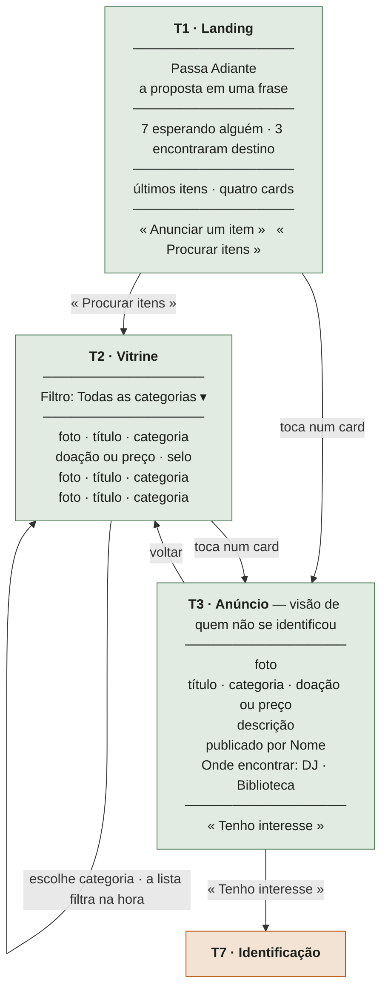
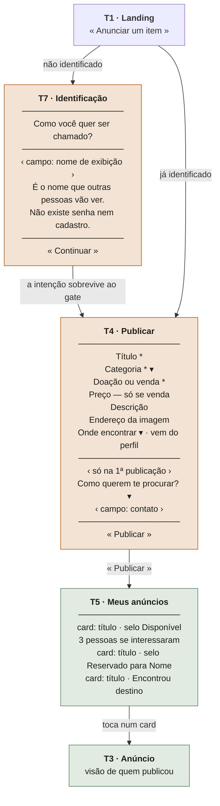
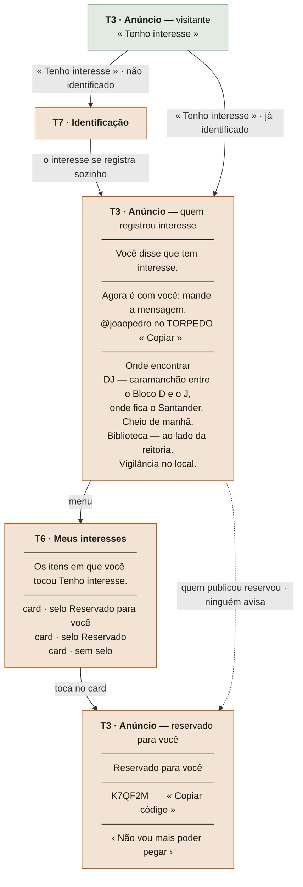
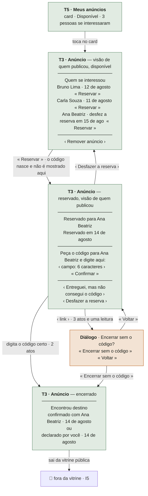
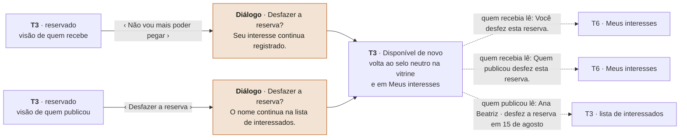

# Wireflows e mensagens de erro

**Cerimônia 18 do upstream**
**Entrada:** `19-jobs-to-be-done.md` · `18-decisoes-de-interacao.md` ·
`12-historias-e-criterios-de-aceite.md` (v2) · `16-modelo-de-dados-por-perfil.md` ·
`17-modelagem-de-dominio.md` · `PRD-0001` · `ADR-0003` · `ADR-0004` ·
`data/locais-campus.toml`
**Alimenta:** a **W0** — cada frase de erro abaixo é um teste, e cada estado vazio é um
critério que hoje está escrito como *"exibe estado vazio"* sem dizer o quê

> **Rótulos.** `verificado` — li o arquivo · `documentado` — fonte canônica afirma, com
> autor, obra e página · `inferido` — leitura minha, pode estar errada.
>
> **Toda copy abaixo está escrita, não descrita.** Onde aparece uma frase entre blocos de
> código, é aquela frase — não um resumo dela. É o que separa este documento de um briefing.

---

## 0. O que um wireflow precisa responder

Wireflow é wireframe e fluxo na mesma figura: o esqueleto da tela **e** para onde cada ação
leva. A figura só serve se responder, de um olhar, o que a arquitetura da informação exige
de qualquer tela.

`documentado` — Thiago Tamosauskas, *Arquitetura da Informação e UX*, **p. 25**:

> *"Entre um uma página randômica dentro de um site. Você consegue responder a todas estas
> perguntas:*
> *0. Com base nos elementos visíveis você pode ver dizer em que site está?*
> *0. Onde você está em relação ao resto do site*
> *0. Em qual seção você está?*
> *0. Quem é a página pai?*
> *0. Você sabe prever para onde pode ir a partir daqui?*
> *0. Os links são descritivos o bastante para você ter uma ideia de seus conteúdos?"*

E, na mesma página, o que a tela precisa antecipar:

> *"Estejam ou não cientes disso usuários chegam a um site sempre com questões em mente. (…)
> 0. Onde estou? (…) 0. Eu sei o que quero: Posso pular diretamente para lá? (…) 0. Não sei
> o que quero, o que vocês tem para oferecer?"*

**Por que isto é mais severo neste produto que na média.** Uso episódico, duas ou três vezes
por ano (`PRD-0001:42`): a pessoa lê cada tela **pela primeira vez toda vez**. Nenhuma
ambiguidade é corrigida por hábito, porque não existe hábito.

E `documentado` — Krug, **p. 57**, sobre a única coisa que a página precisa entregar antes
de qualquer conteúdo:

> *"Divida as páginas em áreas claramente definidas (…) Idealmente, em qualquer página da
> Web bem projetada, os usuários podem jogar uma página e diga: 'Coisas que posso fazer
> neste site!' (…) 'Navegação para chegar ao resto do site!'"*

**A regra de composição que sai daí, e que vale para todas as telas abaixo:** cada tela tem
**uma** região de ação primária, e ela é a primeira coisa depois do título. As ações
secundárias existem, aparecem, e não competem — hierarquia, nunca ocultação.

`documentado` — Krug, **p. 186**, sobre por que ocultar é a resposta errada:

> *"Para que as affordances funcionem, elas precisam ser perceptíveis, e algumas
> características dos dispositivos móveis os tornaram menos perceptíveis ou, pior,
> invisíveis. E por definição, affordances são a última coisa que você deve esconder."*

E o método de contagem de atos usado nos wireflows abaixo — `documentado`, Travis
Lowdermilk, *Design Centrado no Usuário*, **p. 133**:

> *"A análise de tarefas consiste no estudo de cada passo de uma determinada tarefa. A
> questão, nesse tipo de análise, é compreender totalmente todos os passos exigidos para
> completar uma tarefa e melhorar o processo com seu aplicativo."*

**O concorrente é uma geladeira e um grupo de WhatsApp. Cada passo a mais é um passo que
eles não exigem.** Por isso cada wireflow abaixo traz a contagem de atos, e não como
enfeite: é o único número honesto que este produto consegue produzir sem operação real.

---

## 1. Inventário de telas

### As sete que já existem nos critérios

| # | Tela | Onde está definida | Precisa de identificação |
|---|---|---|---|
| **T1** | **Landing** | `H-03` (`12:107-116`) | ❌ |
| **T2** | **Vitrine** | `H-01`, `H-02` (`12:81-105`) | ❌ |
| **T3** | **Página do anúncio** | `H-08`, `H-11`, `H-15` · quatro visões | ❌ para ver, ✅ para agir |
| **T4** | **Publicar** | `H-04` (`12:118-133`) | ✅ |
| **T5** | **Meus anúncios** | `H-05`, `H-06` (`12:135-155`) | ✅ |
| **T6** | **Meus interesses** | `H-14` (`12:264-276`) · Decisão 1 de `18` | ✅ |
| **T7** | **Identificação** | `16:54-62` — **não tem história de usuário própria** | — |

> **T7 não tem história**, e é a única tela obrigatória do produto nessa situação. Ela é
> pré-condição de `H-04`, `H-05`, `H-08` e `H-14`, e não é testada por nenhuma delas.
> Registrado em `W-6`.

### O que estou inventando, e digo que estou

| O que | É tela nova? | Decisão |
|---|---|---|
| **Lista de interessados** (`H-09`) | **Não.** Bloco de T3, visão de quem publicou | `H-09` diz *"Exibe a lista de interessados"* e não diz onde. Tela própria custaria uma navegação a mais no meio do ato de reservar, e a informação que decide a escolha — qual item é — está na página do anúncio |
| **Bloco de contato público** (`16:64-77`) | **Não.** Bloco de T4, só na primeira publicação | Tela própria seria um formulário antes do formulário. Ver a tensão em `J-3` de `19` |
| **Três diálogos** | Não são telas | Encerrar sem código · Desfazer, visão de quem publicou · Desfazer, visão de quem recebe. Copy dos dois primeiros já em `18:388-401` e `18:504-516` |
| **Perfil** (`H-16`, `H-17`) | Sim, e **não desenhei** | Fatia 3, bônus. Se entrar, é T8. Não invento tela de bônus antes de o obrigatório fechar |

**Nenhuma outra tela foi inventada.** Onde faltou superfície, resolvi com bloco numa tela
existente — e disse.

### A decisão de fluxo que atravessa três wireflows: **a intenção sobrevive ao gate**

> **Quando um ato exige identificação, a identificação acontece e o ato se completa
> sozinho. A pessoa volta para onde estava, com a coisa feita.**

Vale para: tocar em "Tenho interesse" sem estar identificado · tocar em "Anunciar um item"
na landing · abrir "Meus interesses" por um link.

**Descartado: voltar para a tela com o botão ainda lá, para a pessoa tocar de novo.**
`documentado` — Krug, **p. 39**:

> *"na maioria das vezes não escolhemos a melhor opção escolhemos a primeira opção
> razoável, uma estratégia conhecida como sacrifício."*

Quem volta e vê o mesmo botão não conclui *"agora posso tocar"* — conclui *"não funcionou"*,
que é a primeira leitura razoável. E paga dois atos pelo mesmo ato.

**O limite:** só se completa o ato que a pessoa **já tocou**. A identificação não autoriza
nada retroativamente e não é sessão que "lembra" de intenções antigas — é a intenção
daquele toque, naquela tela, naquele momento.

---

## 2. Os wireflows

Legenda dos diagramas: `« Botão »` é ação primária · `‹ link ›` é ação secundária ·
`───` separa regiões da tela.

### WF-1 · Chegar e olhar — **2 atos até ver um item**

Não exige identificação em passo nenhum. É o caminho da Persona 3 (`B3`–`B4` de `19`) e o
primeiro terço do vídeo.



**O que a tela responde, na ordem em que a pessoa pergunta** (Tamosauskas, p. 25):

| Pergunta | T1 responde | T2 responde | T3 responde |
|---|---|---|---|
| *Onde estou?* | o nome + a frase de proposta | o filtro, mostrando que isto é uma lista | o título do item |
| *O que vocês têm?* | os últimos itens, visíveis sem rolar | a lista inteira | — |
| *Posso pular direto?* | os dois CTAs | — | — |
| *Para onde posso ir daqui?* | dois destinos, e só dois | de volta, ou para um item | de volta, ou "Tenho interesse" |

**Dois CTAs e não três** (`12:115`). O terceiro destino que alguém sempre quer acrescentar —
"como funciona" — é a própria frase de proposta. Krug, p. 57: a página precisa que a pessoa
diga *"coisas que posso fazer neste site"*, e duas coisas é o que ela consegue dizer.

### WF-2 · Publicar — **1 identificação + 1 formulário**



**Atos, contados:** identificar (1 campo + 1 toque) → preencher (3 campos obrigatórios
mínimos) → publicar (1 toque). **Mínimo viável: 6 toques e 4 digitações.**

**A geladeira custa zero.** O produto nunca ganha nesse eixo, e não deve tentar — ele ganha
no `A12` da jornada, não no `A5`. O que ele pode é não perder por bobagem, e é por isso que
os campos opcionais estão abaixo dos obrigatórios e o asterisco existe.

**Sobre `J-3` (nove campos numa tela sem rolagem, `12:133`):** o que resolvo por interação é
a **ordem** — os três obrigatórios primeiro, a ação primária visível sem rolar, e o bloco de
contato **abaixo do botão de publicar não**, porque é obrigatório na primeira vez. Cortar
campo é decisão de produto. `inferido`: se um campo tiver que sair, o candidato é
**descrição** — é o único que não aparece em nenhum critério de aceite como obrigatório nem
como filtro, e a foto e o título já dizem o que é a coisa.

### WF-3 · Querer um item — **o caminho da Persona 3**



**A seta tracejada é a decisão mais cara do produto e a mais fácil de esquecer:** entre "eu
disse que quero" e "é meu", **ninguém avisa**. `T6` existe para que essa transição tenha
onde ser lida (Decisão 1, `18:83-101`).

**A copy que fecha o `B6` de `19`** — quando o contato é revelado, a tela diz o que fazer com
ele, porque iniciar conversa com um desconhecido é o ato mais caro socialmente da jornada:

```
Você disse que tem interesse.

Agora é com você: mande a mensagem.

    @joaopedro no TORPEDO                        « Copiar »

Se não souber como começar: diga qual item é e proponha um dos
pontos abaixo.
```

**A copy que fecha o `J-5` de `19`** — o bloco de locais usa os campos que
`data/locais-campus.toml` já guarda e que hoje nenhuma tela mostra:

```
Onde encontrar

DJ — caramanchão entre o Bloco D e o Bloco J, onde fica a agência
     do Banco Santander. Também chamado de Caramanchão, Santander.
     Cheio a manhã inteira e do fim da tarde ao começo da noite.

Biblioteca — ao lado da reitoria. Vigilância no local.
     Movimento moderado o dia inteiro, sem horário de pico.
```

> `documentado` — Lowdermilk, **p. 133**: a análise de tarefas serve para *"compreender
> totalmente todos os passos exigidos para completar uma tarefa"*. **"Ir até o DJ" é um
> passo da tarefa**, e é o único passo que o produto pode instruir sem intermediar nada.
> Deixar o campo `onde_fica` no arquivo e não na tela é jogar fora a única ajuda que o
> produto sabe dar à Persona 3 fora do software.

### WF-4 · Reservar e confirmar — **o único trecho que não é CRUD**



**A assimetria de atos é o mecanismo, e está desenhada na figura** (`18:304-312`):
confirmar com código = **2 atos**; declarar sem código = **3 atos e uma leitura**. O atalho
não está escondido — está **abaixo**, com peso de corpo, na mesma rolagem. Krug, p. 186:
*"affordances são a última coisa que você deve esconder."*

**O que a figura torna verificável e a prosa não:** o código **não aparece em nenhum nó
deste wireflow**. `I17` (`17:780`) é estrutural, e um wireflow em que o código aparecesse na
visão de quem publicou seria um wireflow errado antes de qualquer código ser escrito.

### WF-5 · Desfazer — os dois lados, e o que cada um vê depois



**As três linhas tracejadas são a mesma transição de domínio (`I19`) lida por três pessoas
diferentes.** É o que justifica `porQuem` no evento (`17:923`) existir na interface e não só
no modelo: sem ele, quem recebia leria *"esta reserva foi desfeita"* sem saber se foi ela.

---

## 3. Estados vazios — **tela principal, não fallback**

O concorrente literal é uma geladeira que *"parece mais lixo na rua"*
(`02-sintese-questionario.md:229`). **Uma tela vazia que parece morta reproduz exatamente o
problema que o produto ataca**, e é por isso que esta seção não é apêndice.

Estrutura da skill `ux-copy`: *o que isto é + por que está vazio + como começar.*

**Regra que vale nos sete casos, e vem do `PRD-0001:167`:** *"Nenhuma promessa é feita sobre
quando alguém aparecerá — dizer 'logo alguém verá' seria mentira."* Nenhuma frase abaixo
promete futuro.

### EV-1 · Vitrine sem nenhum item — `12:91`

```
Nada aqui ainda.

O Passa Adiante começou agora. O primeiro item que alguém publicar
aparece nesta página.

« Publicar a primeira coisa »
```

> A segunda frase faz o trabalho todo: **"começou agora" é o oposto de "foi abandonado"**, e
> é a única diferença entre esta tela e a geladeira. É fato verificável, não animação.

### EV-2 · Categoria sem itens — `12:101`

```
Nenhum item em Calculadoras e instrumentos agora.

Outras categorias têm coisas.

« Ver todas as categorias »
```

> **Não é erro** — `12:101` é explícito. E o botão devolve o caminho em um toque, em vez de
> obrigar a pessoa a reabrir o filtro e caçar a opção "Todas".

### EV-3 · Landing com a base vazia — `12:241`

```
O Passa Adiante acabou de abrir. Ainda não há itens publicados.

« Publicar a primeira coisa »   « Ver como funciona »
```

**Decisão, e é a única do documento em que substituo um número por uma frase:** com a base
vazia, o bloco de contadores **não exibe "0 · 0"** — exibe a frase acima.

`inferido`, e o argumento: `12:240` manda os números virem da base, e vêm — a frase diz o
mesmo fato que os zeros diriam. **"0 encontraram destino" é a frase mais desanimadora que
este produto consegue imprimir**, e imprimi-la é escolher a formulação que mais se parece
com a geladeira entre duas formulações verdadeiras. Não é esconder (Krug, p. 204, continua
valendo): a informação está lá, dita.

> ⚠️ Este estado quase não acontece: `09-corte-de-escopo.md:102-106` popula a vitrine com
> seed. Ele existe porque `12:241` o exige, e porque é o estado em que a banca cairia se
> derrubasse o volume.

### EV-4 · Meus anúncios, sem nada publicado — `12:144`

```
Você ainda não publicou nada.

Quando publicar, seus itens ficam aqui — com o estado de cada um, e
é daqui que você confirma quando alguém pegar.

« Publicar um item »
```

> A oração do meio existe porque `H-11` acontece **nesta tela**, e com uso episódico a
> pessoa não vai lembrar disso quando voltar. Krug, p. 88: a navegação *"nos diz como usar
> o site"*.

### EV-5 · Meus interesses, sem nada — reuso literal de `18:193-202`

```
Você ainda não demonstrou interesse em nada.

Quando tocar em "Tenho interesse" num item, ele aparece aqui — e é daqui
que você volta para achá-lo depois.

« Ver o que está disponível »
```

### EV-6 · Lista de interessados, sem ninguém — `12:198`

```
Ninguém demonstrou interesse ainda.

Quem tocar em "Tenho interesse" aparece aqui, com o nome que
escolheu mostrar.
```

> **Sem botão e sem promessa.** `12:198` é literal: *"sem prometer que alguém aparecerá"*.
> Não há ação que quem publicou possa tomar aqui — e oferecer uma seria inventar trabalho
> para disfarçar a espera. É o estado `A6` de `19`, e é o mais difícil de escrever
> honestamente.

### EV-7 · Anúncio sem imagem

O endereço da imagem **não é obrigatório** (`12:124`). No card e na página:

```
sem foto
```

Em cinza, no lugar da imagem, com o título e a categoria em tamanho normal. **Não usa ícone
de imagem quebrada** — a diferença entre "não tem foto" e "a foto quebrou" é informação, e
a segunda tem copy própria em `E-05`.

---

## 4. Error Message Guidelines

### 4.1 A estrutura, e de onde ela vem

**Estrutura da skill `ux-copy`:** *o que aconteceu + por quê + como resolver.*

`documentado` — Tom Greever, *Articulando Decisões de Design*, **p. 219**:

> *"Seja direto e claro acerca do que aconteceu. (…) mas também deve ser rápido para
> apresentar a solução e manter o foco na ação, e não nas desculpas. (…) Os motivos pelos
> quais algo deu errado não são, nem de longe, tão importantes quanto corrigir o problema.
> Não fique obcecado em recontar a história. Em geral, isso soa como desculpas."*

> ⚠️ **A passagem trata de admitir um erro a stakeholders, não de escrever mensagem de
> erro.** A citação é `documentado`; a transferência para copy de interface é **`inferido`**,
> e a faço porque a estrutura é literalmente a mesma que a skill `ux-copy` prescreve, dita
> por outro caminho: diga o que aconteceu, vá direto para a ação, não recorra a desculpa.

### 4.2 As oito regras deste produto

| # | Regra | Por quê |
|---|---|---|
| **1** | **Diz o que aconteceu, não o que o sistema fez.** ❌ *"Erro de validação"* ✅ *"Falta o título"* | `12:128` exige dizer **qual** campo falta, não uma mensagem genérica |
| **2** | **Não acusa a pessoa.** Nada é "inválido" — está faltando, não confere, ou não existe | `16:148-157` já proíbe a interface de afirmar identidade; afirmar culpa é o mesmo defeito |
| **3** | **Nenhum pronome de terceira pessoa com gênero**, em nenhuma frase | `18:529-537`, Decisão 4. Nome de exibição é livre (`16:58`) — errar misgendera uma pessoa real |
| **4** | **A terceira parte é ação. Se não houver ação, a frase diz que não há** | O produto às vezes não tem saída a oferecer. `18:384-386`: fingir que tem seria pior |
| **5** | **A mensagem nunca vaza o que a regra protege** — contato, código, ou qual anúncio | `I11` (`17:769`), `I17` (`17:780`), `12:183`, `17:727`. Vazar no corpo do erro é o mesmo defeito por outra porta |
| **6** | **Casos que não podem ser distinguidos sem vazar recebem a mesma frase** | `18:357`: código de outra reserva devolve a **mesma** mensagem que código errado |
| **7** | **Sem "Ops", sem "Desculpe", sem exclamação, sem emoji** | Greever, p. 219: foco na ação, não nas desculpas. E `PRD-0001` inteiro é escrito sem esse registro |
| **8** | **A mensagem não some sozinha.** Nada de toast que desaparece em 3 segundos | Uso episódico (`PRD-0001:42`): quem perde a mensagem não sabe reproduzi-la, porque não sabe o que fez |

### 4.3 Onde a mensagem aparece

| Tipo | Onde | Exemplo |
|---|---|---|
| **De campo** | Abaixo do campo, e o campo fica marcado | *"Falta o título."* |
| **Do ato** | Acima do botão que falhou, na mesma tela, sem recarregar | *"Esse código não confere."* |
| **De acesso** | Ocupa a tela, com um caminho de volta | *"Este anúncio não é seu."* |
| **De estado do item** | Substitui o botão, **antes** de a pessoa tocar | *"Você já disse que tem interesse."* |
| **De conexão** | Faixa fixa no topo, enquanto durar | *"Sem conexão."* |

> **A quarta linha é a que mais se esquece e a mais barata:** onde a interface sabe que o ato
> vai falhar, ela não oferece o ato. `18:170` já registrou a regra — *"a interface não deve
> oferecer e depois negar"* —, e a API continua rejeitando de qualquer forma, porque a
> interface não é a garantia.

### 4.4 As frases

Todas escritas. `‹Nome›` é o nome de exibição, interpolado.

#### E-01 · Campo obrigatório faltando — `12:128`, `I8`

No campo:

```
Falta o título.
```
```
Falta escolher a categoria.
```
```
Falta dizer se é doação ou venda.
```

Acima do botão, quando falta mais de um:

```
Faltam 2 campos para publicar. Estão marcados abaixo.
```

#### E-02 · Preço ausente numa venda — `12:125`, `I6`

```
Falta o preço. Itens marcados como venda precisam de um valor.
```

E o caso inverso, que a interface impede e a API rejeita:

```
Itens marcados como doação não levam preço.
```

#### E-03 · Nome de exibição vazio — `16:56-58`

```
Falta o nome que vai aparecer para as outras pessoas.
```

#### E-04 · Categoria inválida — `12:129`, `I7`

Só acontece por chamada direta à API — a tela oferece as seis de `D1`. Ainda assim é
legível, e a terceira parte é a lista:

```
Essa categoria não existe. As categorias são: Livros e apostilas,
Calculadoras e instrumentos, Eletrônicos e componentes, Vestuário
acadêmico, Móveis e organização, Outros.
```

#### E-05 · Endereço de imagem — `12:131`

**Dois casos, e são diferentes.** Esquema recusado pela API:

```
O endereço da imagem precisa começar com http:// ou https://.
```

Endereço aceito que não carrega — **não é erro de publicação**, porque a imagem não é
obrigatória (`12:124`), e a frase precisa dizer isso:

```
Não conseguimos carregar essa imagem. Confira o endereço — dá para
publicar assim mesmo, e o item aparece sem foto.
```

E, na vitrine, quando a imagem de um item publicado quebra depois:

```
imagem indisponível
```

> Distinta de `EV-7` (*"sem foto"*), e a distinção é informação real: quem publicou pode
> corrigir uma e não a outra. E `PRD-0001:124` não permite editar — então a correção é
> remover e publicar de novo, o que a frase **não** diz porque não cabe num placeholder de
> imagem. Registrado como `W-4`.

#### E-06 · Local fora da lista curada — `12:130`, `E-05`

```
Esse ponto de encontro não está na lista do campus.
```

#### E-07 · Código errado — reuso de `18:379-382`

```
Esse código não confere. Confira com ‹Nome› — são 6 caracteres,
e maiúsculas ou minúsculas dão no mesmo.
```

Código de **outra** reserva, válido em outro anúncio: **a mesma frase**, sem exceção
(regra 6). Campo vazio:

```
Digite o código para confirmar.
```

#### E-08 · Item já reservado

⚠️ **Esta é a mensagem que mudou de natureza por causa de `W-1` (§6).** Sob `12:182`,
registrar interesse em item reservado **é permitido** — então isto não é erro, é aviso
antes do ato, na página do anúncio:

```
Já tem alguém na frente.

Este item está reservado. Você pode dizer que tem interesse do mesmo
jeito — se a reserva for desfeita, quem publicou vê seu nome na lista.

« Tenho interesse mesmo assim »
```

O erro de **reservar** continua existindo (`I15`, `17:778`), na visão de quem publicou:

```
Este item já está reservado para ‹Nome›. Desfaça a reserva antes de
reservar para outra pessoa.
```

#### E-09 · Item já encerrado — `12:183`

**A resposta de erro não contém o contato.** `12:183` é literal, e é critério de segurança.

```
Este item já encontrou destino.

Ele saiu da vitrine enquanto você estava nesta página.

« Ver o que está disponível »
```

#### E-10 · Acesso negado — três sabores, e confundi-los é o erro comum

**(a) Não identificado** — `12:143`, `12:273`. Não é negação, é falta de identificação, e a
frase não pode soar como punição:

```
Para ver esta página, escolha como quer ser chamado.

O Passa Adiante não tem senha nem cadastro — é um nome, e só.

« Escolher um nome »
```

> **Nenhuma frase aqui usa "Entrar", "Login" ou "Acessar sua conta".** `16:155-158`:
> *"uma autenticação aparente que não autentica é pior do que não ter nenhuma."*

**(b) Anúncio de outra pessoa** — `12:154`, `I9`, `I10`:

```
Este anúncio não é seu. Só quem publicou pode alterá-lo.
```

**(c) Anúncio inexistente ou removido** — `12:155`. **Duas frases, e a diferença é
deliberada.** Para quem tem interesse registrado naquele anúncio (`18:168`):

```
Este anúncio foi removido por quem publicou.
```

Para todos os outros:

```
Este anúncio não existe mais.

Pode ter sido removido, ou o endereço está errado.

« Ver o que está disponível »
```

> A primeira frase é mais específica porque a pessoa **tem direito à informação**: ela tinha
> um código de um anúncio que sumiu, e `17:515-521` já registrou que *"o recebedor não é
> avisado — ele descobre lendo"*. A segunda é genérica porque, para quem não participava,
> distinguir "removido" de "nunca existiu" informa sobre o comportamento de terceiros.

#### E-11 · Sem conexão — `12:314-318`, `H-18`

**(a) Navegando o que já carregou** — faixa no topo:

```
Sem conexão. Você está vendo o que já tinha carregado, e pode ter mudado.
```

**(b) Tentando publicar** — `12:316` proíbe fingir sucesso:

```
Não deu para publicar: você está sem conexão.

O que você escreveu continua aqui. Tente de novo quando o sinal voltar.
```

> ⚠️ *"O que você escreveu continua aqui"* é **promessa de comportamento**, não copy: exige
> que o formulário preserve o estado. Se isso não for implementado, **a frase sai** — é a
> única deste documento que mente se o código não a acompanhar. Registrado como `W-5`.

**(c) A tela do código, no campus** — e esta substitui a copy de `18:220`:

```
Este código fica salvo neste aparelho e funciona sem sinal.
```

> **Substitui** *"Anote ou tire um print — o sinal no campus pode falhar na hora."*
> (`18:220`). Motivo em `J-4` de `19`: `D6` (`12:38`, `12:318`) autorizou reter o código, e
> a `U2` de `18:610-625` está fechada. A frase antiga descrevia uma limitação que deixou de
> existir. **Não editei `18`** — a troca é proposta, e a decisão é do Gabriel.

#### E-12 · Limite de uma reserva ativa — reuso de `18:541-546`, `P1`

```
Não foi possível reservar para ‹Nome› agora.

Cada pessoa pode ter uma reserva em aberto de cada vez. Escolha outro
interessado, ou tente mais tarde.
```

> **Custo de privacidade declarado** (`18:548-550`): a mensagem revela que aquela pessoa tem
> uma reserva em algum lugar. É inevitável — é a regra sendo aplicada. O que a copy protege
> é **qual** anúncio, e `17:726` diz que mostrar isso *"seria vazamento, do mesmo tipo que
> `I11` proíbe"*. (`18:550` aponta `17:727`; a linha correta é a **726** — ver `W-7`.)

#### E-13 · Reservar para quem não demonstrou interesse — `12:206`, `I4`

Não existe caminho na interface (só se escolhe da lista). Via API:

```
Só é possível reservar para alguém que demonstrou interesse neste anúncio.
```

#### E-14 · Interesse no próprio anúncio — `12:181`, `I2`

O botão não existe na visão de quem publicou. Via API:

```
Você publicou este anúncio.
```

#### E-15 · Interesse repetido — `12:180`, `I1` — **não é erro**

Substitui o botão. Não é mensagem de erro, é estado:

```
Você já disse que tem interesse.
```

#### E-16 · Confirmar uma reserva que acabou de ser desfeita — reuso de `18:359`

```
Esta reserva foi desfeita. O anúncio voltou para a vitrine.
```

E o caso simétrico, quando os dois desfazem quase junto (`18:489`):

```
Esta reserva já foi desfeita.
```

#### E-17 · Falha inesperada do servidor

```
Não deu para completar isso agora.

O Passa Adiante não respondeu. Tente de novo em instantes.
```

> **Sem "Ops", sem código HTTP, sem "algo deu errado"** — a última não diz nada e é a mais
> usada do mercado. E não pede para "contatar o suporte", porque não existe suporte.

### 4.5 O que nenhuma mensagem deste produto pode dizer

| ❌ Nunca | Por quê |
|---|---|
| *"Erro 400"* · *"Bad Request"* · *"Validation failed"* | Regra 1. Nome de mecanismo não é o que aconteceu |
| *"Ops! Algo deu errado"* | Regra 7, e não informa nada |
| *"Usuário inválido"* · *"Usuário não autorizado"* | O produto **não valida usuário nenhum** (`16:9-23`) |
| *"Entrega confirmada"* · *"Item entregue"* | `17:546-548`: o que foi confirmado é a **reserva** |
| *"Ela desfez"* · *"O dono do anúncio"* | Regra 3, e vale retroativamente |
| *"Você não tem permissão"* quando a pessoa só não se identificou | Confunde negação com falta de identificação — ver `E-10(a)` |
| *"Tente novamente mais tarde"* sozinho, sem dizer o que houve | Regra 4: é a ausência de ação disfarçada de ação |

### 4.6 O mínimo de acessibilidade que a mensagem exige

`inferido`, e são três linhas porque três bastam — não é uma auditoria WCAG, que seria
cerimônia que este ciclo não vai executar:

- **A mensagem de campo é associada ao campo**, e não só posicionada perto dele — quem usa
  leitor de tela precisa ouvi-la ao chegar no campo, não ao varrer a página.
- **A cor não é o único sinal.** O campo com problema tem a frase, não só a borda —
  `documentado`, Krug, **p. 214**: *"tornar os sites mais úteis para 'o resto de nós' é uma
  das formas mais eficazes de torná-los mais eficazes para pessoas com deficiência. Se algo
  confunde a maioria das pessoas que usam seu site, é quase certo que confundirá os usuários
  que têm problemas de acessibilidade."*
- **A mensagem do ato é anunciada quando aparece.** Ela surge sem recarregar a tela
  (`18:356`), e o que muda sem recarregar é exatamente o que passa despercebido.

---

## 5. O custo nos 2 minutos

`18:554-586` já fez esta conta para as quatro decisões e concluiu **custo zero**, com o
único custo sendo de forma. Este documento não muda o roteiro — ele nomeia **qual wireflow
é a demo**:

| Trecho do roteiro (`09-corte-de-escopo.md:121-129`) | Wireflow |
|---|---|
| Landing no desktop · troca para mobile · instalar | **WF-1** |
| Criar anúncio | **WF-2** |
| Interesse → reservar → código → confirmar | **WF-3** + **WF-4** |
| "Meus anúncios" com destino registrado | fim de **WF-4** |

**WF-5 não entra**, e `18:566` já dizia por quê: caminho de exceção não se demonstra em 2
minutos.

**O que este documento acrescenta ao roteiro, e é uma coisa só:** o trecho de `WF-4`
mostra, sem custo de tempo, que **o código não aparece na tela de quem publicou**. É o
único momento do vídeo em que uma regra de segurança é visível em vez de narrada — e vale
uma frase de narração, não um trecho a mais.

---

## 6. Contradições encontradas, com arquivo e linha

Numeradas `W1…W6`.

### W-1 · Três documentos discordam sobre interesse em item reservado — **e um deles é meu**

**A mais grave, e ela vira teste na W0.**

| Arquivo:linha | O que diz | Data |
|---|---|---|
| `17-modelagem-de-dominio.md:761` (`I3`) | *"Anúncio que **não está `Disponível`** não aceita novos interesses"* | 05:17 |
| `18-decisoes-de-interacao.md:170` | *"Bruno tenta se interessar num item reservado → **O botão não existe**"* | 05:58 |
| `12-historias-e-criterios-de-aceite.md:182` (`H-08`) | *"**É possível** registrar interesse em item **reservado** — quem chega sabe que há alguém na frente"* | **06:12** |
| `12-historias-e-criterios-de-aceite.md:46` | tabela de estados: `Reservado` · aceita interesse: **sim** | **06:12** |

**Desenhei para `12`**, e o que cede é o meu `18:170`. Três motivos, nesta ordem:

1. **`12` é o mais recente e é a entrada da W0.** O que vira teste é o critério de aceite.
2. **`12` é a decisão do Gabriel**; `18:170` é derivação minha de `I3`, e derivação não
   sobrevive à premissa mudar.
3. **`12:182` é melhor produto**, e vale dizer: quem chega e vê "já tem alguém" mas quer
   mesmo assim é exatamente quem a Decisão 4 protege — se a reserva for desfeita, o nome já
   está na lista. Sob `18:170`, essa pessoa não teria como entrar na fila e o item voltaria
   à vitrine sem ela.

**O que precisa mudar e não mudo eu:** `I3` (`17:761`) precisa ser reescrita para
*"Anúncio `Encerrado` não aceita novos interesses"*. É modelo de domínio, é do
`especialista-dominio`, e **não modelei**. `E-08` acima já está escrito na forma nova.

### W-2 · O contador da landing tem duas respostas, e a mais recente é decisão

`18:692` recomendou contar destinos declarados junto com os confirmados e **deixou em
aberto**, marcando como decisão de produto. `12:39` (`D7`) decidiu:

> *"O contador da landing soma **confirmados e declarados** — 'encontrou destino' é
> verdadeiro nos dois casos"*

**Fechada.** Registro porque `18:692` continua listando a questão como aberta, e quem ler os
dois documentos na ordem encontra uma pergunta que já tem resposta.

### W-3 · A tela de identificação não tem história de usuário

**Nova.** `T7` é pré-condição de quatro histórias (`H-04`, `H-05`, `H-08`, `H-14`) e não
tem uma. Consequência concreta: **nenhum critério testa o que acontece quando o nome de
exibição vem vazio, ou com 300 caracteres, ou só com espaços** — e `16:56-58` diz que este
é o único campo obrigatório da identidade inteira.

`12:341` já registrou que *"Logout não existe em nenhuma história"*. É a mesma lacuna pela
outra ponta: a tela que cria a sessão e a que a encerra são as duas que ninguém escreveu.

### W-4 · Imagem quebrada não tem conserto, porque não há edição

**Nova.** `PRD-0001:124` corta editar item publicado — *"Remover e publicar de novo
resolve"*. Um item publicado com endereço de imagem que deixa de responder fica
permanentemente sem foto na vitrine, e a única saída de quem publicou é **remover e
republicar**, o que zera os interesses já registrados e a data de publicação que ordena a
vitrine (`H-01`).

Não é grave em 15 dias com seed. É registrado porque a saída existe e tem custo escondido,
e ninguém a nomeou.

### W-5 · Uma frase de erro deste documento depende de código não escrito

**Autodeclarada.** `E-11(b)` diz *"O que você escreveu continua aqui"*. Se o formulário não
preservar o estado ao falhar, **a frase mente** — e é o tipo de mentira que ninguém detecta
em revisão de copy, só em uso. A frase sai, ou o comportamento entra. Não há terceira saída.

### W-6 · `E-04` prova que o formulário e a API não falam a mesma língua

**Menor, e vale registrar antes da W0.** `12:129` exige que categoria fora de `D1` seja
*"rejeitada pela API, com erro em JSON"*, e `E-04` acima escreve a frase. Mas a interface só
oferece as seis categorias — **o caso só existe por chamada direta**. Ou seja: **há uma
mensagem de erro obrigatória por critério de aceite que nenhum usuário verá pela
interface**, e isso vale para `E-04`, `E-06`, `E-13` e `E-14`.

Não é defeito: são critérios de segurança, e `12:186-188` já explica a lógica — *"esconder
na tela e mandar no JSON é vazamento"*. Registro para que a W0 **não** escreva teste de
interface para eles, e sim teste de API. Confundir os dois é como se perde uma tarde.

### W-7 · Referências `arquivo:linha` de `18` envelheceram quando `12` e o `PRD` foram reescritos

**Nova, e é higiene de auditoria, não de produto.** `18-decisoes-de-interacao.md` foi escrito
às 05:58; `12` v2 (06:12) e `PRD-0001` (06:13) mudaram depois. Verifiquei as referências que
reusei e três não apontam mais para o que dizem:

| Em `18` | Aponta para | Onde está hoje |
|---|---|---|
| `PRD-0001:109` — *"não existe busca por texto"* | hoje é *"Confirmação depois de receber"* | **`PRD-0001:120`** |
| `PRD-0001:111` — *"não existe notificação"* | idem | **`PRD-0001:122`** |
| `17:727` — *"seria vazamento"* | hoje é a linha seguinte da mesma frase | **`17:726`** |

E `18:160` cita `12:60-66` para `D3`; no `12` v2, `D3` está na **linha 35**.

**Não corrigi `18`.** As quatro decisões dele foram aprovadas como estão, e o conteúdo
continua correto — o que envelheceu é o ponteiro. Registro porque este projeto trata
citação não-localizável como defeito real: `02-sintese-questionario.md:304-315` adotou a
regra depois de dois analistas independentes buscarem strings publicadas e receberem zero
resultados.

**Recomendação:** referência a documento vivo cita **seção ou identificador** (`D3`, `I11`,
`U2`), não linha. Linha só para arquivo estável — `data/locais-campus.toml`, ADR fechado.

---

## 7. O que não consegui decidir, e o que faltou

| O que | O que faltou |
|---|---|
| **Se `EV-3` pode substituir os zeros por uma frase** | Decidi que sim e o argumento está lá, mas é a única vez neste documento em que escolho a formulação mais animadora entre duas verdadeiras. **Se o Gabriel preferir os zeros, o argumento dele é melhor que o meu**: número na tela é o compromisso que `12:240-246` assume, e frase é interpretação |
| **Qual campo sai do formulário de `T4`** | É decisão de produto (`J-3` de `19`). Apontei **descrição** como candidato e não tenho como validar — nenhum entrevistado foi perguntado sobre formulário |
| **Se o aviso de `E-08` desanima mais do que informa** | *"Já tem alguém na frente"* é honesto e pode fazer a pessoa desistir de um item que voltaria a ficar livre. A alternativa — não avisar — é pior e `H-15` a proíbe. **Só uso real diria qual desanima menos**, e não haverá |
| **Se a frase de `WF-3` que ensina a iniciar a conversa é suficiente** | Ela reduz o custo social de mandar a primeira mensagem para um desconhecido, e não sei se reduz o bastante. É o ato mais caro da jornada B e o mais invisível para quem só olha telas |
| **Se `E-11(a)` deveria dizer há quanto tempo o dado é velho** | *"pode ter mudado"* é vago de propósito — dizer *"carregado há 2 horas"* seria mais preciso e exigiria guardar o instante. É decisão técnica com custo, e não é minha |

---

## Fontes

Todas obtidas via MCP `acdg-skills`, domínio `design-ux-ui` (`skills_buscar` +
`skills_citar` com `verificarTerms`, grounding conferido na chamada). **Nenhuma citada de
memória.**

| Obra | Página | Para quê |
|---|---|---|
| Thiago Tamosauskas, *Arquitetura da Informação e UX* | **p. 25** — *"Perguntas Chave"* e *"Criando um Contexto"* | §0 — as perguntas que cada wireflow tem de responder, e a tabela de WF-1 |
| Steve Krug, *Não Me Faça Pensar, Revisitado (3ª ed.)* | **p. 57** — *"Divida as páginas em áreas claramente definidas"* | §0 — a regra de uma ação primária por tela |
| Steve Krug | **p. 39** — sacrifício / *satisficing* | §1 — por que a intenção precisa sobreviver ao gate |
| Steve Krug | **p. 186** — *"affordances são a última coisa que você deve esconder"* | §0 e WF-4 — por que o atalho declarado fica visível |
| Steve Krug | **p. 214** — acessibilidade e *"o resto de nós"* | §4.6 |
| Steve Krug | **p. 88** e **p. 204** — navegação que ensina o site · esconder corrói a boa vontade | `EV-4` e `EV-3` |
| Travis Lowdermilk, *Design Centrado no Usuário* | **p. 133** — análise de tarefas | §0 e WF-3 — a contagem de atos e o bloco de locais |
| Tom Greever, *Articulando Decisões de Design* | **p. 219** — *"Seja direto e claro acerca do que aconteceu (…) foco na ação, e não nas desculpas"* | §4.1, com a ressalva de que a transferência para copy é `inferido` |

E as skills da Anthropic em
`~/.claude/plugins/cache/knowledge-work-plugins/design/1.2.0/skills/`:

- **`ux-copy`** — as três estruturas usadas literalmente: erro (*o que aconteceu + por quê +
  como resolver*), estado vazio (*o que é + por que está vazio + como começar*), diálogo de
  confirmação (*rotular o botão com a ação, descrever a consequência, nunca "Tem certeza?"*).
- **`design-handoff`** — a lista de estados que uma especificação não pode omitir: *"Default,
  hover, active, disabled, loading, error, empty"*. **Deste conjunto, este documento cobre
  `error` e `empty` e não cobre `loading`** — é bônus no `PRD-0001:101`, e especificar
  animação antes de existir tela seria a cerimônia que este projeto já registrou não fazer.
