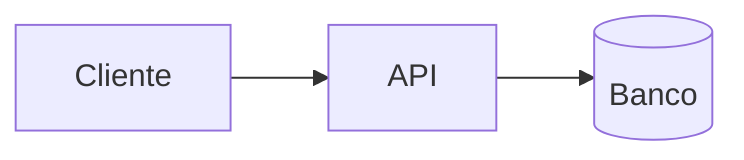

# DD-000N — <título>

- **Status:** Rascunho | Em revisão | Aprovado | Implementado | Obsoleto
- **Autor:** <nome>
- **Data:** AAAA-MM-DD
- **Relacionado:** <PRD-000X, RFC-000X, ADR-000X>

> Formato baseado em [Design Docs at Google](https://www.industrialempathy.com/posts/design-docs-at-google/),
> de Malte Ubl. O objetivo do documento é **identificar o problema e o desenho antes
> de escrever código** — e ele deixa de ser útil no momento em que o sistema existe
> e pode ser lido direto. Não tente mantê-lo eternamente atualizado.

## Contexto e escopo

O panorama de onde este trabalho se encaixa. **Descritivo, não persuasivo** — aqui
você não está vendendo a solução, está situando o leitor.

Curto: dois ou três parágrafos. Quem lê precisa saber o que já existe e onde a peça
nova entra.

## Objetivos e não-objetivos

### Objetivos

- <o que o sistema tem que fazer — verificável, não vago>

### Não-objetivos

- <o que ele explicitamente NÃO vai fazer>

A seção de **não-objetivos é a mais valiosa do documento.** "Não vamos suportar edição
colaborativa simultânea" não é o mesmo que esquecer de mencionar edição colaborativa
— e a diferença é o que evita a discussão se repetir três vezes.

## O desenho

O corpo do documento. Não existe forma fixa, mas o que costuma pertencer aqui:

### Diagrama de contexto

### APIs

Contratos, endpoints, formato de payload. **Não cole a assinatura inteira em IDL** —
o excesso de detalhe torna o documento ilegível e ele desatualiza antes do merge.

### Armazenamento de dados

Modelo, estratégia de persistência, o que é fonte da verdade.

### Grau de restrição

Este desenho é **restrito** (existe uma resposta certa, e o design a persegue) ou
**aberto** (várias respostas defensáveis, e você escolheu uma)? Diga qual — muda
completamente o tipo de feedback que você quer receber.

## Alternativas consideradas

Para cada alternativa séria: em que ela consiste, e qual foi o **trade-off** que fez
você não escolhê-la. Não é preciso ser exaustivo, mas é preciso ser honesto.

## Preocupações transversais

Só preencha o que se aplica de verdade. Seção vazia por obrigação é ruído.

- **Segurança** — superfície de ataque nova, dados sensíveis em trânsito ou em repouso.
- **Privacidade** — que dado pessoal isso toca, e por quanto tempo.
- **Observabilidade** — como você vai saber que quebrou, antes do usuário contar.
- **Acessibilidade** — se toca interface.
- **Performance** — sob que volume isso deixa de funcionar.
