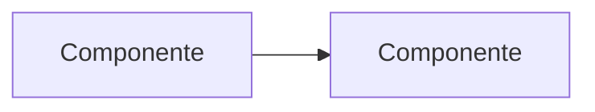
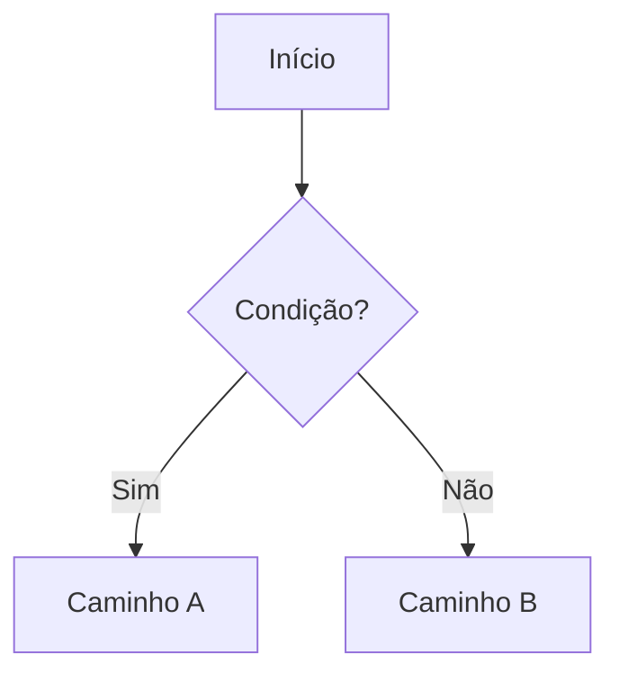
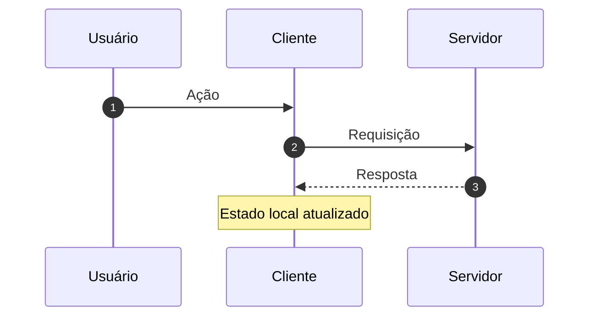
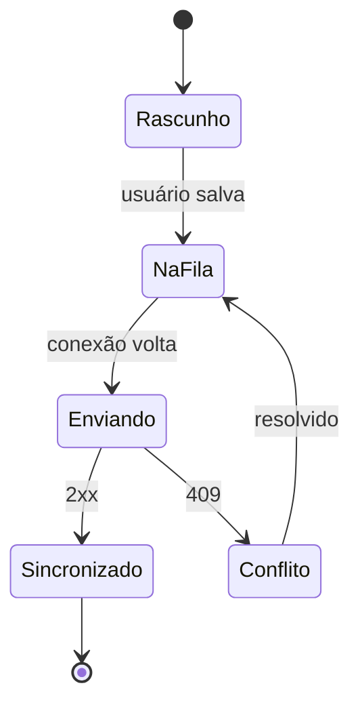
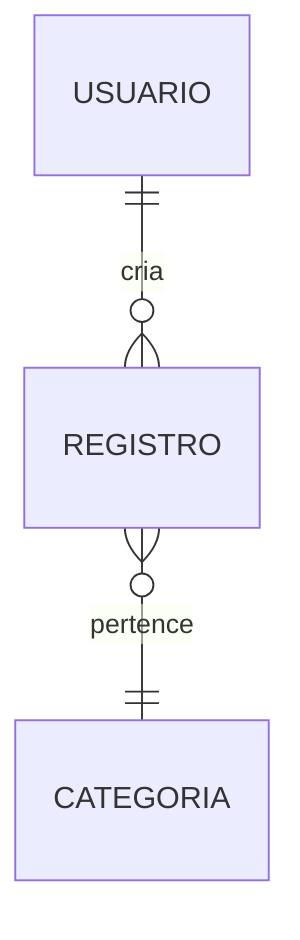
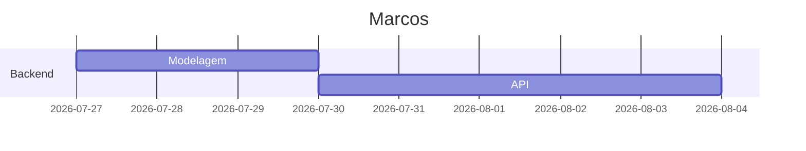

# DIA-<nome-do-diagrama>

- **Representa:** <que parte do sistema>
- **Data:** AAAA-MM-DD
- **Relacionado:** <DD-000X, ADR-000X, PRD-000X>

> Diagramas em [Mermaid](https://mermaid.js.org/) renderizam nativamente no GitHub,
> vivem em texto e aparecem no `git diff` — que é a razão de não usar imagem exportada
> aqui. Um PNG desatualizado mente em silêncio; um bloco Mermaid errado dá para revisar
> em code review.

## Contexto

Uma ou duas frases: o que este diagrama mostra e por que ele existe. Diagrama sem
legenda é enigma.

## Diagrama

## Notas

O que o diagrama **não** mostra. Toda representação omite algo — dizer o que foi
omitido de propósito evita conclusão errada de quem só olha a figura.

---

## Formas úteis para este projeto

### Fluxo de decisão

### Sequência — ideal para autenticação e sincronização

### Máquina de estados — ideal para fila offline

### Entidade-relacionamento

### Cronograma

> **Dica de revisão:** se o diagrama não cabe numa tela sem rolagem, ele está tentando
> explicar duas coisas. Divida em dois.
