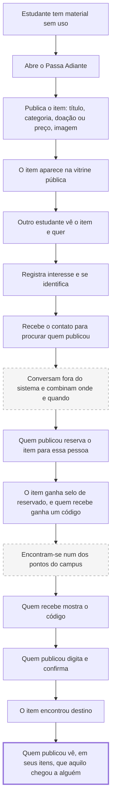

# PRD-0001 — Passa Adiante

- **Status:** Em revisão
- **Autor:** Gabriel Vieira Soriano Aderaldo
- **Data:** 2026-07-28
- **Relacionado:** ADR-0003 · `docs/discovery/` (cerimônias 1–8) · edital do desafio

> PRD responde **o quê** e **para quem** — nunca **como**. Nenhum nome de biblioteca,
> tabela, rota ou framework aparece abaixo, por regra do template.

---

## Problema

Um estudante termina o semestre com material que não usa mais: livros, apostilas,
calculadora, jaleco, componentes. Ele não quer jogar fora — *"LIXO é um destino MUITO
dificil"* [sic] — mas também não tem para quem dar.

Existe uma solução no campus. Uma geladeira velha no ponto de ônibus, onde qualquer um
deixa o que quiser, e uma caixa de sucata no bloco D. Fricção quase nula: chega e larga.

**E mesmo assim não resolve.** Um estudante que usou a geladeira descreveu o que
aconteceu depois:

> *"cheguei a deixar minhas apostilas lá uma vez, porém fiquei **INSEGURO se realmente
> foi útil** ou eu estava só 'espalhando lixo'."*

A dor não está em desapegar. Está **depois**: o gesto fica sem resposta. Quem entregou
não descobre se serviu, e essa dúvida é o que impede a próxima vez. Do outro lado, quem
precisaria do material não sabe que ele existe — a geladeira *"parece mais lixo na rua"*
para quem não foi deliberadamente procurá-la.

**Não é um problema de facilitar a doação. É um problema de doação que não fecha.**

---

## Usuário e contexto de uso

| Aspecto | Descrição |
|---------|-----------|
| **Quem** | Estudante da UNIFOR com material acadêmico sem uso — tipicamente veterano, formando, ou quem trancou. E, do outro lado, quem precisa de material e não tem rede para consegui-lo |
| **Onde/quando** | **Uso episódico, disparado por evento**: faxina, mudança de casa, fim de semestre, formatura. Não é uso recorrente — duas ou três vezes por ano. Publicar acontece em casa, com o item na mão, provavelmente no celular. Procurar acontece no início do semestre |
| **Restrições reais** | Pressa e baixa paciência para cadastro — o concorrente aceita o item sem perguntar nada. Desconforto em expor dado pessoal: *"não gostaria de compartilhar meu número, acho pessoal de mais"*. Nenhuma disposição para voltar ao sistema por obrigação |

**O concorrente real não é outro aplicativo.** É a gaveta, o lixo, a geladeira e
"perguntar pro amigo". Perguntados para onde iriam primeiro, quatro entrevistados
responderam: amigos, *"Biblioteca?"*, um conhecido do mesmo curso, e instituições.
**Nenhum citou um app.**

---

## Métricas de sucesso

O produto não vai a mercado — é entrega de um desafio técnico, sem operação real. Por
isso, **nenhuma métrica de uso é verificável neste ciclo**, e inventar número seria
aspiracional, que é o que este documento não pode ser.

**Critérios de aceite observáveis**, na forma que o template pede:

| # | Critério observável |
|---|---|
| 1 | Uma pessoa que já deixou material na geladeira olha para a tela e **aponta o que ela responde que a geladeira não respondeu** — indicando algo concreto na interface, não a intenção do sistema |
| 2 | Quem publica um item consegue, sem ajuda, chegar até a informação de **quem o recebeu** |
| 3 | Quem se interessa por um item consegue **localizar a pessoa** para conversar, a partir apenas do que a tela mostra |
| 4 | Alguém descreve a vitrine **sem usar as palavras "parado", "vazio" ou "abandonado"** |

**Critério negativo, igualmente informativo:** se a pessoa do critério 1 disser *"é a
mesma coisa"* ou não achar nada concreto para apontar, a premissa central do produto
perdeu força — e é melhor saber disso antes da entrega.

**O que mediríamos se houvesse operação**, registrado para não se perder: a **segunda
publicação** da mesma pessoa, depois de ter recebido a confirmação da primeira. É o
sinal de que o gesto fechou. Não é observável aqui.

---

## Requisitos

### Essenciais

- [ ] Qualquer pessoa vê, sem se identificar, os itens disponíveis e pode filtrar por categoria
- [ ] Uma página pública explica a proposta e mostra que o sistema tem movimento
- [ ] Um estudante identificado publica um item informando título, descrição, categoria, se é doação ou venda com preço, e o endereço de uma imagem
- [ ] Um estudante identificado vê os itens que ele mesmo publicou, e em que estado estão
- [ ] Quem se interessa por um item registra esse interesse, e só então obtém como falar com quem publicou
- [ ] Quem publicou vê quem se interessou e **reserva o item para uma dessas pessoas**
- [ ] O item reservado continua visível, com um selo, e quem se interessou sabe que já tem alguém
- [ ] Quem vai receber ganha um **código**, que mostra no encontro
- [ ] Quem publicou digita o código e o item passa a exibir que **encontrou destino**
- [ ] Quando o código não é possível, quem publicou encerra o item declarando a entrega — e isso fica registrado como declaração de um lado só
- [ ] Qualquer um dos dois desfaz a reserva, e o item volta a circular
- [ ] Quem demonstrou interesse acompanha, numa tela própria, em que pé está cada item que quis
- [ ] Quem publicou remove um item que não quer mais oferecer
- [ ] A aplicação se instala na tela inicial do celular e funciona como aplicativo
- [ ] A mesma aplicação serve uma página rica no computador e uma experiência de aplicativo no celular

### Desejáveis

- [ ] Cada pessoa escolhe o que aparece publicamente como forma de contato
- [ ] Itens já vistos continuam visíveis sem conexão
- [ ] Feedback visual de carregamento e transições suaves
- [ ] Aplicação acessível publicamente na internet

### Fora de escopo

- **Conversa dentro do sistema** — mensagens, comentários ou chat. O contato acontece no
  canal institucional que os estudantes já usam. Construir mais um canal seria pedir que
  adotassem um lugar novo para fazer o que já fazem.
- **Confirmação depois de receber.** Pedir que quem recebeu volte ao sistema *depois* de
  estar com o item — quando não tem mais motivo nenhum para abrir o app. Isso continua
  fora.

  > **Revisão de 2026-07-28.** A versão anterior cortava a confirmação bilateral
  > inteira. Ela voltou, em outro ponto do fluxo: **o código é mostrado antes da
  > entrega, quando a pessoa ainda quer o item**, e quem confirma é quem publicou. A
  > distinção é entre pedir uma volta *depois* — que ninguém faz — e mostrar algo
  > *durante* — que acontece no encontro que já ia acontecer.
- **Avaliação, nota ou reputação.** Não responde à objeção real, que é sobre o material
  ter **bom cuidado** — e saber quem é a pessoa não diz como ela vai tratar o item.
- **Busca por texto.** Não foi pedida e não apareceu em nenhuma entrevista.
- **Envio de arquivo de imagem.** O endereço da imagem basta.
- **Avisos e notificações.** O uso é episódico; notificar quem usa duas vezes por ano é
  incômodo, não serviço.
- **Editar o conteúdo de um item já publicado.** Remover e publicar de novo resolve.

---

## Fluxo principal

O trecho tracejado acontece **fora do produto**, e é uma escolha. O passo destacado no
fim é a razão de o produto existir.

---

## Casos de exceção

Do ponto de vista de quem usa.

| Situação | O que a pessoa vive | O que o produto faz |
|----------|---------------------|---------------------|
| **Publiquei e ninguém quis** | O item fica parado. É o cenário mais comum e o mais desanimador | O item continua disponível. Nenhuma promessa é feita sobre quando alguém aparecerá — dizer "logo alguém verá" seria mentira |
| **Duas pessoas querem o mesmo item** | Preciso escolher | Quem publicou vê todos os interessados e reserva para uma delas. As outras veem que o item foi reservado — sem saber para quem — e decidem se esperam |
| **Combinei e a pessoa não apareceu** | Perdi tempo, e o item segue comigo | Qualquer um dos dois desfaz a reserva. O item volta a ficar disponível, e quem já tinha demonstrado interesse continua na lista |
| **Entreguei e a pessoa sumiu sem me dar o código** | Não consigo fechar, e o item não é mais meu | Existe o caminho "entreguei, mas não consegui o código". O item encerra, marcado como declarado por um lado só — e essa marca fica |
| **Reservei para alguém e mudei de ideia** | Quero doar para outra pessoa, ou não doar mais | Desfaz a reserva e reserva para outro interessado. Ou remove o anúncio, o que também libera quem estava esperando |
| **Entreguei e esqueci de marcar** | Meus itens mostram algo desatualizado | Ninguém é cobrado. O item permanece disponível até quem publicou dizer o contrário — o sistema não presume o que não sabe |
| **Não encontro a pessoa no chat do campus** | Sei que alguém quer, e não consigo falar | Depende do que a pessoa escolheu exibir. É a razão de a escolha do contato existir |
| **Marquei a pessoa errada** | O registro fica incorreto | Quem publicou pode corrigir. O registro serve a ele, não a terceiros |
| **Desisti de doar** | Quero tirar o anúncio | Remove o item |
| **Não quero expor meu nome** | Desconforto real, relatado em entrevista | Escolhe outra forma de contato. **Nenhum dado pessoal aparece para quem não se identificou** |

---

## Perguntas em aberto

| Pergunta | Quem decide |
|----------|-------------|
| Quais categorias existem, e se são fixas ou livres | Gabriel — cerimônia 10 |
| Se "é doação" e "preço" são uma escolha só ou dois campos independentes. Duas entrevistas convergiram em que o critério é o **valor do item**, não o perfil de quem oferece | Gabriel — cerimônia 10 |
| O que a tela de destino mostra: o nome de quem recebeu, ou apenas que alguém do campus recebeu. A dor original é sobre **utilidade**, não identidade | Gabriel |
| **Existe alguém do outro lado?** Nenhum ingressante foi entrevistado, e os dois respondentes que precisaram de material compraram novo. É a suposição mais frágil do produto, e segue como risco aceito | Não decidível sem pesquisa nova |
| Se o nome do produto é "Passa Adiante" | Gabriel |
