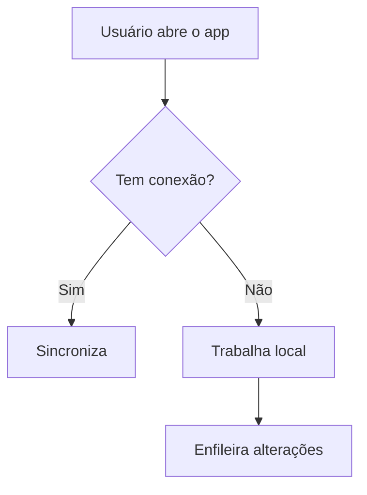

# PRD-000N — <nome da funcionalidade ou do produto>

- **Status:** Rascunho | Em revisão | Aprovado | Em construção | Entregue
- **Autor:** <nome>
- **Data:** AAAA-MM-DD
- **Relacionado:** <DD-000X, RFC-000X>

> PRD responde **o quê** e **para quem** — nunca **como**. No momento em que você
> escrever nome de tabela ou biblioteca aqui, você saiu do PRD e entrou no Design Doc.

## Problema

Que dor existe, de quem é essa dor, e como ela se manifesta hoje. Escreva a partir da
pessoa, não do sistema.

> ❌ "Falta um endpoint de sincronização."
> ✅ "O agente de campo perde o trabalho da manhã inteira quando o sinal cai no meio
> do formulário."

## Usuário e contexto de uso

Quem usa, em que situação, com que dispositivo, sob que restrição. É aqui que se
justifica decisão de produto que depois parece arbitrária no código.

| Aspecto | Descrição |
|---------|-----------|
| Quem | <perfil> |
| Onde/quando | <contexto físico e temporal de uso> |
| Restrições reais | <conexão instável, uma mão ocupada, pressa, tela pequena> |

## Métricas de sucesso

Como saberemos que resolveu. **Verificável, não aspiracional.**

| Métrica | Hoje | Meta |
|---------|------|------|
| <ex: registros perdidos por queda de conexão> | <baseline> | <alvo> |

Se não dá para medir, pelo menos defina o critério de aceite observável: "o usuário
completa o cadastro com o Wi-Fi desligado e o dado aparece no servidor quando a
conexão volta".

## Requisitos

### Essenciais

- [ ] <sem isto, a entrega não existe>

### Desejáveis

- [ ] <agrega valor real, mas o produto funciona sem>

### Fora de escopo

- <o que explicitamente não entra — e, se útil, por quê>

A lista de fora de escopo é o que protege o prazo. Preencha antes de começar, não
depois de atrasar.

## Fluxo principal

Passo a passo do caminho feliz, na linguagem do usuário. Diagrama opcional:

## Casos de exceção

O que acontece quando dá errado, do ponto de vista do usuário — não do stack trace.
Conflito de dados, sessão expirada, permissão negada, entrada inválida.

## Perguntas em aberto

O que ainda não foi decidido e quem precisa decidir.
