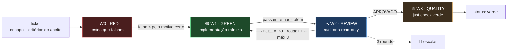

# Fluxo de engenharia — pipeline W0→W3

> **Público-alvo:** um agente ou uma pessoa que precisa operar este repositório **sem
> contexto prévio**.
>
> **Status:** descritivo do estado real em 2026-07-27.
> **Fonte de verdade:** este documento é **derivado** — descreve, não legisla. Quem
> legisla é o [ADR-0002](../adr/ADR-0002-pipeline-w0-w3-e-sdd.md) e a regra
> `.claude/rules/pipeline.md`. Em caso de divergência, vence o ADR.

## 1. O contrato em 30 segundos

Toda mudança auditável abre um **ticket** em `docs/pipeline/` e percorre quatro waves
em ordem:



## 2. Por que assim — as três raízes

O processo foi construído empiricamente antes de ser fundamentado. As citações
literais estão no [ADR-0002](../adr/ADR-0002-pipeline-w0-w3-e-sdd.md); aqui fica o
resumo do que cada fonte sustenta.

| Elemento | Raiz | O que a fonte diz |
|----------|------|-------------------|
| **W0 antes de W1** | Kent Beck, *TDD*, p. 3 | *"Escrevemos código novo apenas se um teste automatizado falhou"* |
| **Estágios com parada no primeiro vermelho** | Sam Newman, *Building Microservices*, p. 244 | *"if the fast tests fail, there probably isn't much sense in running the slower tests anyway"* |
| **Gates manuais dentro da esteira** | idem | *"Some stages may be manual"* |
| **Critérios de aceite viram testes** | Gregory & Crispin, *Agile Testing Condensed*, cap. 4 | Exemplos concretos guiam o desenvolvimento e constroem entendimento compartilhado |
| **Regressão zero** | Jidoka / TPS, via Poppendieck | Parar a linha ao detectar defeito, em vez de empurrar adiante |
| **W2 read-only** | Inspeção formal (Fagan, IBM, 1976) | Revisão como etapa distinta de quem escreveu |

As duas últimas estão registradas como **linhagem reconhecida sem citação primária** —
não foram verificadas contra o texto original. O ADR declara isso explicitamente.

## 3. Anatomia de um ticket

Um arquivo por ticket, em `docs/pipeline/TCK-000N-slug.md`, com front-matter YAML:

```yaml
---
id: TCK-0001
status: w1              # aberto|w0|w1|w2|w3|verde|rejeitado|bloqueado
tamanho: M
waves:
  W0: { outcome: RED,   rounds: 1, em: 2026-07-27 }
  W1: { outcome: null,  rounds: 0, em: null }
  ...
---
```

O corpo tem: **Contexto · Escopo · Fora de escopo · Critérios de aceite · Definition
of Done · Referências**, seguido de uma seção por wave.

**Não há CLI de estado.** O estado vive no front-matter e é auditado por leitura —
`scripts/pipeline-index.py`, ligado ao `just check`. É a mesma mecânica dos ADRs, que
já tem 37 testes cobrindo o guard.

### Por que não uma máquina de estado dedicada

A alternativa — `STATE.json` canônico, `STATE.md` gerado e uma CLI com subcomandos —
foi testada em produção pelo autor num projeto maior, e descartada aqui: são ~350
linhas para manter, com duplicação entre o estado e sua renderização. O ADR-0002 lista
também as ferramentas de terceiros avaliadas e por que não serviram.

## 4. Contrato de cada wave

| | **W0 · RED** | **W1 · GREEN** | **W2 · REVIEW** | **W3 · QUALITY** |
|---|---|---|---|---|
| **Escreve em código de produção?** | ❌ nunca | ✅ o mínimo | ❌ read-only | ❌ só corrige vermelho |
| **Portão** | testes rodam e **falham** | testes passam | veredito + issues | `just check` |
| **`outcome`** | `RED` | `GREEN` | `APROVADO` / `REJEITADO` | `VERDE` |
| **Critério de saída** | falham por a API não existir — não por digitação | zero linha além do necessário | achados com `arquivo:linha` | tudo verde |
| **Aborta se…** | algum teste **passa** antes da implementação | sobrou código não coberto | 3 rounds sem aprovação | qualquer vermelho não endereçado |

**O teste de W0 que passa é um teste fraco.** Se ele passa antes de existir
implementação, ele não está verificando o que deveria — reescreva-o em vez de seguir.

## 5. As invariantes, e onde vivem

Verificadas por `scripts/pipeline-index.py`, executado no `just check`:

| # | Invariante | Mensagem |
|---|-----------|----------|
| 1 | Não se pula wave | `Wn concluída com Wn-1 pendente — wave pulada` |
| 2 | `outcome` coerente com a wave | `W0 com outcome GREEN (esperado: RED)` |
| 3 | Máximo 3 rounds | `W2 com 4 rounds (máximo 3) — deveria ter escalado` |
| 4 | Fechar exige as 4 waves | `status verde com waves pendentes: W2, W3` |
| 5 | Fechado tem data de fechamento | `fechado sem campo fechado preenchido` |
| 6 | W2 rejeitado não fecha verde | `W2 REJEITADO mas o ticket está verde` |

**Consequência prática:** pular wave não é questão de disciplina — o `just check`
recusa, e o índice nomeia a violação.

## 6. Relatório de wave — a regra que sustenta tudo

Cada wave grava sua seção no próprio ticket, colando a **saída literal** do comando.

> Escrever *"os testes passaram"* sem a saída é o modo de falha mais comum deste
> processo, e o mais difícil de detectar depois. Se você não rodou, não reporte.

Isso não é formalidade. O [EP-004](../../ai-log/EP-004-o-portao-que-nao-fechava.md)
registra um portão declarado testado três vezes, com oito casos passando, que podia
ser furado com dois comandos — porque os testes viviam em mensagens de chat e ninguém
os re-executava.

## 7. Quando abrir ticket

**Toda mudança auditável**, escrita por pessoa ou por IA. A auditoria não pergunta
quem escreveu.

Vão direto, sem ticket: correção de digitação em documentação e ajuste de formatação
sem mudança semântica. Na dúvida, abre.

## 8. Regressão zero

Está em `.claude/rules/pipeline.md`, e é a regra mais importante do repositório:

> **Não existe "o erro não é meu".** Qualquer vermelho que apareça na sessão é
> regressão a corrigir agora — tenha ou não sido causado pela mudança atual.

Três saídas legítimas diante de um vermelho: consertar a causa, corrigir o portão mal
classificado **e provar o verde no caminho certo**, ou escalar com a causa-raiz. Marcar
`skip` não é uma delas.

E a cláusula complementar: **código alheio não se reverte sem consultar.** Se algo
parece errado, diga o que encontrou e pergunte antes de agir.

## 9. Comandos

```bash
just pipeline-index    # regenera docs/pipeline/INDEX.md
just pipeline-check    # falha se índice desatualizado ou invariante violada
just check             # portão completo: ADRs + pipeline + hooks
```

## 10. Relação com o SDD

O SDD opera na escala de **feature** e responde *"o que construir e por quê"*; a
pipeline opera na escala de **ticket** e responde *"como construir sem quebrar"*. O
encaixe é a fase de testes: quando o SDD chega ao ponto de escrever testes, ele abre
um ticket e delega.

Neste projeto o SDD está em escala reduzida — o handbook (PRD → Design Doc → ADR) já
cumpre o papel de especificação, sem os 12 gates humanos da implementação original.
